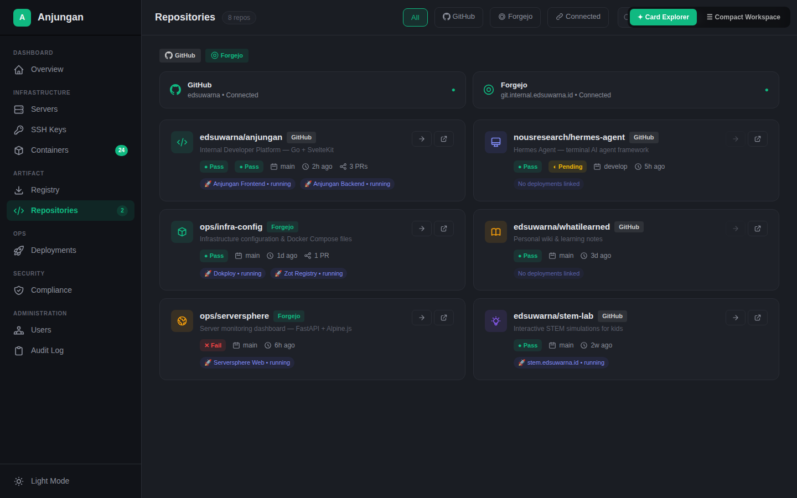
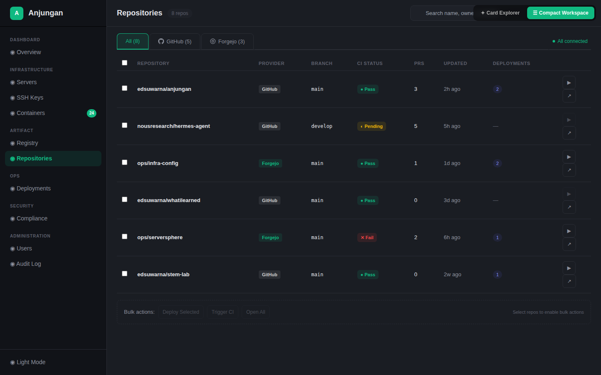
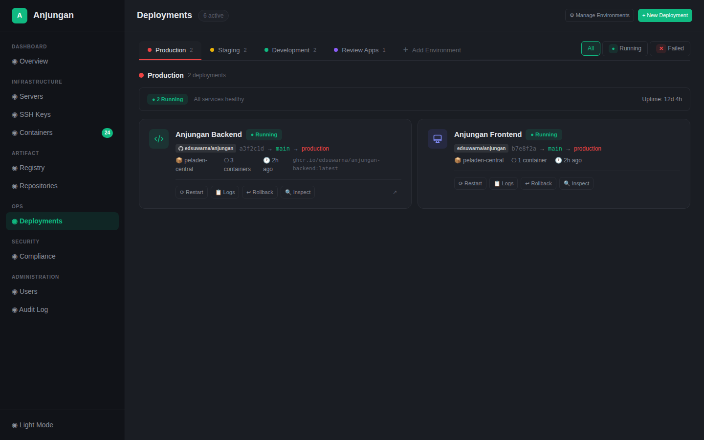
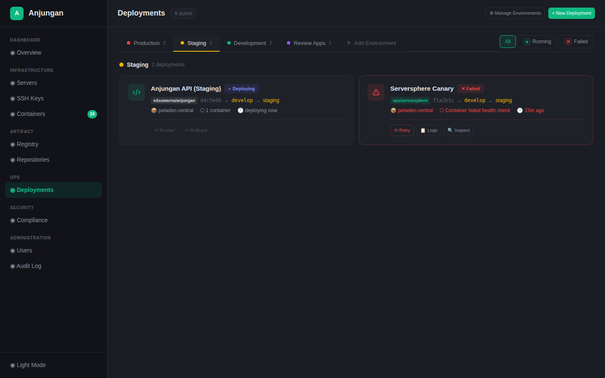
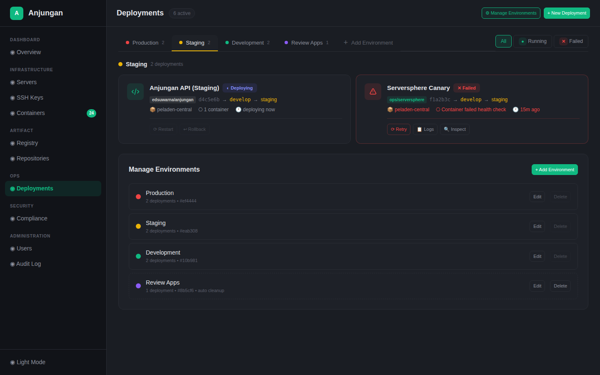
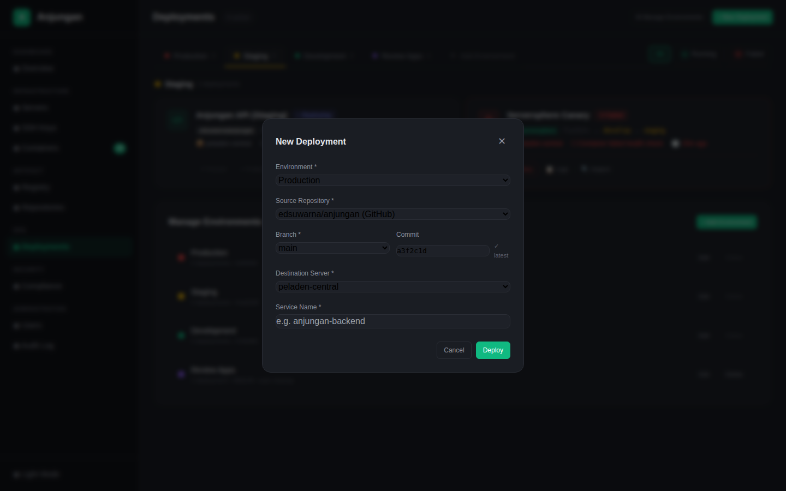

# Anjungan — PRD: Repositories & Deployments

> **Version:** 1.0
> **Status:** Draft
> **Author:** Endang Suwarna
> **Last Updated:** June 4, 2026

---

## 1. Executive Summary

### Problem Statement

Anjungan saat ini punya sidebar menu **Repositories** dan **Deployments** yang masih placeholder — "Coming Soon." Padahal ini dua fitur inti dari Internal Developer Platform (IDP):

- **Repositories:** Tim/dev udah pasti punya code di GitHub dan/atau self-hosted git (Gitea/Forgejo). Tapi buat liat status repo, CI, dan deployment linkage, mereka harus buka tab terpisah.
- **Deployments:** Setiap service yang jalan di server Anjungan berasal dari suatu repo. Tapi saat ini ga ada catatan siapa deploy apa, dari branch mana, ke environment mana.

Kedua fitur ini **saling terkait** — repo di-deploy ke environment tertentu sebagai suatu service. Linkage ini yang bikin IDP jadi *single pane of glass*.

### Target Audience

- **Endang sendiri** (platform engineer / satu-satunya user)
- **Future team members** (kalo nanti ada kolaborator)
- **Self-hosted infra** — Dokploy, VPS, Zot registry

### Goals

| Goal | Metric |
|------|--------|
| Lihat semua repo dari GitHub + Forgejo dalam satu tempat | 2 provider connected |
| Lihat status CI tanpa buka GitHub/Forgejo | Badge pass/fail/pending |
| Lihat deployment mana yang berasal dari repo mana | 2-way linkage (repo→deploy, deploy→repo) |
| Bikin environment sendiri (ga hardcode) | Environment CRUD |
| Deploy service baru dari UI | 1-click deploy dari modal |

### Non-Goals

- ❌ Bukan git client — gantiin GitHub UI (commit, branch management, PR review)
- ❌ Bukan CI/CD pipeline engine — trigger workflow doang, bukan ngerun sendiri
- ❌ Bukan replacement buat ArgoCD / GitOps — manual deploy dulu, auto-deploy nanti

---

## 2. Product Overview

### Fitur Ini Dalam Konteks Anjungan

```
┌────────────────────────────────────────────────────┐
│                   Anjungan IDP                      │
├────────────┬────────────┬───────────┬──────────────┤
│  Servers   │ Containers │ Registry  │ Compliance   │
│  SSH Keys  │            │           │              │
├────────────┴─────┬──────┴─────┬─────┴──────────────┤
│   Repositories   │           Deployments            │
│  (GitHub/Forgejo)│    (Environment-based)           │
└──────────────────┴──────────────────────────────────┘
         │                    │
         └────── 🔗 2-way linkage ──────┘
```

### Tech Stack

| Layer | Technology | Reason |
|-------|-----------|--------|
| Backend | Go (existing Anjungan API) | Pake pola adapter `GitProvider` interface |
| Frontend | SvelteKit (existing) | Route baru di `/repositories` dan `/deployments` |
| Database | PostgreSQL (existing) | Tabel baru: `environments`, `deployments`, `repo_connections` |
| Auth | JWT (existing) | Per-user token untuk provider connection |
| Git Provider API | GitHub REST API v3, Forgejo/Gitea API | Komunikasi langsung dari backend |

---

## 3. Feature Requirements

### 3.1 Feature Inventory — Current State (June 2026)

| Domain | Backend | Frontend | Status |
|--------|---------|----------|--------|
| Repositories — List repos | 🟡 Stub routes ada | ❌ Placeholder | 🔴 Not started |
| Repositories — Multi-provider | ❌ Not implemented | ❌ Not implemented | 🔴 Not started |
| Repositories — CI status | ❌ Not implemented | ❌ Not implemented | 🔴 Not started |
| Repositories — Detail page | 🟡 Action/workflow routes | ❌ Not implemented | 🔴 Not started |
| Deployments — List | 🟡 Stub routes ada | ❌ Placeholder | 🔴 Not started |
| Deployments — Create | 🟡 Stub POST route | ❌ Not implemented | 🔴 Not started |
| Deployments — Detail/Get | 🟡 Stub GET route | ❌ Not implemented | 🔴 Not started |
| Deployments — Rollback | 🟡 Stub POST route | ❌ Not implemented | 🔴 Not started |
| Deployments — History | 🟡 Stub GET route | ❌ Not implemented | 🔴 Not started |
| Deployments — Environment CRUD | ❌ Not implemented | ❌ Not implemented | 🔴 Not started |
| Repo ↔ Deployment linkage | ❌ Not implemented | ❌ Not implemented | 🔴 Not started |

### 3.2 Database Schema (New Tables)

```sql
-- Connected git provider accounts (per-user)
CREATE TABLE repo_connections (
    id          UUID PRIMARY KEY DEFAULT gen_random_uuid(),
    user_id     UUID NOT NULL REFERENCES users(id),
    provider    VARCHAR(20) NOT NULL,  -- 'github', 'forgejo'
    label       VARCHAR(100),           -- e.g. "GitHub Personal"
    base_url    VARCHAR(255),           -- Forgejo instance URL, NULL for GitHub
    token_encrypted TEXT NOT NULL,      -- encrypted PAT
    is_active   BOOLEAN DEFAULT true,
    created_at  TIMESTAMPTZ DEFAULT now(),
    updated_at  TIMESTAMPTZ DEFAULT now()
);

-- Environments (user-defined)
CREATE TABLE environments (
    id          UUID PRIMARY KEY DEFAULT gen_random_uuid(),
    name        VARCHAR(100) NOT NULL,
    color       VARCHAR(7) NOT NULL DEFAULT '#10b981',  -- hex color
    description TEXT,
    is_protected BOOLEAN DEFAULT false,  -- true = can't delete (e.g. Production)
    created_at  TIMESTAMPTZ DEFAULT now(),
    updated_at  TIMESTAMPTZ DEFAULT now()
);

-- Deployments
CREATE TABLE deployments (
    id              UUID PRIMARY KEY DEFAULT gen_random_uuid(),
    name            VARCHAR(200) NOT NULL,         -- e.g. "Anjungan Backend"
    environment_id  UUID REFERENCES environments(id),
    repo_provider   VARCHAR(20) NOT NULL,
    repo_owner      VARCHAR(100) NOT NULL,
    repo_name       VARCHAR(100) NOT NULL,
    branch          VARCHAR(200) NOT NULL,
    commit_sha      VARCHAR(40),
    server_id       UUID REFERENCES servers(id),
    service_name    VARCHAR(200),                   -- Docker service / container name
    image           VARCHAR(500),                   -- full image ref
    status          VARCHAR(20) NOT NULL DEFAULT 'pending',
                    -- 'pending', 'deploying', 'running', 'success', 'failed', 'rolled_back'
    deployed_by     UUID REFERENCES users(id),
    deployed_at     TIMESTAMPTZ DEFAULT now(),
    updated_at      TIMESTAMPTZ DEFAULT now(),
    rollback_from   UUID REFERENCES deployments(id) -- previous version
);

-- Deployment history (audit trail)
CREATE TABLE deployment_history (
    id              UUID PRIMARY KEY DEFAULT gen_random_uuid(),
    deployment_id   UUID REFERENCES deployments(id),
    status          VARCHAR(20) NOT NULL,
    message         TEXT,
    created_at      TIMESTAMPTZ DEFAULT now()
);
```

### 3.3 Feature Specs

#### F1 — Repository Multi-Provider Connection (P0)

| Aspect | Detail |
|--------|--------|
| **Priority** | P0 — Must have for v1 |
| **Backend** | `GitProvider` interface: `ListRepos()`, `ListBranches()`, `GetCommitStatus()`, `ListPRs()`, `ListWorkflows()`. Implement `GitHubAdapter` (REST API v3, PAT auth) dan `ForgejoAdapter` (Gitea API, PAT + instance URL). Simpan token terenkripsi per-user di tabel `repo_connections`. |
| **Frontend** | Halaman `/repositories` — grid card layout. Setiap card: repo name, provider badge (GitHub/Forgejo), branch, last commit, CI status badge, PR count, linked deployments. Filter by provider. Search by name. |
| **UX** | Provider connection via Settings → Connected Accounts → GitHub (PAT) / Forgejo (PAT + instance URL). Status koneksi visible di halaman repositori. |

#### F2 — Repository ↔ Deployment Linkage (P0)

| Aspect | Detail |
|--------|--------|
| **Priority** | P0 — Core value of IDP |
| **Backend** | Join query: deployments + repo_connections, grouped by `(repo_provider, repo_owner, repo_name)`. Endpoint: `GET /repositories/{id}/deployments` dan `GET /deployments/{id}/repository`. |
| **Frontend** | Di card repo: badge "🚀 2 deployments" yang bisa diklik → liat deployment mana aja. Di card deployment: source chain `repo/owner → commit → branch → environment` visible. |
| **UX** | Linkage dua arah. Dari repo liat deployment. Dari deployment liat repo. |

#### F3 — Tab-Based Deployments Page (P0)

| Aspect | Detail |
|--------|--------|
| **Priority** | P0 |
| **Backend** | `GET /deployments` — list semua deployment, bisa di-filter by environment_id. `GET /deployments/{id}` — detail. `POST /deployments` — create new. `POST /deployments/{id}/rollback` — rollback. `GET /deployments/history` — audit trail. |
| **Frontend** | Halaman `/deployments` — tabs by environment. Setiap tab nampilin card-grid deployment di environment itu. Tiap card: service name, status badge, source chain (repo → branch → environment), server, container count, quick actions (Restart, Logs, Rollback, Inspect). Summary bar per environment (running count, uptime). |
| **UX** | Filter chips inline di tab bar: All / Running / Failed. Search bar. New Deployment modal (flow: environment → repo → branch → commit → server → service name → deploy). |

#### F4 — Custom Environments (P0)

| Aspect | Detail |
|--------|--------|
| **Priority** | P0 |
| **Backend** | CRUD endpoints: `GET /environments`, `POST /environments`, `PUT /environments/{id}`, `DELETE /environments/{id}` (soft delete — deployments jadi orphaned). Protected flag prevents delete. |
| **Frontend** | Manage Environments panel di halaman deployments. Tab "+ Add Environment" ujung kanan. Modal create: name, color (color picker), description. Edit modal sama. Delete dengan konfirmasi. |
| **UX** | Default seed: Production (#ef4444, protected: true), Staging (#eab308), Development (#10b981). Tambahan: Review Apps (#8b5cf6, auto-cleanup). |

#### F5 — CI Status Badge (P1)

| Aspect | Detail |
|--------|--------|
| **Priority** | P1 |
| **Backend** | `GetCommitStatus(owner, repo, ref)` → return latest status checks dari GitHub/Forgejo. Cache 30s. |
| **Frontend** | Badge pass (● Pass / ✅), fail (✕ Fail / ❌), pending (◐ Pending) di setiap card repo. Warna: green/red/yellow. |
| **UX** | Badge bisa diklik → detail workflow yang fail (link ke GitHub/Forgejo). |

#### F6 — Deployment History & Rollback (P1)

| Aspect | Detail |
|--------|--------|
| **Priority** | P1 |
| **Backend** | Tabel `deployment_history` otomatis tercatat tiap status change. Rollback: set status deployment jadi `rolled_back`, update deployment dengan `rollback_from` pointing ke deployment sebelumnya, restore image/commit. |
| **Frontend** | Tab "History" di detail panel deployment — timeline kronologis. Rollback button di card + detail panel. |
| **UX** | Konfirmasi rollback: "Rollback Anjungan Backend to commit a3f2c1d from 2h ago?" |

#### F7 — Quick Actions on Deployments (P1)

| Aspect | Detail |
|--------|--------|
| **Priority** | P1 |
| **Backend** | `POST /deployments/{id}/restart` → restart container via server SSH. `POST /deployments/{id}/redeploy` → deploy ulang dengan image/commit yang sama. |
| **Frontend** | Button: ⟳ Restart, 📋 Logs (link ke container logs), ↩ Rollback, 🔍 Inspect, ↗ Open Repo. |

#### F8 — Review Apps / Ephemeral Environments (P2)

| Aspect | Detail |
|--------|--------|
| **Priority** | P2 — Future |
| **Backend** | Environment dengan `auto_cleanup: true`. Auto-create dari webhook PR. Auto-delete pas PR merge/close. |
| **Frontend** | Tab khusus Review Apps. Badge "⏳ auto-removed after PR merge". |
| **UX** | Tiap PR di GitHub → auto-deploy ke environment review-apps dengan nama `pr-{number}`. |

---

## 4. API Design

### 4.1 Repositories

| Method | Path | Description | Auth |
|--------|------|-------------|------|
| GET | `/api/v1/repositories` | List all repos across all providers | ✅ |
| GET | `/api/v1/repositories/{id}` | Single repo detail | ✅ |
| GET | `/api/v1/repositories/{id}/deployments` | Deployments linked to this repo | ✅ |
| GET | `/api/v1/repositories/{id}/workflows` | List workflows/Actions | ✅ |
| POST | `/api/v1/repositories/{id}/workflows/{workflow_id}/trigger` | Trigger workflow run | ✅ |
| GET | `/api/v1/repo-connections` | List connected provider accounts | ✅ |
| POST | `/api/v1/repo-connections` | Connect new provider | ✅ |
| PUT | `/api/v1/repo-connections/{id}` | Update connection | ✅ |
| DELETE | `/api/v1/repo-connections/{id}` | Disconnect provider | ✅ |

### 4.2 Deployments

| Method | Path | Description | Auth |
|--------|------|-------------|------|
| GET | `/api/v1/environments` | List all environments | ✅ |
| POST | `/api/v1/environments` | Create environment | ✅ Admin |
| PUT | `/api/v1/environments/{id}` | Update environment | ✅ Admin |
| DELETE | `/api/v1/environments/{id}` | Delete (soft) environment | ✅ Admin |
| GET | `/api/v1/deployments` | List deployments (filter: environment_id, status) | ✅ |
| POST | `/api/v1/deployments` | Create new deployment | ✅ |
| GET | `/api/v1/deployments/{id}` | Detail deployment | ✅ |
| POST | `/api/v1/deployments/{id}/restart` | Restart deployment | ✅ |
| POST | `/api/v1/deployments/{id}/rollback` | Rollback deployment | ✅ |
| POST | `/api/v1/deployments/{id}/redeploy` | Redeploy with same config | ✅ |
| GET | `/api/v1/deployments/{id}/history` | Deployment history/timeline | ✅ |

### 4.3 Response Format (Standard)

```json
{
  "success": true,
  "data": { ... },
  "meta": { "total": 10, "page": 1, "limit": 20 }
}
```

### 4.4 Deployment Status Flow

```
pending → deploying → running (success)
                    → failed
                    → rolled_back (from running)
```

---

## 5. UI/UX Design Guidelines

### 5.1 Layout Kunci

**Repositories Page:**
```
┌─────────────────────────────────────────────────────┐
│ [All] [GitHub] [Forgejo]  [🔍 Search...]           │
│                                                      │
│ Connected: ● GitHub (edsuwarna) ● Forgejo (internal)│
│                                                      │
│ ┌─ edsuwarna/anjungan ─────────────┐ ┌─ ops/infra─┐│
│ │ ● GitHub   ● Pass                │ │ ● Forgejo  ││
│ │ main · a3f2c1d · 2h ago          │ │ main · e5f6g││
│ │ 🔀 3 PRs   🚀 2 deployments    │ │ 🚀 2 deploys││
│ │ [⟳] [↗]                        │ │ [⟳] [↗]    ││
│ └──────────────────────────────────┘ └────────────┘│
└─────────────────────────────────────────────────────┘
```

**Deployments Page:**
```
┌─────────────────────────────────────────────────────┐
│ [Pro] [Stg] [Dev] [Review] [+ Add]  [🔍 Search...] │
│ ─────────────────────────────────────────────────── │
│                                                        │
│ 🔴 Production: 2 deployments                          │
│                                                        │
│ ┌─ Anjungan Backend ─────────────────────────────┐    │
│ │ ● Running                                       │    │
│ │ 📎 edsuwarna/anjungan → a3f2c1d → main → prod  │    │
│ │ 📦 peladen-central · ⎔ 3 containers · 🕐 2h    │    │
│ │ [⟳ Restart] [📋 Logs] [↩ Rollback] [🔍 Inspect]│    │
│ └────────────────────────────────────────────────┘    │
└─────────────────────────────────────────────────────┘
```

### 5.2 Color Semantics (Environment)

| Environment | Color | Hex | Usage |
|------------|-------|-----|-------|
| Production | Red | #ef4444 | dot, tab underline, border |
| Staging | Yellow | #eab308 | dot, tab underline |
| Development | Green | #10b981 | dot, tab underline |
| Review Apps | Purple | #8b5cf6 | dot, tab underline |

### 5.3 Status Badge Semantics

| Status | Badge Style | Color |
|--------|------------|-------|
| Running / Success | ● Pass / ✓ | #10b981 |
| Failed | ✕ Fail | #ef4444 |
| Pending / Deploying | ◐ Pending | #818cf8 |
| Rolled Back | ↩ Rolled Back | #eab308 |

### 5.4 Mockup Screenshots

#### Repositories — Varian A: Card Explorer



Card-based layout, tiap repo sebagai card dengan info lengkap (CI status, branch, PRs, linked deployments). Filter by provider, search, connected accounts status bar.


Klik card → expand detail panel: source info, deployment linkage, recent commits, quick actions (Trigger Workflow, Deploy Branch, Open on GitHub).

#### Repositories — Varian B: Compact Workspace



Table-based layout, lebih padat, multi-select checkbox + bulk actions. Provider tabs (All/GitHub/Forgejo) + count per provider.

#### Deployments (v2) — Tab-based + Custom Environments



Environment tabs (🔴 Production, 🟡 Staging, 🟢 Dev, 🟣 Review Apps, + Add). Summary bar (running count, uptime). Tiap card: service name, status badge, source chain (repo → commit → branch → environment), server, containers, quick actions.



Switch tab → konten langsung ganti. Deploying dan Failed status visible dengan actionable buttons (Retry, Logs).



CRUD panel: color-coded environment list, edit/delete buttons. Protected environments (Production) ga bisa di-delete. "+ Add Environment" button.



Modal: pilih Environment → Repository → Branch → Commit → Server → Service Name → Deploy.

#### Mockup HTML Files

- `sketches/repositories/mockup.html` — 2 varian (Card Explorer + Compact Workspace)
- `sketches/deployments/mockup.html` — 2 varian (Pipeline Cards + Timeline)
- `sketches/deployments-v2/mockup.html` — Final: Tab-based + Custom Environments

---

## 6. Non-Functional Requirements

| Aspect | Target | Notes |
|--------|--------|-------|
| API latency | < 500ms | GitHub/Forgejo API panggilan async, cache 30s |
| Token storage | Encrypted at rest | AES-256-GCM di PostgreSQL |
| Rate limit | Respect GitHub API rate limit | 5000 req/jam, cache aggressively |
| Error handling | Graceful fallback | Provider offline → "Connection lost" bukan error 500 |
| Deployment count | Scalable to 50+ deployments | Virtual scrolling atau pagination |

---

## 7. Implementation Roadmap

### Phase 1: Foundation (v1.0)

> **Goal:** Repo list + basic deployments with environments

| Order | Feature | Effort | Dependency |
|-------|---------|--------|-----------|
| 1 | Database migrations (environments, deployments, repo_connections) | 1 day | — |
| 2 | `GitProvider` interface + `GitHubAdapter` + `ForgejoAdapter` | 3 days | #1 |
| 3 | `GET /repositories` — list repos, merge GitHub + Forgejo | 2 days | #2 |
| 4 | Repo connection flow (per-user PAT + instance URL) | 2 days | #2 |
| 5 | Repositories frontend page (card layout + provider filter) | 2 days | #3, #4 |
| 6 | Environments CRUD (backend + frontend panel) | 2 days | #1 |
| 7 | Deployments CRUD (backend) | 3 days | #1 |
| 8 | Deployments frontend page (tabs by environment) | 2 days | #6, #7 |
| 9 | CI status badge (GitHub check runs) | 1 day | #2 |
| 10 | Repo ↔ Deployment linkage (2-way) | 2 days | #3, #7 |
| 11 | New Deployment modal flow | 1 day | #7, #8 |

**Total Phase 1:** ~19 days

### Phase 2: Operations (v1.1)

| Order | Feature | Effort |
|-------|---------|--------|
| 1 | Deployment history + audit trail | 2 days |
| 2 | Rollback flow | 2 days |
| 3 | Quick actions (Restart, Redeploy, Logs) | 2 days |
| 4 | Workflow trigger from UI | 1 day |

### Phase 3: Future

| Feature | Notes |
|---------|-------|
| Review Apps / ephemeral environments | Auto-deploy from PR |
| Webhook integration | Auto-deploy on push to branch |
| Deployment scheduling | "Deploy at 2AM" |
| Rollback comparison | Diff between current and previous |
| GitLab provider | If needed later |

---

## 8. Design Decisions

### 8.1 Multi-Provider, Not Just GitHub

- **Why:** Endang pake GitHub + kemungkinan self-hosted Forgejo di infra sendiri
- **Pattern:** `GitProvider` interface di Go, tiap provider implement beda adapter
- **Trade-off:** Lebih banyak effort initial, tapi scalable

### 8.2 Per-User Auth, Not Global Token

- **Why:** Lebih secure, tiap user cuma liat repo yang diakses
- **Pattern:** `repo_connections` table with encrypted PAT per user
- **Trade-off:** Each user must connect their own accounts

### 8.3 Tabs, Not Grouped Sections

- **Why:** Lebih scalable kalo environment banyak, fokus per environment
- **Pattern:** Tabs row with color-coded dot, "+ Add Environment" tab di ujung
- **Trade-off:** Cross-environment comparison butuh toggle/split view nanti

### 8.4 Custom Environments, Not Hardcoded

- **Why:** Setup tiap orang beda
- **Pattern:** CRUD with color picker, protected flag for delete protection
- **Default seeds:** Production (red, protected), Staging (yellow), Development (green)

### 8.5 Soft Delete for Environments

- **Why:** Kalo Production environment kehapus = bencana. Deployment orphaned ga boleh ilang.
- **Pattern:** `is_protected` flag + orphaned deployment status
- **Trade-off:** Perlu cleanup task kalo mau bersihin orphaned deployments

---

## 9. Glossary

| Term | Definition |
|------|-----------|
| **Provider** | Git hosting service (GitHub, Forgejo, GitLab) |
| **Adapter** | Go interface implementasi untuk satu provider |
| **Environment** | Logical deployment target (Production, Staging, Dev, dll) |
| **Deployment** | Satu service yang running di satu server dari satu repo |
| **Source Chain** | Visual path: `repo → commit → branch → environment` |
| **Protected Environment** | Environment yang gabisa di-delete (biasanya Production) |
| **Orphaned Deployment** | Deployment yang environment-nya udah di-delete |
| **Review App** | Ephemeral deployment dari PR, auto-cleanup pas merge |

---

## 10. Related Documents

- [README.md](../README.md)
- [Sidebar.svelte](../frontend/src/lib/components/layout/Sidebar.svelte) — existing sidebar structure
- [api.svelte.js](../frontend/src/lib/api.svelte.js) — existing API client stubs
- [repository/handler.go](../backend/internal/repository/handler.go) — existing backend stubs
- [deployment/handler.go](../backend/internal/deployment/handler.go) — existing backend stubs
- `sketches/repositories/mockup.html` — UI mockup repositori
- `sketches/deployments-v2/mockup.html` — UI mockup deployment final
