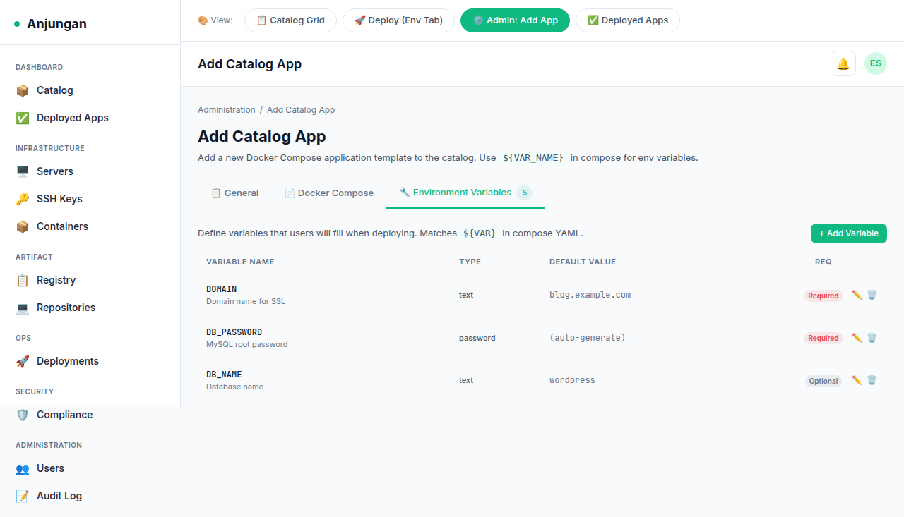
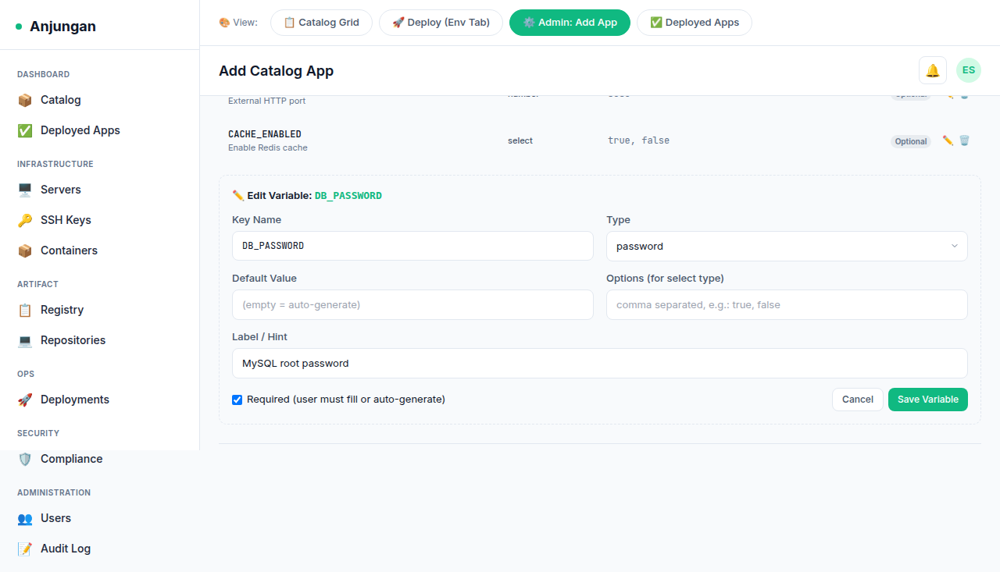
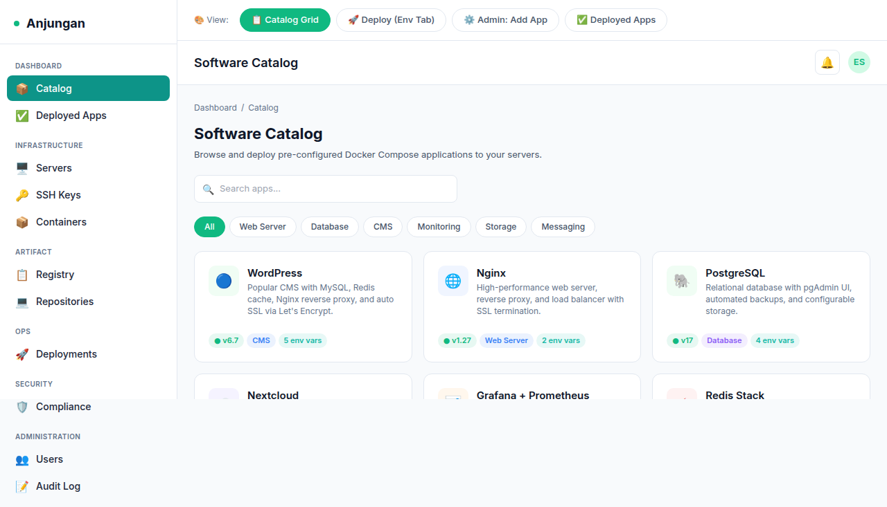
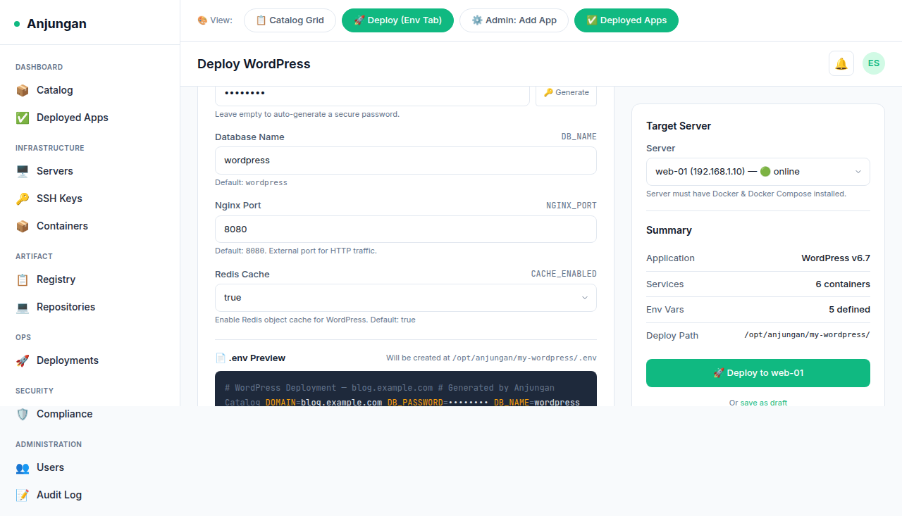
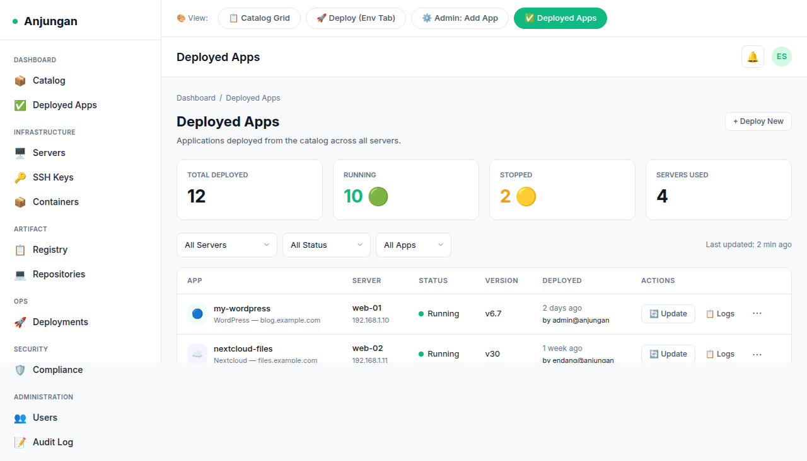

# Software Katalog — Product Requirements Document (PRD)

> **Feature:** Software Katalog (App Catalog) — recurring Docker Compose stack templates that admin can curate and users can deploy to any server with one click.
>
> **Project:** Anjungan IDP
> **Status:** Draft — Proposed for Phase 2
> **Last Updated:** June 2026

---

## 1. Vision

Transform Anjungan from a **server/container management tool** into a true **Internal Developer Platform (IDP)** by providing a self-service app catalog. Users deploy common services (WordPress, Nextcloud, N8N, MinIO, Metabase, etc.) without SSH, without env var guesswork, and without asking infra — just pick an app, fill the variables, choose a server, and deploy.

> *"App Store experience for your infrastructure."*

---

## 2. Goals & Success Metrics

### Goals

| # | Goal | Why |
|---|------|-----|
| G1 | Admin can create, edit, archive, and delete catalog entries | Core curation workflow |
| G2 | Users can deploy any catalog app to any registered server in ≤3 clicks | Self-service without infra tickets |
| G3 | Env variables are defined, typed, and documented — no guessing | Reduce deploy failures from missing vars |
| G4 | Deployed apps can be tracked, restarted, updated, and removed from one dashboard | Full lifecycle management |
| G5 | Coexist with existing Git-based deployment system | Both workflows are valid |

### Non-Goals

- This is **not** a CI/CD pipeline — no build steps, no git integration, no rollback history
- This is **not** a Helm chart manager — Docker Compose only for v1
- This is **not** a Kubernetes integration — Anjungan targets Docker/SSH hosts

---

## 3. User Personas & Stories

### Persona A: Platform Admin (Operates the catalog)

> *"I want to add a standard stack so the team can deploy it without calling me."*

**Stories:**
- As an admin, I can add a new catalog app with name, description, icon, category, and Docker Compose YAML
- As an admin, I can define typed environment variables (text, password, number, select) that users fill during deployment
- As an admin, I can preview/edit the compose file and env vars inline
- As an admin, I can archive or delete apps that are no longer maintained

### Persona B: Developer / End User (Consumes the catalog)

> *"I need a PostgreSQL instance for staging — let me grab it from the catalog."*

**Stories:**
- As a user, I can browse all available catalog apps with search and category filter
- As a user, I can open an app detail card to see description, compose preview, and required env vars
- As a user, I can click "Deploy" → fill environment variables → pick a server → deploy
- As a user, I can see all apps I've deployed (across all servers) in one "My Deployed Apps" page
- As a user, I can restart, update (re-pull), stop/start, or remove a deployed app
- As a user, I can view real-time deploy logs from the catalog deployment

---

## 4. Feature Specification

### 4.1 Admin: Catalog Management

#### 4.1.1 App CRUD (Admin-only)

| Endpoint | Method | Description |
|----------|--------|-------------|
| `/api/v1/catalog` | GET | List all catalog entries (paginated, filterable) |
| `/api/v1/catalog` | POST | Create new catalog entry |
| `/api/v1/catalog/{id}` | GET | Single catalog detail (with compose YAML + env vars) |
| `/api/v1/catalog/{id}` | PUT | Update catalog entry |
| `/api/v1/catalog/{id}` | DELETE | Delete catalog entry |

**App Schema:**
| Field | Type | Description |
|-------|------|-------------|
| id | UUID | Auto-generated |
| name | string | Display name (e.g., "WordPress") |
| description | string | Short description of the app |
| category | string | Grouping (e.g., "CMS", "Database", "Analytics", "Automation") |
| icon | string | Iconify icon name (e.g., "simple-icons:wordpress") |
| compose_yaml | text | Full Docker Compose YAML |
| version | string | Latest version tag (e.g., "6.7") |
| status | enum | active, archived |
| created_at | timestamp | |
| updated_at | timestamp | |

#### 4.1.2 Environment Variable Definitions (Admin)

Each catalog app can have N environment variable definitions. These tell the system what variables to collect from the user during deployment and what to put in the `.env` file.

| Field | Type | Description |
|-------|------|-------------|
| id | UUID | Auto-generated |
| catalog_app_id | UUID | FK → catalog_apps |
| key | string | Env var name (e.g., `WORDPRESS_DB_HOST`) |
| label | string | Human label (e.g., "Database Host") |
| hint | string | Optional helper text |
| type | enum | text, password, number, select |
| default_value | string | Optional default |
| required | boolean | Whether user must fill this |
| options | json | For select type: array of `{label, value}` pairs |
| sort_order | int | Display order in form |
| created_at | timestamp | |

**Auto-detect:** When admin pastes a compose YAML, backend parses `${VAR_NAME}` patterns in the YAML and suggests env var definitions automatically. Admin can review, edit, add, or remove.

#### 4.1.3 Admin UI — 3-Tab Editor

See mockup reference: `docs/assets/software-katalog/admin-env-vars.png`

| Tab | Content |
|-----|---------|
| **General** | Name, description, category, icon, version, status |
| **Docker Compose** | Full YAML editor (monaco/textarea) with syntax highlighting |
| **Environment Variables** | Table of all env var definitions — inline editable. Key, type, default, required, options. "Auto-detect from compose" button |

> **Mockup references:**
> - Admin env vars tab: 
> - Inline edit variable: 

### 4.2 User-Facing Catalog Page

#### 4.2.1 Catalog Grid

- Grid of cards (responsive: 4-col → 2-col → 1-col)
- Each card shows: icon, name, category badge, short description, env var count, "Deploy" button
- Search bar + category filter chips
- Click card → expand/show detail overlay or side panel with compose preview + env var list
- Empty state: "No apps in catalog yet — ask your admin to add some."

> **Mockup reference:** 

#### 4.2.2 Deploy Wizard

When user clicks "Deploy" on a catalog app:

1. **Step 1 — Env Variables Form**
   - Form fields auto-generated from env var definitions
   - Input types: text input, password (masked + "generate password" button), number input, select dropdown
   - Required fields marked with *
   - Helper text / hint shown below each field
   - Live `.env` preview panel on the right (auto-updates as user types)
   - "Generate secure password" for password-type fields

2. **Step 2 — Select Server**
   - Dropdown/select of available servers (from infra module)
   - Show server status, host, tags for context
   - "Test connection" indicator (optional, v2)

3. **Step 3 — Review & Deploy**
   - Summary: app name, server, env count, compose file preview
   - "Deploy" button → fires deployment job
   - Redirect to deployed app detail page with real-time logs

> **Mockup reference:** 

### 4.3 Deployed Apps Management

#### 4.3.1 "Deployed Apps" Page

A dedicated page showing all apps deployed via the catalog (separate from Git-based deployments).

**Stats Cards (top row):**
- Total deployed apps
- Running
- Stopped
- Failed

**Table/List Columns:**
| Column | Description |
|--------|-------------|
| App | Icon + name |
| Server | Target server name |
| Status | running / stopped / failed / deploying |
| Ports | Exposed ports (parsed from Docker) |
| Deployed At | Timestamp |
| Deployed By | User who deployed |
| Actions | Restart, Update, Start/Stop, Logs, Remove |

**Actions:**
| Action | Implementation |
|--------|----------------|
| **Restart** | SSH: `docker compose restart` in app directory |
| **Update** | SSH: `docker compose pull && docker compose up -d` |
| **Start** | SSH: `docker compose start` |
| **Stop** | SSH: `docker compose stop` |
| **Logs** | SSH: `docker compose logs --tail=100` → display in modal |
| **Remove** | SSH: `docker compose down -v` (with confirmation modal warning about data volumes) |

> **Mockup reference:** 

#### 4.3.2 Catalog Deployment Records

Each catalog deployment creates a record linked to the source app template, so updates know which compose file to pull.

**Catalog Deployments Table:**
| Field | Type | Description |
|-------|------|-------------|
| id | UUID | Auto-generated |
| catalog_app_id | UUID | FK → catalog_apps (nullable — if app is deleted, deployment record remains) |
| app_name | string | Snapshot of app name at deploy time |
| server_id | UUID | FK → servers |
| compose_dir | string | Path on target server (e.g., `/opt/anjugan/wordpress-blog`) |
| env_vars | json | Snapshot of env vars used at deploy time |
| version | string | App version deployed |
| status | enum | deploying, running, stopped, failed |
| assigned_port | string | Detected port mapping after deploy |
| deployed_by | UUID | FK → users |
| deployed_at | timestamp | |
| updated_at | timestamp | |

---

## 5. UI / UX Design

### 5.1 Design Principles

- Follow Anjungan's existing Emerald (`#10b981`) design system
- Dark + light mode compatibility
- Mobile responsive (grid stacks to single column)
- Consistent with existing deployment pages (same table patterns, button styles)
- Cancel on the right, primary action on the left
- Modals for confirmations, inline for edits

### 5.2 Navigation

- **Sidebar** — new "Catalog" item with icon (e.g., `solar:box-bold`) between "Deployments" and "Admin" (for admin, show "Manage Catalog" sub-item)
- **Deployed Apps** — accessible from sidebar as "My Apps" or from catalog page "View my deployed apps" link
- **Admin Catalog Editor** — accessible via Admin sidebar → "Software Catalog"

### 5.3 Component Hierarchy (Frontend)

```
frontend/src/
├── routes/
│   ├── catalog/
│   │   ├── +page.svelte              — Catalog grid (browse apps)
│   │   └── [id]/
│   │       ├── deploy/
│   │       │   └── +page.svelte      — Deploy wizard (steps 1-3)
│   │       └── +page.svelte          — App detail page
│   └── deployed-apps/
│       └── +page.svelte              — All catalog-deployed apps
├── lib/
│   └── components/
│       ├── catalog/
│       │   ├── CatalogCard.svelte     — Single app card in grid
│       │   ├── CatalogGrid.svelte     — Grid layout + search + filters
│       │   ├── EnvVarForm.svelte      — Dynamic env var form generator
│       │   ├── EnvPreview.svelte      — Live .env preview panel
│       │   ├── ServerSelect.svelte    — Server picker with status
│       │   └── DeployLogs.svelte      — Real-time deploy log viewer
│       └── admin/
│           └── catalog/
│               ├── CatalogEditor.svelte      — 3-tab admin editor
│               ├── ComposeEditor.svelte      — YAML editor tab
│               ├── EnvVarEditor.svelte       — Env var table tab
│               └── EnvVarInlineEdit.svelte   — Inline edit row
```

---

## 6. Technical Design

### 6.1 Backend Architecture

```
backend/internal/
└── catalog/                    # New package (parallel to deployment/)
    ├── handler.go              # HTTP handlers for catalog CRUD + deploy
    ├── service.go              # Business logic: deploy, parse compose, generate .env
    ├── types.go                # Request/response types
    └── ssh.go                  # SSH command execution helpers (reuse infra package)
```

**Integration with existing modules:**
- Reuses `infra` package for SSH connection management
- Reuses `deployment` package for audit logging pattern
- Reuses `govaluate` or similar for compose variable detection
- Env var auto-detect: regex `${VAR_NAME}` → suggest definitions

### 6.2 Deploy Engine

When user clicks "Deploy", the following happens:

```
1. Backend receives: catalog_app_id + env_vars (key:value map) + server_id
2. Lookup catalog app → get compose_yaml + env_var_definitions
3. Validate all required env vars are present
4. Generate .env content from env_vars
5. SSH into target server:
   a. mkdir -p /opt/anjugan/{app-name}-{random-suffix}
   b. Write docker-compose.yml via SCP/cat
   c. Write .env file via SCP/cat
   d. cd to directory && docker compose up -d
6. Capture output (stream to deploy log)
7. Create catalog_deployments record with status
8. Return deployment ID for tracking
```

### 6.3 Auto-Detect Compose Variables

When admin pastes compose YAML, backend:

1. Parses YAML
2. Finds all `${VAR_NAME}` or `$VAR_NAME` patterns in YAML values
3. Extracts unique variable names
4. Cross-references with existing env var definitions
5. Returns suggestions: `[{key: "VAR_NAME", type: "text"}]`
6. Admin accepts/rejects/edits suggestions before saving

### 6.4 Data Model

```sql
-- Catalog app templates (admin-managed)
CREATE TABLE catalog_apps (
    id            UUID PRIMARY KEY DEFAULT gen_random_uuid(),
    name          VARCHAR(255) NOT NULL,
    description   TEXT,
    category      VARCHAR(100),
    icon          VARCHAR(255),
    compose_yaml  TEXT NOT NULL,
    version       VARCHAR(50),
    status        VARCHAR(20) NOT NULL DEFAULT 'active', -- active, archived
    created_by    UUID REFERENCES users(id),
    created_at    TIMESTAMPTZ NOT NULL DEFAULT NOW(),
    updated_at    TIMESTAMPTZ NOT NULL DEFAULT NOW()
);

-- Environment variable definitions per catalog app
CREATE TABLE catalog_app_env_vars (
    id              UUID PRIMARY KEY DEFAULT gen_random_uuid(),
    catalog_app_id  UUID NOT NULL REFERENCES catalog_apps(id) ON DELETE CASCADE,
    key             VARCHAR(255) NOT NULL,
    label           VARCHAR(255),
    hint            TEXT,
    type            VARCHAR(20) NOT NULL DEFAULT 'text', -- text, password, number, select
    default_value   TEXT,
    required        BOOLEAN NOT NULL DEFAULT false,
    options         JSONB,       -- [{label:"Option 1", value:"opt1"}, ...]
    sort_order      INT NOT NULL DEFAULT 0,
    created_at      TIMESTAMPTZ NOT NULL DEFAULT NOW()
);

-- Records of apps deployed from catalog
CREATE TABLE catalog_deployments (
    id              UUID PRIMARY KEY DEFAULT gen_random_uuid(),
    catalog_app_id  UUID REFERENCES catalog_apps(id) ON DELETE SET NULL,
    app_name        VARCHAR(255) NOT NULL,
    server_id       UUID NOT NULL REFERENCES servers(id) ON DELETE CASCADE,
    compose_dir     VARCHAR(512) NOT NULL,
    env_vars        JSONB,       -- snapshot of env vars used
    version         VARCHAR(50),
    status          VARCHAR(20) NOT NULL DEFAULT 'deploying',
    assigned_port   VARCHAR(50),
    deployed_by     UUID REFERENCES users(id),
    deployed_at     TIMESTAMPTZ NOT NULL DEFAULT NOW(),
    updated_at      TIMESTAMPTZ NOT NULL DEFAULT NOW()
);

CREATE INDEX idx_catalog_app_env_vars_app_id ON catalog_app_env_vars(catalog_app_id);
CREATE INDEX idx_catalog_deployments_app_id ON catalog_deployments(catalog_app_id);
CREATE INDEX idx_catalog_deployments_server_id ON catalog_deployments(server_id);
CREATE INDEX idx_catalog_deployments_user_id ON catalog_deployments(deployed_by);
```

### 6.5 API Routes

All routes under `/api/v1/catalog` (auth middleware required):

```
## Catalog Apps (Admin: POST/PUT/DELETE require admin role)
GET    /api/v1/catalog                    → List all active apps
GET    /api/v1/catalog?status=all         → List all apps (including archived)
GET    /api/v1/catalog?category=Database  → Filter by category
POST   /api/v1/catalog                    → Create app (admin)
GET    /api/v1/catalog/{id}               → Get app detail
PUT    /api/v1/catalog/{id}               → Update app (admin)
DELETE /api/v1/catalog/{id}               → Delete app (admin)

## Env Var Definitions (nested under catalog app)
POST   /api/v1/catalog/{id}/env-vars/detect  → Auto-detect vars from compose (admin)
GET    /api/v1/catalog/{id}/env-vars          → List env vars for app
POST   /api/v1/catalog/{id}/env-vars          → Create env var (admin)
PUT    /api/v1/catalog/{id}/env-vars/{eid}    → Update env var (admin)
DELETE /api/v1/catalog/{id}/env-vars/{eid}    → Delete env var (admin)
PUT    /api/v1/catalog/{id}/env-vars/reorder  → Reorder env vars (admin)

## Catalog Deployment (user-facing)
POST   /api/v1/catalog/{id}/deploy            → Deploy app to server (user)
GET    /api/v1/catalog/deployments            → List all catalog deployments
GET    /api/v1/catalog/deployments/{did}      → Get deployment detail
GET    /api/v1/catalog/deployments/{did}/logs → Get deployment logs (SSH output)
POST   /api/v1/catalog/deployments/{did}/restart   → Restart (user)
POST   /api/v1/catalog/deployments/{did}/update     → Pull + up -d (user)
POST   /api/v1/catalog/deployments/{did}/stop       → Stop (user)
POST   /api/v1/catalog/deployments/{did}/start      → Start (user)
POST   /api/v1/catalog/deployments/{did}/remove      → docker compose down -v (user)
```

---

## 7. Phased Implementation Plan

### Phase 1 — Foundation (v1.0-alpha)

**Backend:**
- [ ] Create `catalog` package (handler, service, types)
- [ ] DB migrations: `catalog_apps`, `catalog_app_env_vars`, `catalog_deployments`
- [ ] Admin CRUD API for catalog apps and env vars
- [ ] Auto-detect compose variables endpoint
- [ ] Deploy engine: SSH → write compose + .env → `docker compose up -d`
- [ ] Catalog deployment CRUD + status tracking
- [ ] Lifecycle actions: restart, update, stop, start, remove (SSH-based)

**Frontend:**
- [ ] Catalog grid page (browse, search, filter)
- [ ] App detail card (compose preview, env var list)
- [ ] Admin: 3-tab editor (General, Compose, Env Vars)
- [ ] Admin: Env var inline edit with auto-detect
- [ ] Deploy wizard: env form → server select → review → deploy
- [ ] Env form with type-aware inputs (password generate, select, etc.)
- [ ] Deployed apps page with table + actions
- [ ] Deploy log viewer (real-time stream)

### Phase 2 — Polish (v1.0-beta)

- [ ] Live `.env` preview panel during deploy wizard
- [ ] Deploy history per catalog app
- [ ] Notification on deploy complete/failed
- [ ] Server selection with filter (by tag, region, status)
- [ ] Port conflict detection before deploy
- [ ] Auto-backup compose file before update (rollback support)

### Phase 3 — Advanced (v1.1+)

- [ ] Version history (admin can keep multiple compose versions)
- [ ] Health check URLs per app template
- [ ] Custom domain / reverse proxy setup (auto nginx config?)
- [ ] Resource limits suggestion (CPU/mem from compose)
- [ ] App dependency graph (e.g., WordPress needs MySQL)
- [ ] Export/import catalog between Anjungan instances

---

## 8. Edge Cases & Open Questions

### Edge Cases

| # | Edge Case | Mitigation |
|---|-----------|------------|
| E1 | Server SSH connection fails during deploy | Status = "failed", show SSH error log to user, allow retry |
| E2 | Port conflict (chosen port already in use) | Detect via `docker ps` before deploy, surface warning but let user override |
| E3 | Admin deletes a catalog app that has active deployments | `ON DELETE SET NULL` on FK — deployment records stay, but source template gone. Show warning before delete |
| E4 | Compose YAML has syntax errors | Validate YAML before saving. Show parse error with line number |
| E5 | Duplicate app names | Unique constraint on `name` for active apps. Archived apps can have same name |
| E6 | Very long deploy output (>10K lines) | Stream via Server-Sent Events (SSE) or WebSocket. Truncate stored logs to last 1000 lines |
| E7 | User deploys same app twice to same server | Allow it — use random suffix for compose directory. The `catalog_app_id` tracks the *template*, not a single instance |
| E8 | Docker compose `down -v` removes volumes | Confirmation dialog with warning about data loss. Admin can mark apps as "has data volumes" in template |
| E9 | Env var key conflicts with Docker reserved vars | Block reserved keys (e.g., `PATH`, `HOME`, `HOSTNAME`) in validation |

### Open Questions

1. **Should the deploy be synchronous (blocking) or async (background job)?**
   - Recommendation: Async with real-time log streaming via SSE. User sees logs as they happen.
   - Status polling fallback for clients that don't support SSE.

2. **How to handle secrets in env vars (passwords, API keys)?**
   - Store in DB as encrypted at rest (AES-256 with app key)?
   - Or store as plaintext in the deployment snapshot (since it's needed for future restarts)?
   - Recommendation v1: Plaintext in DB with `pgcrypto` column-level encryption for password-type vars. Full secret management in Phase 3.

3. **Where to store compose files on the target server?**
   - Convention: `/opt/anjugan/{app-slug}-{random-suffix}/`
   - Should admin configure a base path per server?

4. **Update strategy — `docker compose pull && up -d` is simple, but what about config changes?**
   - V1: Just re-write compose + .env, then `up -d`. Works for most stateless services.
   - V2: Diff old vs new compose, warn about breaking changes.

5. **Multi-node / cluster deployments?**
   - V1: Single server only.
   - V2: Deploy to multiple servers (same config, different env vars per server).

---

## 9. Mockup Screenshots

| View | Screenshot |
|------|-----------|
| **Catalog Grid** — Browsing available apps with search and category filter |  |
| **Deploy Wizard** — Env var form with live .env preview, server selection, review |  |
| **Admin: Env Vars Tab** — 3-tab editor showing env variable definitions table |  |
| **Admin: Inline Edit** — Click to edit env variable properties (key, type, default, required) |  |
| **Deployed Apps** — All catalog-deployed apps with status and lifecycle actions |  |

---

## 10. Relationship to Existing Features

### How it Differs from Git-based Deployments

| Aspect | Git-based Deployment (Existing) | Catalog Deployment (New) |
|--------|--------------------------------|------------------------|
| Source | GitHub/Forgejo repo — code | Admin-curated template — Docker Compose |
| Trigger | Push → build → deploy | One-click from catalog |
| Config | Branch, commit, docker image | Env vars form, server select |
| Target | Any registered server | Any registered server |
| Lifecycle | Manual updates per deploy | Update button = pull + up -d |
| Rollback | Yes (version history) | Not in v1 (Phase 3) |

### Shared Infrastructure

- **SSH module** — both use `infra` package's SSH connection
- **Audit logging** — both log to `audit_log` table
- **Server selection** — both reference `servers` table
- **Access control** — both respect RBAC roles

---

## 11. Dependencies

| Dependency | Why | Status |
|------------|-----|--------|
| Anjungan backend >= v0.1 | Chi router, DB, auth middleware, SSH infra | ✅ Existing |
| Anjungan frontend >= v0.1 | SvelteKit, Tailwind, Iconify, API client | ✅ Existing |
| SSH access to target servers | Required for `docker compose` commands | ✅ Existing (from infra) |
| Docker + Docker Compose on target servers | Compose plugin (v2) or standalone | ⚠️ Need to verify on deploy |
| PostgreSQL JSONB | For `env_vars` and `options` columns | ✅ Existing |

---

## 12. Risks & Mitigations

| Risk | Impact | Mitigation |
|------|--------|------------|
| Compose YAML with malicious volume mounts (host FS access) | Security breach | Admin-only create/edit. Code review for catalog entries. Sandbox compose via validation |
| User deploys to wrong server (e.g., staging app to production) | Data loss / confusion | Clear server labels, tags, environment markers. Confirmation step with server details |
| Docker compose syntax evolves (v2 → v3) | Deploy failures | Backend just passes YAML to server's Docker — version compatibility handled by Docker itself |
| Server disk fills up from app data | Service degradation | Disk usage warning in server health. Phase 2: quota enforcement |
| Catalog explosion (1000s of apps) | UI clutter | Categories, search, archive old apps |

---

*End of PRD — next step: Implementation plan (detailed task breakdown)*
