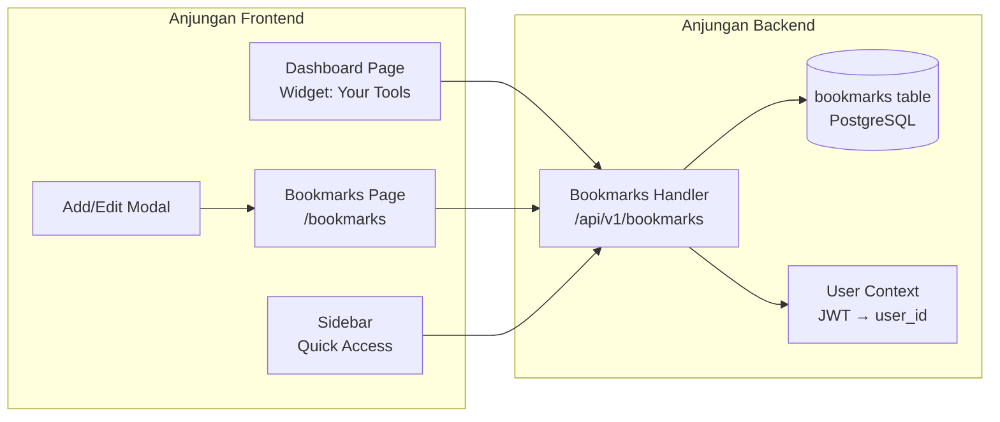
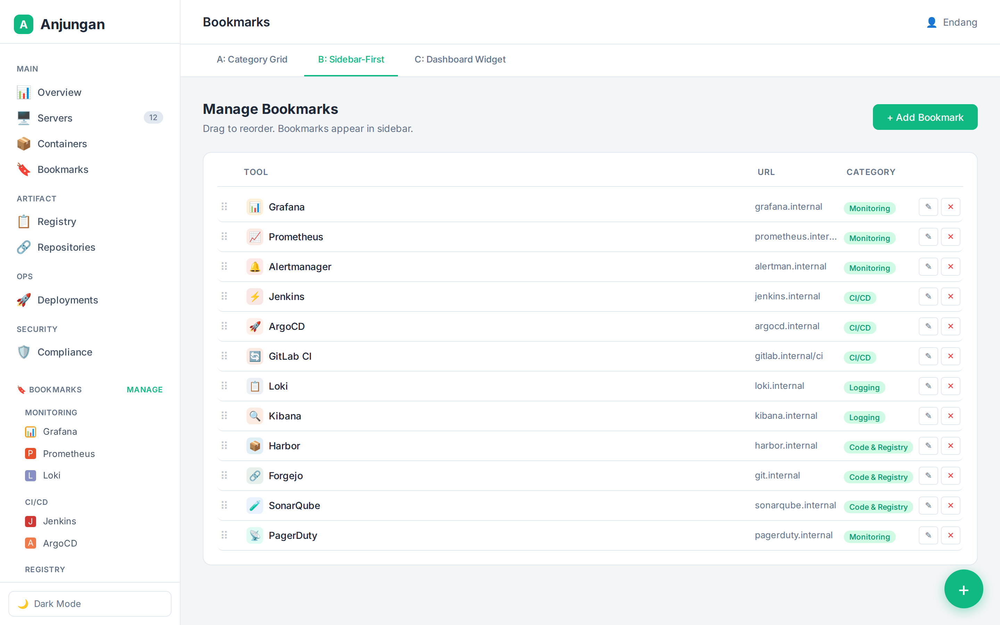
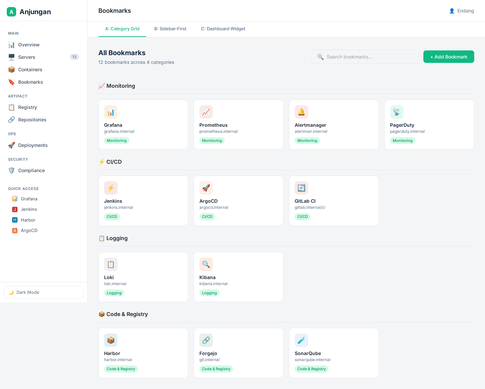
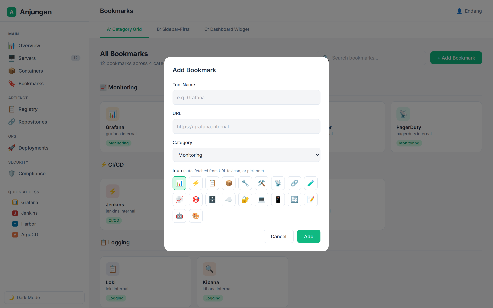
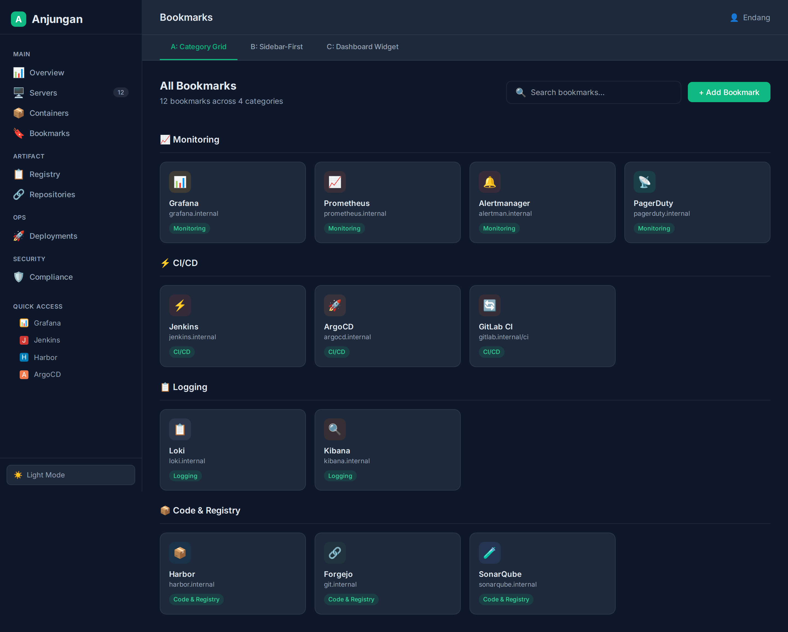

# Anjungan — PRD: Bookmarks (Tool Shortcuts)

> **Version:** 1.0
> **Status:** Draft
> **Author:** Endang Suwarna
> **Last Updated:** June 5, 2026

---

## 1. Executive Summary

### Problem Statement

Developer sehari-hari buka banyak tools — Grafana buat monitoring, Jenkins buat CI/CD, Harbor buat registry, ArgoCD buat deploy, SonarQube buat code quality, Jira buat tracking, dan masih banyak lagi. Selama ini:

- **Browser bookmark** — campur aduk sama bookmark pribadi, susah dicari
- **Mental map** — "grafana.internal:9090" diinget manual
- **Spreadsheet / notes** — catat URL di mana aja, gak terpusat
- **Onboarding** — developer baru tanya "URL tools X di mana?"

Anjungan sebagai IDP udah jadi single pane of glass buat infra management (servers, containers, compliance, deployments). Tapi belum ada tempat buat nyimpen **links ke tools eksternal** yang dipake sehari-hari.

**Bookmarks feature solving this:**
- **Dashboard widget** — 8 tools favorit langsung kelihatan pas login
- **Dedicated page** — full management dengan kategori
- **Sidebar quick access** — akses dari halaman mana aja
- **Per-user** — tiap orang punya bookmark sendiri
- **Auto-favicon** — gak perlu upload gambar, fetch otomatis dari URL

### Target Audience

| Persona | Pain | Benefit |
|---------|------|---------|
| **Endang (admin)** | 15+ tools, lupa URL | Satu tempat buat semua tools |
| **Developer** | Tanya "URL X di mana?" | Lihat di dashboard / sidebar |
| **New hire** | Onboarding lama | Langsung lihat ekosistem tools |

### Goals

| Goal | Metric |
|------|--------|
| Kurangi waktu cari URL tools | < 2 detik dari login |
| Single source of truth buat tool URLs | 100% tools terdaftar di bookmark |
| Zero onboarding friction | New hire bisa akses semua tools di hari 1 |
| Zero gambar manual | Auto-favicon dari URL |

### Current Status (June 2026)

🔴 **Bookmarks feature is NOT yet implemented.** This PRD is a proposal for the new feature.

---

## 2. Product Overview

### Arsitektur



**Data flow:**
```
User login → JWT → Backend verify → 
  ├─ GET /api/v1/bookmarks → fetch by user_id → sorted by sort_order
  │   └─ Dashboard widget: limit 8
  │   └─ Bookmarks page: all, grouped by category
  │   └─ Sidebar: top 5
  ├─ POST /api/v1/bookmarks → create (title, url, category, icon)
  ├─ PUT /api/v1/bookmarks/{id} → update
  ├─ PATCH /api/v1/bookmarks/reorder → bulk sort_order update
  └─ DELETE /api/v1/bookmarks/{id} → delete
```

### Tech Stack

| Component | Technology | Reason |
|-----------|-----------|--------|
| Backend | Go (chi) | Existing pattern — reuses Repository pattern |
| DB | PostgreSQL | Existing — new migration `000020` |
| Auth | JWT (user_id) | Existing — reuses auth middleware |
| Frontend | Svelte 5 + Tailwind | Existing — emerald theme, .card pattern |
| Icons | Iconify Solar + auto-favicon fetch | Existing icon system |
| Auto-favicon | Google favicon API / direct fetch | `https://www.google.com/s2/favicons?domain=...` |

### Design Mockups

> 3 varian desain telah dibuat. Hybrid approach yang dipilih: **Variant C (Dashboard Widget) + Variant A (Category Grid)** — lihat detail di Design References (Section 10).










---

## 3. Feature Specifications

> **Legend:** P0 = Core (v1.0) | P1 = Important (v1.1) | P2 = Future

### F1 — Bookmarks CRUD (Backend Core)

| | |
|---|---|
| **Priority** | P0 |
| **Status** | 🔴 **Planned** |
| **Backend** | 5 endpoints: `GET /api/v1/bookmarks` — list by user_id, sorted by sort_order. `POST /api/v1/bookmarks` — create (title, url, category, icon_type, icon_value). `PUT /api/v1/bookmarks/{id}` — update (owner-only, verify user_id). `DELETE /api/v1/bookmarks/{id}` — delete (owner-only). `PATCH /api/v1/bookmarks/reorder` — bulk update sort_order (accepts `[{id, sort_order}, ...]`). All endpoints use existing `auth.Middleware` + extract `user.id` from JWT claims. Audit logging on create/update/delete via existing `audit.Log()`. |
| **Frontend** | — |
| **Data** | `bookmarks` table — see Section 4. |

### F2 — Bookmarks Management Page (/bookmarks)

| | |
|---|---|
| **Priority** | P0 |
| **Status** | 🔴 **Planned** |
| **Backend** | (uses F1 endpoints) |
| **Frontend** | Route `/bookmarks`. Layout: page header with title "Bookmarks" + "Add Bookmark" button + search bar. Content: category sections (Monitoring, CI/CD, Logging, Code & Registry, Internal Tools, Other). Each bookmark as a **card**: icon/favicon (40×40), tool name (bold), URL (subtle, truncated), category pill badge. Cards in a responsive grid: 4 columns desktop → 2 columns tablet → 1 column mobile. Click card → open URL in new tab (`target="_blank"` + `rel="noopener noreferrer"`). Search bar filters by title + URL in real-time. |
| **UX** | **Loading:** skeleton cards grid (4 placeholder cards). **Empty state:** "🔖 No bookmarks yet — add your first tool!" with prominent "Add Bookmark" CTA + example: "Start with Grafana, Jenkins, or Harbor." **Error:** toast on API failure. **Edge case:** URL without protocol → auto-prepend `https://`. Long title → truncate with ellipsis at 2 lines. |

### F3 — Dashboard Widget "Your Tools"

| | |
|---|---|
| **Priority** | P0 |
| **Status** | 🔴 **Planned** |
| **Backend** | Reuses `GET /api/v1/bookmarks` — frontend limits to 8 on dashboard. Could add `?limit=8` param for optimization. |
| **Frontend** | Widget on Dashboard page `/` — placed after stat cards, before recent activity. Title: "🔖 Your Tools" with "Manage Bookmarks →" link to `/bookmarks`. Grid of 8 bookmark items: icon (24×24) + name (13px). Compact design — no cards, just hoverable rows with border on hover. Click → open URL. **Empty state:** smaller version of empty state — "No tools yet" + "Add Bookmark" button inline. **Scrolling:** if > 8 bookmarks, show "View all →" link. |
| **UX** | Widget should be visually lightweight — not competing with stat cards. Row layout with subtle hover border. The "Manage Bookmarks" link is right-aligned in the widget header. |

### F4 — Sidebar Quick Access

| | |
|---|---|
| **Priority** | P1 |
| **Status** | 🔴 **Planned** |
| **Backend** | Reuses `GET /api/v1/bookmarks` — fetches first 5 bookmarks (lowest sort_order = most important). |
| **Frontend** | Collapsible section in Sidebar (`Sidebar.svelte`) named "⚡ Quick Access". Shows 5 bookmarks as compact icon + label. Each item: favicon (16×16) + tool name (13px). Click → open URL in new tab. "Manage" link at bottom → `/bookmarks`. Section is collapsed by default on mobile, expanded on desktop. State persisted in `localStorage` (collapsed/expanded). Bookmarks data fetched reactively — updated when user adds/deletes. |
| **UX** | Should NOT bloat the sidebar — compact, single-line items. Category labels NOT shown in sidebar (only tool name). If user has < 5 bookmarks, show only existing ones (no empty state). |

### F5 — Add/Edit Bookmark Modal

| | |
|---|---|
| **Priority** | P0 |
| **Status** | 🔴 **Planned** |
| **Backend** | Uses F1 POST/PUT endpoints |
| **Frontend** | Modal component (`BookmarkFormModal.svelte`) with fields: **Tool Name** (text input, required, max 100 chars), **URL** (text input, required, validates URL format, auto-prepend `https://` if missing protocol), **Category** (dropdown: Monitoring, CI/CD, Logging, Code & Registry, Internal Tools, Other — matches sidebar categories), **Icon** (auto-favicon preview + Iconify picker fallback — fetch favicon from URL on blur, show preview; if favicon unavailable, show emoji grid picker). **Edit mode:** pre-fill all fields from existing bookmark. **Create mode:** empty form. Submit button: "Add" (create) / "Update" (edit). Cancel button → close modal. |
| **UX** | Modal centered, max-width 480px. Favicon auto-preview: on URL blur, show loading spinner → if favicon found, display it → if not, fallback to text-based icon (first letter of tool name). Form validation: URL required + valid format, name required. Error toast on API failure. Keyboard: Enter to submit, Esc to close. |

### F6 — Drag-to-Reorder

| | |
|---|---|
| **Priority** | P1 |
| **Status** | 🔴 **Planned** |
| **Backend** | `PATCH /api/v1/bookmarks/reorder` — accepts `[{id, sort_order}, ...]` in request body. Batch update dalam 1 transaction. Also allow individual `PUT /api/v1/bookmarks/{id}` with `sort_order` field. |
| **Frontend** | On Bookmarks page `/bookmarks`, enable drag handle (⠿ icon, subtle). User can drag cards to reorder within and across categories. Reorder triggers debounced API call (500ms after last drag) to persist new order. Visual feedback: card lifts on drag, drop zone highlighted. Implement via HTML5 Drag & Drop API (no external library needed). |
| **UX** | Drag handle only visible on hover or in "manage" mode. Gravity: dropped card slides into target position with CSS transition. If API call fails, card snaps back to original position + error toast. |

### F7 — Auto-Favicon from URL

| | |
|---|---|
| **Priority** | P0 |
| **Status** | 🔴 **Planned** |
| **Backend** | Store `icon_type` (`auto`, `iconify`, `emoji`) and `icon_value` in DB. For `auto`, store the favicon URL after successful fetch. On create/update, backend attempts to fetch favicon from URL (`https://www.google.com/s2/favicons?domain=...` or direct `GET domain/favicon.ico`). If fetch succeeds, save `icon_type=auto` + `icon_value=<favicon_url>`. If fails, fall back to `icon_type=emoji` + `icon_value=🔗` (default). |
| **Frontend** | Display icon based on `icon_type`: **auto** → `` in card/icon circle. **iconify** → `<Icon icon={icon_value} />`. **emoji** → `<span>{icon_value}</span>`. Card icon container: 40×40px rounded-xl with subtle background (emerald-subtle). Fallback for broken favicon images: show first letter of tool name. |

### F8 — Search & Filter

| | |
|---|---|
| **Priority** | P1 |
| **Status** | 🔴 **Planned** |
| **Backend** | `GET /api/v1/bookmarks?q=search&category=...` — optional query params for server-side filtering (useful when bookmarks > 50). Otherwise, frontend-side filtering is sufficient for most users. |
| **Frontend** | Search bar at top of `/bookmarks` page. Filters bookmarks in real-time by title and URL (case-insensitive). Category filter pills below search bar: "All", "Monitoring", "CI/CD", "Logging", "Code & Registry", "Internal Tools", "Other". Active pill highlighted with emerald-primary style. If search + filter combination returns 0 results: "No bookmarks match your search" + clear filter CTA. |

---

## 4. Database Schema

### 000020_create_bookmarks.up.sql

```sql
CREATE TABLE bookmarks (
    id          UUID PRIMARY KEY DEFAULT gen_random_uuid(),
    user_id     UUID NOT NULL REFERENCES users(id) ON DELETE CASCADE,
    title       TEXT NOT NULL,
    url         TEXT NOT NULL,
    icon_type   TEXT NOT NULL DEFAULT 'auto'
                CHECK (icon_type IN ('auto', 'iconify', 'emoji')),
    icon_value  TEXT,
    category    TEXT NOT NULL DEFAULT 'Other'
                CHECK (category IN (
                    'Monitoring', 'CI/CD', 'Logging',
                    'Code & Registry', 'Internal Tools', 'Other'
                )),
    sort_order  INTEGER NOT NULL DEFAULT 0,
    created_at  TIMESTAMPTZ NOT NULL DEFAULT NOW(),
    updated_at  TIMESTAMPTZ NOT NULL DEFAULT NOW()
);

CREATE INDEX idx_bookmarks_user_id ON bookmarks(user_id);
CREATE INDEX idx_bookmarks_sort ON bookmarks(user_id, sort_order);
```

### Design Notes

| Field | Notes |
|-------|-------|
| `user_id` | FK ke `users(id)` — per-user bookmarks. Cascade delete: kalo user dihapus, bookmarknya ilang. |
| `icon_type` | `auto` = favicon dari URL, `iconify` = Iconify SVG icon, `emoji` = emoji fallback |
| `icon_value` | Untuk `auto`: favicon URL. Untuk `iconify`: icon name (e.g. `solar:chart-2-bold`). Untuk `emoji`: emoji character. |
| `sort_order` | 0-based. Drag reorder updates this field. GET returns sorted ascending. |
| `category` | Enum constraint — kalo mau nambah kategori, perlu migration baru. |

---

## 5. API Design

### Endpoints

| Method | Path | Auth | Description |
|--------|------|------|-------------|
| `GET` | `/api/v1/bookmarks` | JWT | List user's bookmarks, sorted by `sort_order`. Optional: `?limit=N&category=X&q=search` |
| `POST` | `/api/v1/bookmarks` | JWT | Create bookmark — body: `{title, url, icon_type?, icon_value?, category?, sort_order?}` |
| `PUT` | `/api/v1/bookmarks/{id}` | JWT | Update bookmark (owner only) |
| `DELETE` | `/api/v1/bookmarks/{id}` | JWT | Delete bookmark (owner only) |
| `PATCH` | `/api/v1/bookmarks/reorder` | JWT | Bulk reorder — body: `[{id, sort_order}, ...]` |

### Response Format

All responses follow existing Anjungan convention:

```json
// GET /api/v1/bookmarks
{
  "success": true,
  "data": [
    {
      "id": "uuid",
      "title": "Grafana",
      "url": "https://grafana.internal",
      "icon_type": "auto",
      "icon_value": "https://grafana.internal/favicon.ico",
      "category": "Monitoring",
      "sort_order": 0,
      "created_at": "2026-06-05T10:00:00Z",
      "updated_at": "2026-06-05T10:00:00Z"
    }
  ]
}

// POST /api/v1/bookmarks
{
  "success": true,
  "data": {
    "id": "uuid",
    "title": "Grafana",
    "url": "https://grafana.internal",
    "icon_type": "auto",
    "icon_value": null,
    "category": "Monitoring",
    "sort_order": 0,
    "created_at": "2026-06-05T10:00:00Z",
    "updated_at": "2026-06-05T10:00:00Z"
  }
}
```

---

## 6. Non-Functional Requirements

| Aspect | Target |
|--------|--------|
| **Performance** | GET bookmarks < 50ms (indexed by user_id) |
| **Auto-favicon fetch** | Non-blocking — return bookmark immediately, fetch favicon async |
| **Offline resilience** | Bookmark page shows cached data if API fails (last-known state) |
| **Security** | User can only CRUD their own bookmarks (user_id from JWT) |
| **Storage** | Negligible — each bookmark < 500 bytes. 100 bookmarks/user × 100 users = ~5MB |
| **URL safety** | Sanitize URLs before storage — reject `javascript:`, `file:`, `data:` protocols |
| **Mobile** | Responsive grid: 4→2→1 columns. Sidebar accessible via hamburger |
| **Dark mode** | Full support — card backgrounds, text, borders adapt to theme |

---

## 7. UI/UX Design Guidelines

### Card Design

```
┌──────────────────────────────────┐
│  ┌──────┐                        │
│  │ 📊   │  Grafana               │
│  │      │  grafana.internal      │
│  └──────┘  ┌──────────┐          │
│            │Monitoring│          │
│            └──────────┘          │
└──────────────────────────────────┘
```

- **Card:** `rounded-xl`, border `1px solid var(--border)`, padding `16px`, `bg-card`
- **Hover:** border changes to `var(--primary)` (#10b981), subtle shadow lift
- **Icon:** 40×40px, `rounded-xl`, centered icon/text, background `rgba(16,185,129,0.12)` (emerald-subtle)
- **Title:** 14px, font-weight 600
- **URL:** 12px, `var(--text-muted)` (#64748b / #94a3b8), single-line truncate
- **Category pill:** 11px, `rounded-full`, background `rgba(16,185,129,0.12)`, text `#059669` (light) / `#34d399` (dark)
- **Grid:** `display: grid; grid-template-columns: repeat(4, 1fr); gap: 16px`

### Dashboard Widget

```
┌─────────────────────────────────────────────┐
│ 🔖 Your Tools                  Manage →    │
│                                             │
│ 📊 Grafana  ⚡ Jenkins  📦 Harbor  🚀 ArgoCD│
│ 📈 Prometh. 🔍 Kibana  📋 Loki    🔗 Forgejo│
│                                             │
└─────────────────────────────────────────────┘
```

- **Widget:** `rounded-xl`, border, padding `20px`, `bg-card`
- **Title:** 14px, font-weight 600, with "Manage →" right-aligned (links to `/bookmarks`)
- **Items:** flex row, padding `10px 12px`, border-radius `8px`, hover: `bg-nav-hover`
- **Icon:** 24×24px, `rounded-lg`
- **Grid:** 4 columns desktop, 2 columns mobile

### Sidebar Quick Access

```
  ⚡ Quick Access ▼
    📊 Grafana
    ⚡ Jenkins
    📦 Harbor
    🚀 ArgoCD
    📈 Prometheus
    Manage →
```

- **Section title:** 13px, `var(--text-muted)`, collapsible toggle
- **Items:** 13px, 6px 12px 6px 24px padding, hover: `bg-nav-hover`
- **Icon:** 16×16px, `rounded-sm`

### Color Semantics

| Element | Light Mode | Dark Mode |
|---------|-----------|-----------|
| Card background | `#ffffff` | `#1e293b` |
| Card border | `#e2e8f0` | `rgba(148,163,184,0.15)` |
| Card hover border | `#10b981` | `#10b981` |
| Primary text | `#1e293b` | `#e2e8f0` |
| Muted text (URL) | `#64748b` | `#94a3b8` |
| Category pill bg | `#d1fae5` | `rgba(16,185,129,0.15)` |
| Category pill text | `#059669` | `#34d399` |

---

## 8. Implementation Roadmap

### Phase 1: Core Bookmarks (v1.0)

| Order | Feature | Effort | Depends On |
|-------|---------|--------|-----------|
| 1 | DB migration `000020_create_bookmarks` | 0.5 day | — |
| 2 | Backend CRUD handler + Repository methods | 1 day | #1 |
| 3 | Frontend Bookmarks page `/bookmarks` | 1.5 days | #2 |
| 4 | Dashboard widget "Your Tools" | 0.5 day | #2 |
| 5 | Add/Edit modal + form validation | 0.5 day | #3 |
| 6 | Auto-favicon (frontend fetch + display) | 0.5 day | #5 |
| **Total** | | **4.5 days** | |

### Phase 2: Enhancement (v1.1)

| Order | Feature | Effort | Depends On |
|-------|---------|--------|-----------|
| 1 | Sidebar Quick Access | 0.5 day | Phase 1 |
| 2 | Search + category filter (frontend) | 0.5 day | Phase 1 |
| 3 | Drag-to-reorder | 1 day | Phase 1 |

### Phase 3: Future

| Feature | Effort | Notes |
|---------|--------|-------|
| Server-side search (for 50+ bookmarks) | 0.5 day | Add query params to GET endpoint |
| Admin global bookmarks | 1 day | New `is_global` column, admin UI |
| Import from browser bookmarks HTML | 1-2 days | Parse Chrome/Firefox HTML export |
| Export bookmarks | 0.5 day | JSON/CSV export endpoint |

---

## 9. Non-Feature: Scope Boundaries

### What This PRD Does NOT Cover

| Aspek | Kenapa Tidak |
|-------|-------------|
| **Monitoring tool health** | Beda concern — bookmark cuma nyimpen URL, gak ngecek apakah toolnya online |
| **SSO / proxy** | Bookmark langsung ke URL tools, gak lewat proxy Anjungan |
| **Bookmark from browser import** | Phase 3 — fitur tambahan, gak kritikal buat v1 |
| **Shared/team bookmarks** | Phase 3 — perlu model data beda (shared_bookmarks table) |
| **Built-in browser** | Gak ada rencana bikin browser di Anjungan — bookmark open in new tab |

---

## 10. Design References

### Mockup Screenshots Catalog

| File | Description | What It Shows |
|------|-------------|---------------|
| `../sketches/bookmarks/001-variant-a-category-grid.png` | **Variant A — Category Grid** | Full Bookmarks page with 4 category sections (Monitoring, CI/CD, Logging, Code & Registry). Card grid layout. Search bar at top. Sidebar shows compact Quick Access section with 4 items. Light mode. |
| `../sketches/bookmarks/002-variant-b-sidebar-first.png` | **Variant B — Sidebar-First** | Sidebar has full bookmark categories with expandable sections. Dedicated page is a management list view with drag handles, edit/delete buttons. FAB "+" button. |
| `../sketches/bookmarks/003-variant-c-dashboard-widget.png` | **Variant C — Dashboard Widget** | Dashboard with stat cards + "Your Tools" widget showing 8 bookmark items. "Recently Added" card next to it. Links to full Bookmarks page. |
| `../sketches/bookmarks/004-variant-a-with-modal.png` | **Add Bookmark Modal** | Modal with fields: Tool Name, URL, Category dropdown, Icon emoji picker. Shows validation and favicon auto-preview area. |
| `../sketches/bookmarks/005-variant-a-dark-mode.png` | **Dark Mode — Category Grid** | Variant A in dark mode. Card backgrounds `#1e293b`, sidebar `#0f172a`, emerald accents visible. |

### Design Decision: Hybrid A+C (Selected)

> **Keputusan:** Implementasi menggabungkan **Variant C (Dashboard Widget)** sebagai primary access + **Variant A (Category Grid)** sebagai dedicated management page.

| Layer | Variant Source | Description |
|-------|---------------|-------------|
| **Layer 1 — Dashboard** | C | "Your Tools" widget — 8 bookmarks, visible pas login |
| **Layer 2 — Sidebar** | A (compact) | Collapsible "Quick Access" — 5 bookmarks, visible dari mana aja |
| **Layer 3 — Dedicated Page** | A | `/bookmarks` — full management, categories, search, CRUD |

Variant B (Sidebar-First) di-reject karena sidebar Anjungan udah crowded dengan nav items. Bookmark kategori di sidebar bakal jadi noise.

---

## 11. Glossary

| Term | Definition |
|------|------------|
| **Favicon** | Website icon (16×16 or 32×32) — auto-fetched from URL's `/favicon.ico` or Google favicon API |
| **Category** | Grouping label untuk bookmark — Monitoring, CI/CD, Logging, Code & Registry, Internal Tools, Other |
| **Quick Access** | Collapsible sidebar section yang nampilin 5 bookmark teratas |
| **Your Tools widget** | Dashboard component yang nampilin 8 bookmark teratas di halaman utama |
| **Auto-favicon** | Fetch favicon otomatis dari URL bukuan upload gambar manual |
| **Iconify** | Icon library (Solar set) yang udah dipake di sidebar Anjungan |

---

## 12. References

- [PRD.md](./PRD.md) — Main Anjungan PRD
- [PRD-compliance.md](./PRD-compliance.md) — Compliance & Security Scanning (existing card-based UI pattern reference)
- [Main Anjungan ROADMAP.md](../ROADMAP.md) — Phase planning & status
- [DECISIONS.md](../DECISIONS.md) — Architecture decision records
- [Bookmarks Sketches](../sketches/bookmarks/index.html) — Interactive mockup (3 variants, dark/light mode, modal demo)

---

*End of PRD — Bookmarks Feature*
