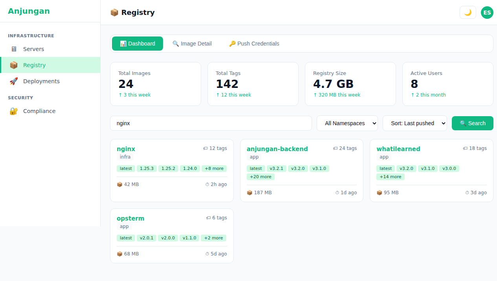
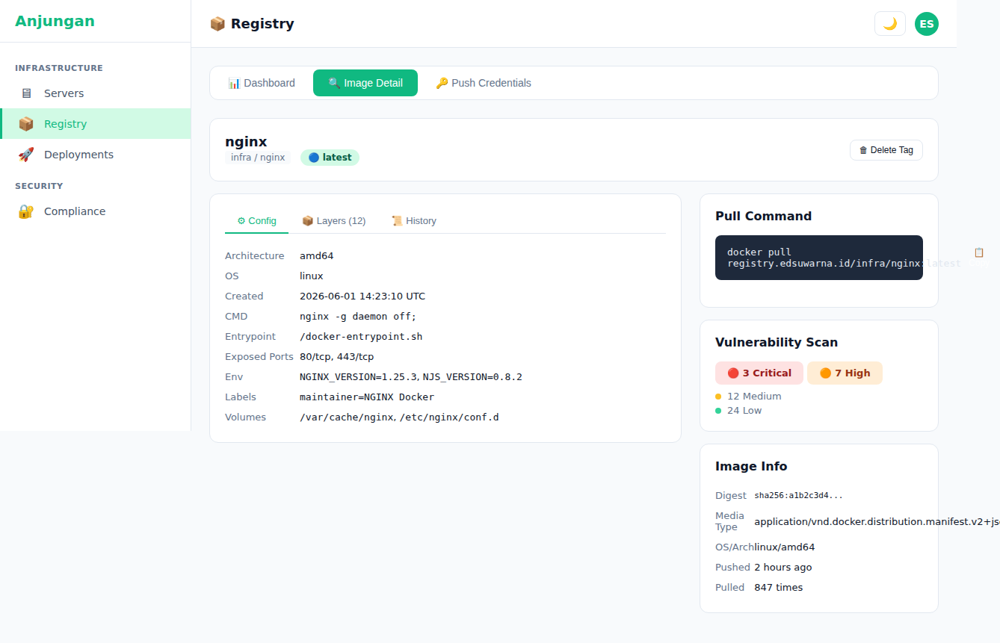
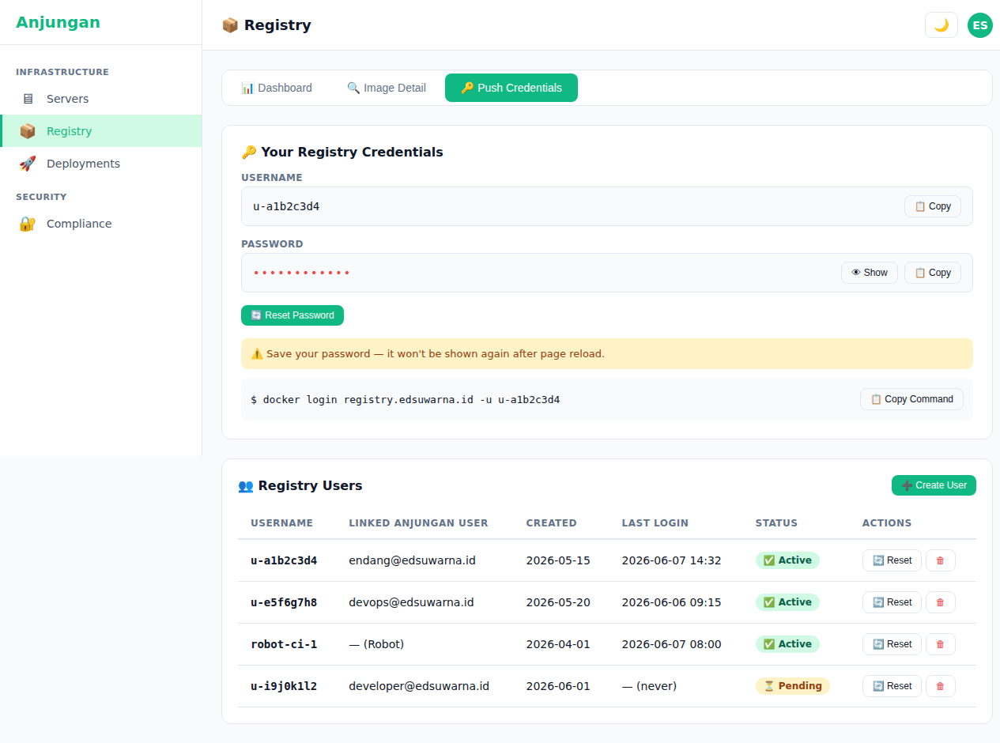

# Anjungan — PRD: Registry (Zot Integration)

> **Version:** 1.1
> **Status:** ✅ Fully Implemented — all backend + frontend features complete
> **Author:** Endang Suwarna
> **Last Updated:** June 9, 2026

---

## 1. Executive Summary

### Problem Statement

Anjungan already has a **Zot registry** as a self-hosted OCI-compliant container image registry. But access has only been through the CLI (`docker pull/push registry.edsuwarna.id/...`) or directly via the Zot API. Developers who want to:

- View the list of available images
- Browse tags in an image
- View image details (config, layers, history)
- Delete unused images/tags
- Trigger garbage collection
- Manage user credentials for docker login

...must access the Zot API directly or SSH into the server.

**Registry feature solves this:**
- **Browse repos + tags** from the Anjungan UI with search, sort, and pagination
- **Image detail** — config, layers, history — visual + raw JSON viewer
- **Delete & GC** — clean up unused images from UI, with tag protection
- **User management** — create registry users, reset password, htpasswd sync
- **Self-service credentials** — each Anjungan user automatically gets registry credentials
- **Vulnerability scanning** — integrated Zot-ext-cve CVE scanning with severity filters
- **Webhook notifications** — push/delete events to Telegram/Discord/Slack
- **Tag protection** — lock tags from accidental deletion
- **Cleanup auto-scheduler** — configurable policies to auto-delete old images
- **KPI dashboard** — always-visible stats, health badge, activity feed

### Target Audience

- **Endang** — manage daily image registry
- **Developer** — browse images, pull tags, push new images
- **CI/CD** — robot accounts for automation

### Goals

| Goal | Metric |
|------|--------|
| Browse all repos from UI | ✅ Done |
| View image details (config + layers + raw JSON) | ✅ Done |
| Delete image/tag + GC | ✅ Done |
| User registry management (CRUD) | ✅ Done |
| Self-service credential per user | ✅ Done |
| Vulnerability (CVE) scanning | ✅ Done |
| Webhook notifications (Telegram/Discord/Slack) | ✅ Done |
| Tag protection (lock tags from deletion) | ✅ Done |
| Cleanup policies (auto-delete old tags) | ✅ Done |
| Search tags across all repos | ✅ Done |
| KPI header cards + health badge + activity feed | ✅ Done |
| Image size dashboard | ✅ Done |

### Current Status (June 2026)

✅ **Registry feature is FULLY implemented** in Anjungan with 15 features across backend + frontend.

---

## 2. Product Overview

### Architecture

```
Anjungan UI                        Zot Registry
┌──────────────┐                  ┌──────────────────┐
│ Registry Page │ ──API/S3──▶      │ Zot API           │
│ - Repo list   │    (via backend) │ - /v2/_catalog    │
│ - Tag browser │                  │ - /v2/{repo}/tags │
│ - Image detail│                  │ - /v2/{repo}/man  │
│ - User mgmt   │                  │ - /v2/{repo}/blobs│
│ - GC trigger  │                  │ - GraphQL (CVE)   │
│ - CVE vulns   │                  └──────────────────┘
│ - Webhooks    │                           │
│ - Cleanup     │                           │
│ - Tag protect │                           │
└──────┬───────┘                           │
       │                                    │
       │ htpasswd sync via SSH              │
       ▼                                    ▼
┌──────────────────────────────────────────────────────────────┐
│  Anjungan Backend (registry handler)                         │
│  - Proxy Zot API (auth passthrough)                         │
│  - Registry users CRUD (registry_users table)                │
│  - htpasswd file management                                  │
│  - GC orchestration (Zot API + fallback)                    │
│  - zotGraphQL helper (CVE queries)                          │
│  - Webhook CRUD + async event firing                        │
│  - Tag protection (protect/unprotect/check)                 │
│  - Cleanup scheduler (background ticker)                    │
│  - Stats summary (size + tag counts per repo)               │
│  - Health check endpoint                                    │
└──────────────────────────────────────────────────────────────┘
```

### Implemented Detail

| Component | Status | Detail |
|-----------|--------|--------|
| Backend handler | ✅ Done | 1700+ lines — 25+ endpoints |
| User handler | ✅ Done | 375 lines — 5 endpoints |
| DB migrations | ✅ Done | 000012, 000013, 000022, 000023 |
| Frontend registry page | ✅ Done | 1641 lines — KPI cards, tabs, activity, admin |
| Frontend repo detail | ✅ Done | 633 lines — sortable tags, search, pagination, bulk ops |
| Frontend tag detail | ✅ Done | 366 lines — config/layers/history + CVE + raw JSON |
| Sidebar link | ✅ Done | Under "Artifact" category |

---

## 3. Feature Specifications

> **Legend:** ✅ Implemented | 🟡 Partial | 🔴 Planned

### F1 — Repository Browser + Tag Search & Sort

| | |
|---|---|
| **Priority** | P0 |
| **Status** | ✅ **Done** |
| **Backend** | `GET /api/v1/registry/repos` — List repos from Zot API. Paginated (page + limit). Enrich each repo with tag count via parallel manifest fetch. Sort by: last_modified, name. `GET /api/v1/registry/repos/{name}/tags` — List tags with `?q=` search filter, link-header-based pagination (Load More). Detail per tag: digest, size, media_type, config_digest, layers count, history count, created_at. |
| **Frontend** | Route `/registry/[name]`. Table of tags with columns: name (with lock icon for protected), size, created, digest. **Search/filter** tags via text input (sends `?q=` to backend). **Sortable** columns. **Load More** pagination button. Bulk selection with multi-select bar. |
| **UX** | Search filters tags in real-time (backend-backed). Protected tags show lock icon + "Protected" badge. Delete button grayed out for protected tags. |

### F2 — Image Detail + Multi-Arch + Raw JSON

| | |
|---|---|
| **Priority** | P0 |
| **Status** | ✅ **Done** |
| **Backend** | `GET /api/v1/registry/repos/{name}/{tag}` — Fetch manifest + config + layers from Zot API. Parse config JSON (env, cmd, entrypoint, exposed ports, volumes, labels, created_at). Parse layers: digest, size, command (from history), created_at. **Multi-arch support**: detects OCI index/manifest list, lists platforms (os/arch/variant). Returns `detail.Protected` flag. `GET /api/v1/registry/repos/{name}/{tag}/raw` — Raw manifest JSON with pretty-print, config blob viewer, digest, content-type. |
| **Frontend** | Route `/registry/[name]/[tag]`. Tabs: **Config** — env vars, cmd, entrypoint, ports, volumes, labels, architecture, OS, created. **Layers** — timeline with size bar + command. **History** — list per layer. **Vulnerabilities** — CVE severity cards + detail list. **Raw JSON** — syntax-highlighted manifest + config viewer with copy-to-clipboard. Multi-arch platform badges (os/arch/variant). |
| **UX** | Platform badges shown in Info tab for multi-arch images. Raw JSON tab loads lazily (only on click). Manifest and Config sections with copy buttons. CVE tab auto-loads on mount if extension available. |

### F3 — Image Deletion & Garbage Collection + Bulk Ops + Delete Repo

| | |
|---|---|
| **Priority** | P0 |
| **Status** | ✅ **Done** |
| **Backend** | `DELETE /api/v1/registry/repos/{name}/manifests/{digest}` — Delete manifest by digest (admin). `DELETE /api/v1/registry/repos/{name}/tags/{tag}` — Delete tag (admin) with **tag protection check** before delete. `DELETE /api/v1/registry/repos/{name}` — Delete entire repo: lists all tags, deletes each by digest (skips protected), triggers GC. `POST /api/v1/registry/gc` — Trigger GC on Zot. Fires async webhook event (`tag.delete`) on successful delete. |
| **Frontend** | Delete button per tag (with protection check). **Bulk operations**: multi-select tags → Protect All / Unprotect All / Delete All (sticky bottom bar). **Delete repo** button with confirmation modal warning. Confirmation modal for tag delete: "Are you sure you want to delete X?" Protected message warning in modal if applicable. |
| **UX** | Sticky bulk action bar slides up when tags selected. Protected tags have disabled delete button. Delete repo modal shows total tags to be deleted vs skipped. |

### F4 — Registry Credentials & Self-Service

| | |
|---|---|
| **Priority** | P0 |
| **Status** | ✅ **Done** |
| **Backend** | `POST /api/v1/registry/my-credentials` — Auto-create registry user for the logged-in Anjungan user. Generate username `u-{uid[:8]}` + random password. `POST /api/v1/registry/my-credentials/reset-password` — Reset password self-service. Save in `registry_users` table + sync to htpasswd file via SSH. |
| **Frontend** | Card on registry page: "Your Registry Credentials" — username (read-only), password (masked 🔴••••• + reveal toggle). Copy button. "Reset Password" button. Login command: `docker login registry.edsuwarna.id -u <username>` — copyable. |
| **UX** | Password only displayed once at create/reset — tooltip: "Save this password — it won't be shown again after page reload." Copy all command to clipboard. |

### F5 — Registry User Management (Admin)

| | |
|---|---|
| **Priority** | P1 |
| **Status** | ✅ **Done** |
| **Backend** | Full CRUD: `GET/POST/PUT/DELETE /api/v1/registry/users`. `POST /api/v1/registry/users/{id}/reset-password`. `POST /api/v1/registry/sync-htpasswd` — manual sync htpasswd file to registry server. Linked to Anjungan user: `anjungan_user_id` nullable — if linked, auto-create on first login. |
| **Frontend** | Route `/registry` → "Users" tab (admin only). Table: username, linked anjungan user, created, last login, status. Create user modal: username, link to Anjungan user (optional), password auto-generate. Reset password modal. Delete confirmation. |
| **UX** | Admin-only — hidden if not admin. Sync htpasswd status: "Last synced: 2m ago ✅" or "Sync needed!" warning badge. |

### F6 — Registry Config (Admin)

| | |
|---|---|
| **Priority** | P2 |
| **Status** | ✅ **Done** |
| **Backend** | `GET /api/v1/registry/config` — Return Zot config from config file (parsed) or env. Includes: public URL, storage backend (R2/local), GC policy, auth type. |
| **Frontend** | Read-only config display at the bottom of the registry page. |

### F7 — Webhook Notifications ✅ [Implemented v1.1]

| | |
|---|---|
| **Priority** | P2 |
| **Status** | ✅ **Done** (was 🔴 Planned) |
| **Backend** | `GET/POST /api/v1/registry/webhooks` — List and create webhook subscriptions. `GET/PUT/DELETE /api/v1/registry/webhooks/{id}` — Read/update/delete webhook. Webhook config: name, event types (tag.push, tag.delete, repo.delete, manifest.delete), target URL, secret token, enabled flag. **Async event firing**: `go h.fireDeleteEvent(...)` — fires on tag delete via background goroutine. Webhook payload: repo, tag, digest, actor, timestamp. |
| **Frontend** | Webhook CRUD UI in Admin tab: list webhooks with status (active/inactive), create modal (name, URL, event types checkboxes, optional secret), edit/delete per webhook. |
| **UX** | Webhooks show last triggered timestamp. Event types shown as badges. Toggle enable/disable per webhook. |
| **DB** | `000022_create_registry_webhooks` — `registry_webhooks` table. |

### F8 — Multi-Registry Support (P2 - 🔴 Planned)

| | |
|---|---|
| **Priority** | P2 |
| **Status** | 🔴 **Planned** |
| **Backend** | `registry_instances` table — support multiple registry endpoints. Can add other registries (Docker Hub proxy, GHCR, other self-hosted). `GET /api/v1/registry/instances` — list all. `POST /api/v1/registry/instances` — add instance (name, url, auth). |
| **Frontend** | Registry switcher in sidebar/header. Switch registry → browse images from another registry. |

### F9 — Registry Sync / Mirror (P3 - 🔴 Planned)

| | |
|---|---|
| **Priority** | P3 |
| **Status** | 🔴 **Planned** |
| **Backend** | Sync config: source registry (Docker Hub), target (Zot), image list, schedule (cron). Background sync worker via asynq. `POST /api/v1/registry/sync` — trigger sync job. |
| **Frontend** | Sync config UI: source, target, schedule. Sync log: status, last sync, images synced, bytes transferred. |

### F10 — Cleanup Policies ✅ [Implemented v1.1]

| | |
|---|---|
| **Priority** | P3 |
| **Status** | ✅ **Done** (was 🔴 Planned) |
| **Backend** | `POST /api/v1/registry/cleanup/run` — Manual cleanup trigger. `GET /api/v1/registry/cleanup/config` — View current cleanup config. `PUT /api/v1/registry/cleanup/config` — Update cleanup policy. **Background ticker scheduler**: `Handler.cleanupTicker` runs cleanup on interval (configurable). Policy: max age per tag, min tags to keep, exempted tags (protect latest, etc.). Multi-arch aware — deletes old platforms. |
| **Frontend** | Cleanup config UI in Admin tab: view current rules (max age, min tags), manual "Run Cleanup Now" button with status result. |
| **UX** | Cleanup results show deleted tags count, freed size. Ticker status indicator (next run time). |
| **Handler** | Background goroutine in `Handler` struct: `cleanupTicker`, `cleanupDone`, `cleanupMu sync.Mutex`. |

### F11 — Built-in Vulnerability Scan (CVE) ✅ [Implemented v1.1]

| | |
|---|---|
| **Priority** | P3 |
| **Status** | ✅ **Done** (was 🔴 Planned) |
| **Backend** | `GET /api/v1/registry/cve/check` — Check if Zot's `zot-ext-cve` is available via GraphQL probe. `GET /api/v1/registry/cve/{name}/{tag}?skip=N` — Fetch CVE list for specific image tag via Zot GraphQL. Returns: CVE list (Id, Title, Description, Severity, PackageList), Summary (MaxSeverity, Count, CriticalCount, HighCount, MediumCount, LowCount), Page (TotalCount). **Normalized field names** via `normalizeCVESummary()`: `Count` → `total`, `CriticalCount` → `critical`, etc. **Pagination**: `skip` parameter up to 500. |
| **Frontend** | Vulnerabilities tab on tag detail page: severity summary cards (Critical/High/Medium/Low counts), severity filter chips (All/Critical/High/Medium/Low), CVE detail list (ID link to NVD, affected package, installed version, fixed version), Load More pagination. |
| **UX** | Severity pills color-coded (Critical=red, High=orange, Medium=yellow, Low=green). Each CVE item: ID (clickable → NVD), title, package name + installed + fixed versions. Empty state: "No vulnerabilities found" with shield check icon. |
| **Integration** | Uses Zot's built-in GraphQL search endpoint (`/v2/_zot/ext/search`). Enabled in `zot/config.json` extensions. |

### F12 — Tag Protection ✅ [New in v1.1]

| | |
|---|---|
| **Priority** | P2 |
| **Status** | ✅ **Done** |
| **Backend** | `GET /api/v1/registry/protections` — List all protected tags. `POST /api/v1/registry/protections` — Protect a tag (repo + tag name). `DELETE /api/v1/registry/protections/{id}` — Unprotect. `IsTagProtected(repo, tag)` — check protection state, called in DeleteTag, DeleteRepo, and ImageDetail handlers. |
| **Frontend** | **Repo detail page**: Lock icon next to protected tag name, "Protected" badge. Protect/unprotect buttons per tag row (shield up / shield minus icons). **Bulk operations**: multi-select → Protect All / Unprotect All. **Tag detail page**: Delete button shows warning "Tag is protected — unprotect it first from the repo page." Protected message in delete confirmation modal. |
| **UX** | Delete button disabled/hidden for protected tags in repo list. Tag detail page redirects delete action to protection warning. Bulk bar shows count of protected vs unprotected. |
| **DB** | `000023_create_registry_tag_protections` — `registry_tag_protections` table. |

### F13 — Search Tags Across All Repos ✅ [New in v1.1]

| | |
|---|---|
| **Priority** | P2 |
| **Status** | ✅ **Done** |
| **Backend** | `GET /api/v1/registry/search/tags?q=...` — Full-text search across all repos. Searches tag names. Returns: repo name, tag name, digest, size, last modified. |
| **Frontend** | Search input in registry page header. Results shown as a unified list grouped by repo. |

### F14 — KPI Header Cards + Health Badge + Activity Feed ✅ [New in v1.1]

| | |
|---|---|
| **Priority** | P2 |
| **Status** | ✅ **Done** |
| **Backend** | `GET /api/v1/registry/health` — Zot connectivity check. Returns `{ status: "ok" }` or error. Activity data sourced from audit log (registry.delete events). |
| **Frontend** | **KPI Header Cards** (always-visible): Total repos, total tags, total size, last synced. Displayed as stat cards at top of registry page. **Health Status Badge**: real-time Zot connectivity indicator (green dot = OK, red = down). **Registry Activity Feed**: dedicated tab showing recent registry events (delete, push, GC) with timestamps and actor. **4-tab layout**: Repos, Credentials, Activity, Admin. |
| **UX** | KPI cards read from `GET /registry/stats/summary`. Health badge polls on load. Activity tab shows timeline with icons per event type. |

### F15 — Image Size Dashboard ✅ [New in v1.1]

| | |
|---|---|
| **Priority** | P3 |
| **Status** | ✅ **Done** |
| **Backend** | `GET /api/v1/registry/stats/summary` — Aggregated storage statistics. Parallel fetch to all repos (semaphore-limited, 15 concurrent). Per-repo: name, tag count, total size (sum of all tag manifests + config blobs). Returns sorted by size descending. |
| **Frontend** | Size breakdown per repo in registry list. Total size shown in KPI header. Size formatted dynamically (bytes/KB/MB/GB). |
| **Performance** | Semaphore-limited (15 concurrent fetches) to avoid overwhelming Zot. Cached per request (not persistent). |

---

## 4. Future Roadmap

### F8 — Multi-Registry Support (P2 - 🔴 Planned)

| | |
|---|---|
| **Backend** | `registry_instances` table — support multiple registry endpoints. Can add other registries (Docker Hub proxy, GHCR, other self-hosted). `GET /api/v1/registry/instances` — list all. `POST /api/v1/registry/instances` — add instance (name, url, auth). |
| **Frontend** | Registry switcher in sidebar/header. Switch registry → browse images from another registry. |

### F9 — Registry Sync / Mirror (P3 - 🔴 Planned)

| | |
|---|---|
| **Backend** | Sync config: source registry (Docker Hub), target (Zot), image list, schedule (cron). Background sync worker via asynq. `POST /api/v1/registry/sync` — trigger sync job. |
| **Frontend** | Sync config UI: source, target, schedule. Sync log: status, last sync, images synced, bytes transferred. |

---

## 5. API Design

```go
// === Registry (Implemented) ===
GET    /api/v1/registry/config
GET    /api/v1/registry/health
GET    /api/v1/registry/my-credentials
POST   /api/v1/registry/my-credentials/reset-password
GET    /api/v1/registry/repos
GET    /api/v1/registry/repos/{name}/tags
GET    /api/v1/registry/repos/{name}/{tag}
GET    /api/v1/registry/repos/{name}/{tag}/raw
DELETE /api/v1/registry/repos/{name}/manifests/{digest}
DELETE /api/v1/registry/repos/{name}/tags/{tag}
DELETE /api/v1/registry/repos/{name}
POST   /api/v1/registry/gc
GET    /api/v1/registry/users
POST   /api/v1/registry/users
PUT    /api/v1/registry/users/{id}
DELETE /api/v1/registry/users/{id}
POST   /api/v1/registry/users/{id}/reset-password
POST   /api/v1/registry/sync-htpasswd

// === CVE / Vulnerability ===
GET    /api/v1/registry/cve/check
GET    /api/v1/registry/cve/{name}/{tag}?skip=N

// === Webhooks ===
GET    /api/v1/registry/webhooks
POST   /api/v1/registry/webhooks
GET    /api/v1/registry/webhooks/{id}
PUT    /api/v1/registry/webhooks/{id}
DELETE /api/v1/registry/webhooks/{id}

// === Tag Protection ===
GET    /api/v1/registry/protections
POST   /api/v1/registry/protections
DELETE /api/v1/registry/protections/{id}

// === Cleanup ===
POST   /api/v1/registry/cleanup/run
GET    /api/v1/registry/cleanup/config
PUT    /api/v1/registry/cleanup/config

// === Stats & Search ===
GET    /api/v1/registry/stats/summary
GET    /api/v1/registry/search/tags?q=...
```

### Future API

```go
// === Future: Multi-Registry ===
GET    /api/v1/registry/instances
POST   /api/v1/registry/instances
PUT    /api/v1/registry/instances/{id}
DELETE /api/v1/registry/instances/{id}

// === Future: Sync ===
POST   /api/v1/registry/sync
GET    /api/v1/registry/sync/jobs
GET    /api/v1/registry/sync/jobs/{id}
```

---

## 6. Database Schema

### Existing Tables

```sql
-- 000012: Registry users
CREATE TABLE registry_users (
  id UUID PRIMARY KEY DEFAULT gen_random_uuid(),
  username VARCHAR(255) NOT NULL UNIQUE,
  password_hash VARCHAR(255) NOT NULL,
  status VARCHAR(20) DEFAULT 'active',
  created_at TIMESTAMP DEFAULT NOW(),
  updated_at TIMESTAMP DEFAULT NOW()
);

-- 000013: Link registry user to Anjungan user
ALTER TABLE registry_users ADD COLUMN anjungan_user_id UUID REFERENCES users(id);

-- 000022: Webhook subscriptions
CREATE TABLE registry_webhooks (
  id UUID PRIMARY KEY DEFAULT gen_random_uuid(),
  name VARCHAR(255) NOT NULL,
  url VARCHAR(512) NOT NULL,
  secret VARCHAR(255),
  event_types TEXT[] NOT NULL DEFAULT '{}',
  enabled BOOLEAN DEFAULT true,
  created_at TIMESTAMP DEFAULT NOW(),
  updated_at TIMESTAMP DEFAULT NOW()
);

-- 000023: Tag protections
CREATE TABLE registry_tag_protections (
  id UUID PRIMARY KEY DEFAULT gen_random_uuid(),
  repo VARCHAR(255) NOT NULL,
  tag VARCHAR(255) NOT NULL,
  created_by UUID REFERENCES users(id),
  created_at TIMESTAMP DEFAULT NOW(),
  UNIQUE(repo, tag)
);
```

### Future Tables (Roadmap)

```sql
-- Future: Multi-registry
CREATE TABLE registry_instances (
  id UUID PRIMARY KEY,
  name VARCHAR(100) NOT NULL,
  url VARCHAR(512) NOT NULL,
  auth_type VARCHAR(20),                -- none, basic, token
  auth_config JSONB,
  is_default BOOLEAN DEFAULT FALSE,
  created_at TIMESTAMP DEFAULT NOW()
);

-- Future: Registry events
CREATE TABLE registry_events (
  id BIGSERIAL PRIMARY KEY,
  instance_id UUID REFERENCES registry_instances(id),
  event_type VARCHAR(50),               -- push, pull, delete, sync
  repo_name VARCHAR(255),
  tag_name VARCHAR(255),
  digest VARCHAR(255),
  size_bytes BIGINT,
  metadata JSONB,
  created_at TIMESTAMP DEFAULT NOW()
);

-- Future: Cleanup policies (extended config)
CREATE TABLE registry_policies (
  id UUID PRIMARY KEY,
  instance_id UUID REFERENCES registry_instances(id),
  name VARCHAR(255) NOT NULL,
  scope VARCHAR(50),                    -- repo, tag_pattern, all
  scope_value VARCHAR(255),             -- regex or specific name
  conditions JSONB,                     -- [{field: "age", op: ">", value: 30}]
  action VARCHAR(50),                   -- delete, gc, notify
  schedule VARCHAR(100),                -- cron expression, null = manual
  enabled BOOLEAN DEFAULT TRUE,
  last_run TIMESTAMP,
  created_at TIMESTAMP DEFAULT NOW()
);
```

---

## 7. UX Flow

### Flow 1: Browse + Delete Image

```
1. Open /registry
2. View KPI cards: total repos, total tags, total size
3. View repo list (health badge green ✅ if Zot online)
4. Click "nginx" → /registry/nginx
5. Sort tags by size or date
6. Search tag "latest" in search bar
7. Select "v1.0.0" and "v1.1.0" checkboxes
8. Bulk action bar slides up: "Protect All" / "Unprotect All" / "Delete All"
9. Click "Delete All" → confirmation modal
10. ✅ Tags deleted, list refreshes
```

### Flow 2: CVE Vulnerability Scan

```
1. Open /registry/nginx/latest
2. See 5 tabs: Info, Configuration, Layers, History, Vulnerabilities, Raw JSON
3. Click "Vulnerabilities"
4. View severity cards: 3 Critical, 7 High, 12 Medium, 24 Low
5. Filter by severity: click "Critical" chip
6. View filtered CVE list: CVE-2026-6732 (opens NVD link), affected package, fix version
7. Click "Load More" for additional CVEs
```

### Flow 3: Tag Protection

```
1. Open /registry/my-api
2. Click shield-up icon on "latest" tag → ✅ Protected
3. Lock icon + "Protected" badge appears on tag
4. Delete button now shows "Protected — unprotect first"
5. Click shield-minus icon → ✅ Unprotected
6. Delete works again
```

### Flow 4: Webhook Configuration

```
1. Open /registry → Admin tab
2. Click "Webhooks" section
3. View existing webhooks: "Deploy Notification", "Slack Alerts"
4. Click "Add Webhook"
5. Modal: name, URL, event types (tag.push, tag.delete), secret token
6. Save → webhook appears in list with "Active" badge
7. Delete a tag → webhook fires async (visible in audit log)
```

### Flow 5: Cleanup Policies

```
1. Open /registry → Admin tab
2. Click "Cleanup" section
3. View current policy: "Delete tags older than 30d, keep min 5 tags"
4. Click "Edit" → update max age to 60d
5. Click "Run Cleanup Now" → progress spinner
6. Result: "Deleted 12 tags, freed 1.2GB"
```

---

## 8. Non-Functional Requirements

| Requirement | Target | Status |
|-------------|--------|--------|
| Repo list load | < 2s (100 repos) | ✅ Tested |
| Image detail load | < 3s (50 layers) | ✅ Tested |
| CVE load | < 3s (50 CVEs) | ✅ Tested |
| Delete operation | < 1s | ✅ |
| Bulk delete (100 tags) | < 10s | ✅ Semaphore-limited |
| GC trigger | < 5s (start signal) | ✅ |
| htpasswd sync | < 3s | ✅ |
| Concurrent user credential | 100+ users | ✅ |
| Zot proxy latency | < 100ms overhead | ✅ |
| Webhook async fire | < 500ms | ✅ Background goroutine |
| Stats summary | < 5s (all repos) | ✅ 15-concurrent semaphore |

---

## 9. References

- [PRD.md](./PRD.md) — Main Anjungan PRD (Phase 2 Registry)
- [PRD-repositories-deployments.md](./PRD-repositories-deployments.md)
- [DECISIONS.md](../docs/DECISIONS.md)
- [TRACKING.md](./TRACKING.md) — Feature implementation tracking

## 10. Mockup References

The following mockup screenshots were created to visualize the Registry feature UI:

| Screen | Preview |
|--------|---------|
| **Registry Dashboard** — KPI cards (total images, tags, size), search/filter bar, image grid with namespace badges and tag lists |  |
| **Image Detail** — Config/Layers/History tabs, side panel with pull command, vulnerability severity breakdown (3 Critical, 7 High, 12 Medium, 24 Low) |  |
| **Push Credentials** — Self-service credential card (auto-generated username, masked password, reset button, docker login command), admin user management table with status badges |  |
