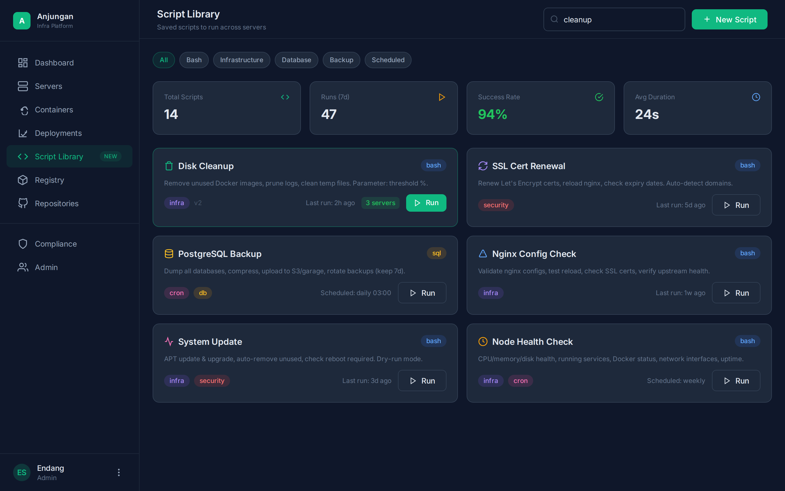
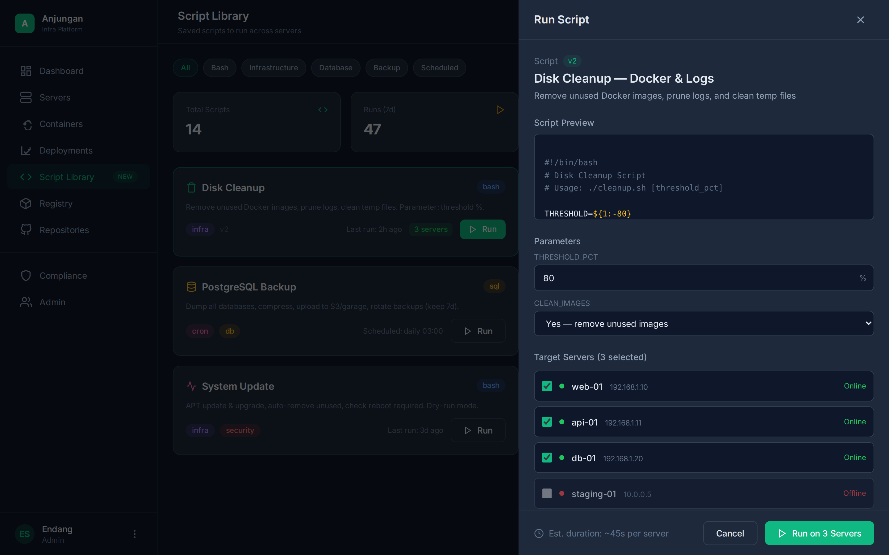
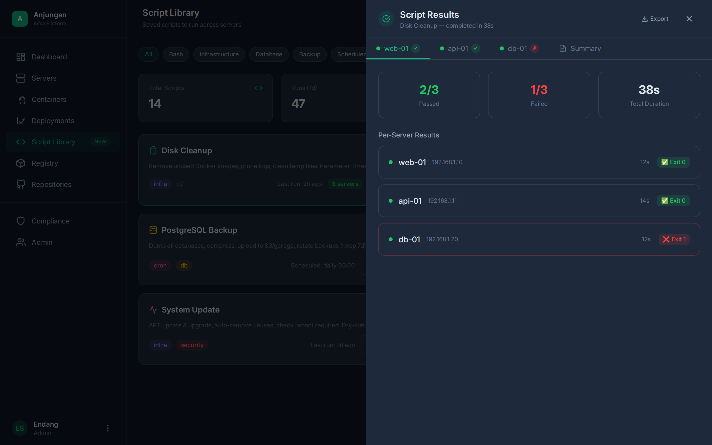
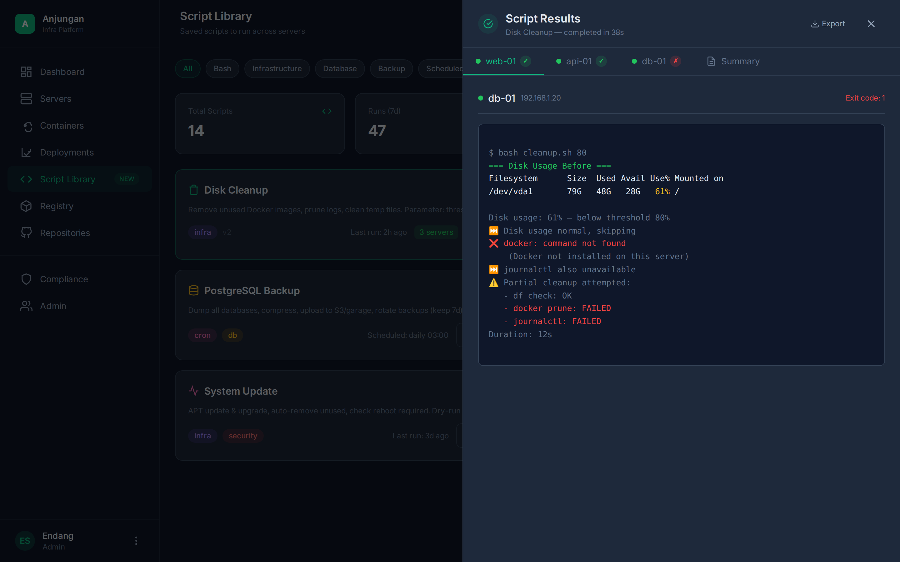
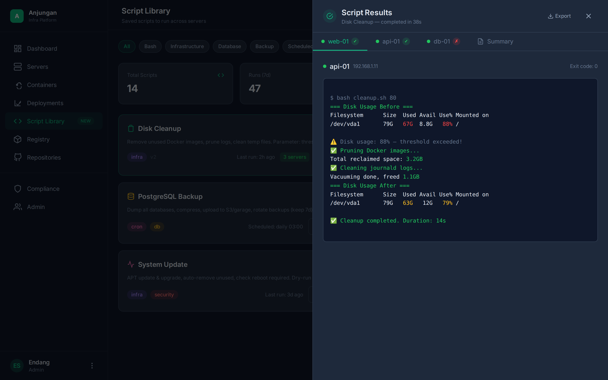

# Anjungan — PRD: Script Library

> **Version:** 1.0
> **Status:** 🔴 Not Implemented — Proposed for Phase 5
> **Author:** Endang Suwarna
> **Last Updated:** June 5, 2026

---

## 1. Executive Summary

### Problem Statement

Managing infrastructure requires running repetitive operational scripts across multiple servers — disk cleanup, SSL renewal, DB backup, system updates, health checks. Currently:

- **Manual SSH** — each execution opens terminal, SSH one by one, run script, wait for completion
- **No inventory** — scripts scattered across notes, ~/.scripts/ on each server, random repos
- **No audit trail** — who ran which script on which server when? What was the exit code?
- **No multi-server** — if cleanup is needed on 5 servers, execute 5 times manually
- **No results history** — success/failure output disappears after terminal is closed

**Script Library solves this:**

- **Single inventory** — all scripts stored, categorized, searchable
- **One-click run** — select script, set parameters, select servers, execute via SSH
- **Multi-server** — run script on N servers in parallel, view aggregated results
- **Full audit trail** — each run is recorded: who, which server, status, output
- **Scheduling** — cron-based, daily/weekly/custom
- **Templates** — parameter injection, multi-server aware script structure

### Current Status (June 2026)

| Domain | Status | Detail |
|--------|--------|--------|
| Script Library Dashboard | ❌ **Not implemented** | Planned — Phase 5 |
| Script CRUD (Create/Edit/Delete) | ❌ **Not implemented** | Planned — Phase 5 |
| Multi-Server Execution Engine | ❌ **Not implemented** | Planned — Phase 5 |
| Results Viewer | ❌ **Not implemented** | Planned — Phase 5 |
| Scheduling & Automation | ❌ **Not implemented** | Planned — Phase 5 |
| History & Audit Log | ❌ **Not implemented** | Planned — Phase 5 |
| Script Template Library | ❌ **Not implemented** | Planned — Phase 5 |

### Target Audience

- **Endang** (platform engineer) — run infra scripts, schedule backups, health checks
- **Team members (future)** — execute approved scripts without needing direct SSH access
- **Ops / SRE (future)** — automate routine maintenance via scheduled scripts

### Goals

| Goal | Metric |
|------|--------|
| Script execution from UI | < 3 clicks to run a script |
| Multi-server parallel execution | Up to 10 servers simultaneously |
| Real-time results streaming | Output appears < 1 second per line |
| Script template system | Variable injection, parameter validation |
| Scheduled execution | Cron-based (daily/weekly/custom) |
| Audit trail completeness | 100% runs logged forever |
| Run history query | < 500ms for 90 days |

---

## 2. Product Overview

### Architecture

```
Anjungan Backend                          Target Server(s)
┌─────────────────────────┐               ┌────────────────────┐
│ Script Library Engine   │               │                    │
│ POST /run ────SSH──────▶│               │ - Execute bash      │
│ GET /results ◀──parse───│               │ - Capture stdout    │
│ GET /history ◀──────────│               │ - Exit code 0/1     │
│                         │               │ - Duration tracking │
│ Script Runner           │               │                    │
│ ├─ RunScript(script,    │               └────────────────────┘
│ │   params, servers[])  │
│ ├─ SSH connection pool  │
│ ├─ Parallel exec engine │
│ └─ Output streamer      │
│                         │
│ DB: scripts,            │
│     script_versions,    │
│     script_runs,        │
│     run_outputs         │
└─────────────────────────┘
```

### Script Execution Flow

```
1. User browse → filter → select script card
2. Click "Run" → slide-over panel opens
3. Script preview (syntax highlight) + parameters (auto-detected)
4. Select target servers (multi-select, status indicators)
5. Optional: set schedule (daily/weekly/custom cron)
6. Click "Run on N Servers"
7. Backend SSH parallel ke semua server selected
8. Stream stdout real-time, aggregate per-server
9. Results panel: summary (pass/fail count) + per-server tabs
10. Each tab: full stdout, exit code, duration
11. Run logged to script_runs table automatically
```

### Script Categories & Tags

```
Script Categories          Tags (multi)
├── Infrastructure         ├── infra
├── Database               ├── db
├── Backup                 ├── backup
├── Security               ├── security
├── Monitoring             ├── monitoring
├── System Administration  ├── cron
└── Custom                 └── custom

Script Lifecycle
├── Draft    — still being worked on
├── Active   — ready to use
└── Archived — retired (but not deleted — audit trail)
```

---

## 3. Feature Specifications

> **Legend:** ✅ Implemented | 🟡 Partial | 🔴 Planned

### F1 — Script Library Dashboard

| | |
|---|---|
| **Priority** | P0 |
| **Status** | 🔴 **Not implemented** |
| **Backend** | `GET /api/v1/scripts` — list all scripts with pagination + filters (category, tag, search). `GET /api/v1/scripts/stats` — aggregate: total scripts, runs (7d), success rate %, avg duration. Archived scripts remain visible with visual indicator. |
| **Frontend** | Route `/scripts`. **KPI cards** (top row): Total Scripts, Runs (7d), Success Rate (color-coded: 🟢>90%, 🟡80-90%, 🔴<80%), Avg Duration. **Filter chips**: All, Bash, SQL, Infrastructure, Database, Backup, Scheduled. **Script cards** (2-col grid): icon (per category), title, description (2 line max), tags (multi), version badge, last run timestamp, server count, quick Run button. Search bar on the top right — search by name/description/tags. **New Script** button → create modal/page. |
| **UX** | Cards: click → detail page with full info + run history. Run button directly opens slide-over run panel. Hover card → subtle border highlight. Empty state when no scripts exist: "No scripts yet. Create your first script to automate server tasks." **Mockup reference:**  |

### F2 — Script CRUD (Create/Edit/Delete)

| | |
|---|---|
| **Priority** | P0 |
| **Status** | 🔴 **Not implemented** |
| **Backend** | `POST /api/v1/scripts` — create script (name, description, content, category, tags, parameters schema). `PUT /api/v1/scripts/{id}` — update. `DELETE /api/v1/scripts/{id}` — soft delete (archived). `GET /api/v1/scripts/{id}` — detail. `GET /api/v1/scripts/{id}/versions` — version history. Versioning: each update creates a new version row — script_versions table. Restore version endpoint: `POST /api/v1/scripts/{id}/restore/{version}`. |
| **Frontend** | **Create modal/editor**: script name input, description textarea, code editor (monaco or code-mirror clone — syntax highlight bash/sql/yaml), category select, tags multi-select, parameters schema builder (variable name, type, default value, description). Save → auto-create version 1. **Edit page**: same form pre-filled, "Update" → auto-bump version. **Delete**: confirmation modal "Archive this script? Runs will be preserved." **Version history**: list of versions with diff viewer. |
| **UX** | Code editor with line numbers, syntax highlight (bash default). Parameter schema builder: add row — name/type(default)/desc — generates `$PARAM_NAME` injection. Diff view between versions: green/red lines. |

### F3 — Script Run Panel (Slide-over)

| | |
|---|---|
| **Priority** | P0 |
| **Status** | 🔴 **Not implemented** |
| **Backend** | `POST /api/v1/scripts/{id}/run` — accept: `{parameters: {}, server_ids: [], schedule?: {cron: string}}`. Validate parameters against schema, validate server access, queue async execution. Return `run_id` immediately. `GET /api/v1/scripts/{id}/run/{runId}/status` — polling endpoint (running/completed/failed). |
| **Frontend** | **Slide-over panel from right** (600px). Content: script header (name, version, description), **script preview** (read-only syntax highlighted, scrollable max-height 140px), **parameters section** (auto-generated from schema — input fields, selects, toggles), **target servers** (checkbox list with status dot: 🟢 online / 🔴 offline / 🟡 pending, offline servers disabled with explanation), **schedule option** (run now / daily / weekly / custom cron), **estimated duration** indicator. Footer: Cancel + "Run on N Servers" primary button. Panel open/close animation slide. |
| **UX** | Form validation: parameters required check, server min 1 selected. If schedule set → "Schedule Run" button instead. Offline servers: disabled, greyed out, tooltip "Server offline". Duration estimate based on historical avg. **Mockup reference:**  |

### F4 — Multi-Server Execution Engine

| | |
|---|---|
| **Priority** | P0 |
| **Status** | 🔴 **Not implemented** |
| **Backend** | `internal/scripts/runner.go` — execution engine. **Parallel execution** — goroutine per server, max concurrency 10 (configurable). **SSH connection pooling** — reuse existing management SSH connections. **Parameter injection** — replace `$PARAM_NAME` or `${PARAM_NAME}` with actual values. **Timeout control** — per-server timeout 120s default (configurable per script). **Error handling** — per-server isolated: server A failure does not affect server B. **Output capture** — stdout + stderr separate, duration per-server. **Exit code** — 0 = success, non-zero = fail. |
| **Frontend** | Progress indicator during execution: per-server status (running/spinner, completed ✓, failed ✗). Real-time output streaming via SSE/WebSocket. |
| **UX** | If a server fails: partial success is still acceptable — failed server marked red, success stays green. No rollback — infra scripts are idempotent. |

### F5 — Results Viewer

| | |
|---|---|
| **Priority** | P0 |
| **Status** | 🔴 **Not implemented** |
| **Backend** | `GET /api/v1/scripts/{id}/run/{runId}` — full results: pass/fail count per-server, total duration. `GET /api/v1/scripts/{id}/run/{runId}/output/{serverId}` — per-server output. `GET /api/v1/scripts/{id}/run/{runId}/export` — export results as text/JSON. |
| **Frontend** | **Results slide-over panel** (700px) or full page. **Summary bar** (3 cards): Passed (N/M), Failed (N/M), Total Duration. **Per-server tabs**: tab button per server with status indicator (✓ pass / ✗ fail). **Output area** — code-block style, stdout monospace, exit code badge, duration. **Error highlight** — stderr lines in red, error exit code banner at top. **Export button** — download raw output. **Re-run button** — quick re-run with same params + servers. | 
| **UX** | Tab active by default: Summary (overall view). Click server tab → detail output. Error server tab has red dot indicator. Scrolling output area with max-height + scrollbar. **Mockup reference:**    |

### F6 — Scheduling & Automation

| | |
|---|---|
| **Priority** | P1 |
| **Status** | 🔴 **Not implemented** |
| **Backend** | `script_schedules` table: script_id, parameters (JSONB), server_ids (array), cron_expression, enabled, last_run, next_run. Scheduler via asynq or internal cron engine. **Check-in pattern** — scheduler runs, triggers execute, logs to script_runs. **Notification** — telegram/slack webhook on failure. |
| **Frontend** | **Schedule picker** in run panel: "Run now", "Daily", "Weekly (Sun 02:00)", "Monthly (1st)", "Custom cron". **Schedule list** page: all scheduled scripts, next run, last run status, enable/disable toggle. |
| **UX** | Scheduled runs appear in history with "scheduled" source badge. Fail notification: score drop alert. |

### F7 — History & Audit Log

| | |
|---|---|
| **Priority** | P1 |
| **Status** | 🔴 **Not implemented** |
| **Backend** | `GET /api/v1/scripts/{id}/runs` — paginated run history: timestamp, user, parameters, servers, pass/fail, duration. `GET /api/v1/scripts/runs` — global run history across all scripts (filterable: ?script_id=&server=&status=&user=&from=&to=). Output retention: 90 days auto-cleanup. |
| **Frontend** | **Per-script history** tab on detail page: table — date, user, servers count, status (pass/fail), duration, "View results" link. **Global history** page: all runs, filterable by script, server, status, date range. |
| **UX** | Empty history: "No runs yet. Run this script to see results here." Pagination: 20 per page. |

### F8 — Script Template Library

| | |
|---|---|
| **Priority** | P2 |
| **Status** | 🔴 **Not implemented** |
| **Backend** | Built-in template engine. Variables declared in script header comment block: `# @param THRESHOLD_PCT number 80 "Disk usage threshold"` — auto-parsed on create. Pre-built templates: Disk Cleanup, SSL Renew, DB Backup, Health Check, System Update — seeded via migration. |
| **Frontend** | "New from Template" button — select template from list, edit content, save as new script. Template gallery: categorized templates. |
| **UX** | Template remains read-only — user duplicates to create a custom one. Template updatable via server migration. |

---

## 4. API Design

### Endpoints

```go
// === Script CRUD ===
GET    /api/v1/scripts                        // List all scripts (?category=&tag=&search=&page=&limit=)
POST   /api/v1/scripts                        // Create script (name, desc, content, category, tags, params_schema)
GET    /api/v1/scripts/{id}                   // Script detail
PUT    /api/v1/scripts/{id}                   // Update script (auto-bump version)
DELETE /api/v1/scripts/{id}                   // Soft delete (archive)
GET    /api/v1/scripts/stats                  // Dashboard stats (total, runs_7d, success_rate, avg_dur)

// === Versioning ===
GET    /api/v1/scripts/{id}/versions          // Version history
GET    /api/v1/scripts/{id}/versions/{v}      // Specific version content
POST   /api/v1/scripts/{id}/restore/{v}       // Restore version

// === Execution ===
POST   /api/v1/scripts/{id}/run               // Run script: {parameters: {}, server_ids: [], schedule?: {}}
GET    /api/v1/scripts/{id}/run/{runId}        // Run result (summary + per-server)
GET    /api/v1/scripts/{id}/run/{runId}/output/{serverId}  // Per-server output
GET    /api/v1/scripts/{id}/run/{runId}/export // Export results (?format=text|json)

// === History ===
GET    /api/v1/scripts/{id}/runs              // Per-script run history (?page=&limit=)
GET    /api/v1/scripts/runs                   // Global run history (?script_id=&server=&status=&user=&from=&to=)

// === Scheduling ===
GET    /api/v1/scripts/schedules              // List all schedules
POST   /api/v1/scripts/schedules              // Create schedule: {script_id, parameters, server_ids, cron}
PUT    /api/v1/scripts/schedules/{id}         // Update schedule
DELETE /api/v1/scripts/schedules/{id}         // Delete schedule
PATCH  /api/v1/scripts/schedules/{id}/toggle  // Enable/disable

// === Templates ===
GET    /api/v1/scripts/templates              // List built-in templates
POST   /api/v1/scripts/from-template/{tplId}  // Create from template
```

---

## 5. Database Schema

```sql
-- Scripts inventory
CREATE TABLE scripts (
  id UUID PRIMARY KEY DEFAULT gen_random_uuid(),
  name VARCHAR(255) NOT NULL,
  description TEXT,
  content TEXT NOT NULL,                        -- script body (bash/sql/yaml)
  category VARCHAR(50),                         -- infra, db, backup, security, monitoring, system, custom
  tags TEXT[] DEFAULT '{}',                     -- multi-tag: {infra, cron, security}
  params_schema JSONB DEFAULT '[]',            -- [{name, type, default, description, required}]
  version INTEGER DEFAULT 1,
  status VARCHAR(20) DEFAULT 'active',          -- draft, active, archived
  created_by UUID REFERENCES users(id),
  created_at TIMESTAMP DEFAULT NOW(),
  updated_at TIMESTAMP DEFAULT NOW()
);

-- Script version history
CREATE TABLE script_versions (
  id UUID PRIMARY KEY DEFAULT gen_random_uuid(),
  script_id UUID REFERENCES scripts(id),
  version INTEGER NOT NULL,
  content TEXT NOT NULL,
  params_schema JSONB,
  changelog TEXT,                              -- summary of what changed
  created_by UUID REFERENCES users(id),
  created_at TIMESTAMP DEFAULT NOW(),
  UNIQUE(script_id, version)
);

-- Script run results
CREATE TABLE script_runs (
  id UUID PRIMARY KEY DEFAULT gen_random_uuid(),
  script_id UUID REFERENCES scripts(id),
  script_version INTEGER NOT NULL,             -- freeze version at run time
  parameters JSONB DEFAULT '{}',               -- actual parameter values used
  source VARCHAR(20) DEFAULT 'manual',         -- manual, scheduled, webhook
  schedule_id UUID REFERENCES script_schedules(id),  -- null for manual runs
  total_servers INTEGER DEFAULT 0,
  passed_servers INTEGER DEFAULT 0,
  failed_servers INTEGER DEFAULT 0,
  total_duration_ms INTEGER DEFAULT 0,
  created_by UUID REFERENCES users(id),
  created_at TIMESTAMP DEFAULT NOW()
);

-- Per-server run output
CREATE TABLE script_run_outputs (
  id UUID PRIMARY KEY DEFAULT gen_random_uuid(),
  run_id UUID REFERENCES script_runs(id),
  server_id UUID REFERENCES servers(id),
  exit_code INTEGER,
  stdout TEXT,
  stderr TEXT,
  duration_ms INTEGER,
  status VARCHAR(20) DEFAULT 'completed',     -- running, completed, failed, timeout
  started_at TIMESTAMP,
  completed_at TIMESTAMP
);

-- Schedules
CREATE TABLE script_schedules (
  id UUID PRIMARY KEY DEFAULT gen_random_uuid(),
  script_id UUID REFERENCES scripts(id),
  script_version INTEGER NOT NULL,             -- freeze version
  parameters JSONB DEFAULT '{}',
  server_ids UUID[] NOT NULL,                  -- target servers array
  cron_expression VARCHAR(100) NOT NULL,
  enabled BOOLEAN DEFAULT TRUE,
  last_run TIMESTAMP,
  next_run TIMESTAMP,
  notify_on_fail BOOLEAN DEFAULT TRUE,
  created_by UUID REFERENCES users(id),
  created_at TIMESTAMP DEFAULT NOW(),
  updated_at TIMESTAMP DEFAULT NOW()
);
```

---

## 6. UX Flow

### Flow: Browse & Run Script

```
1. Buka /scripts
2. KPI: "14 scripts", "47 runs/7d", "94% success rate", "Avg 24s"
3. Filter chips: All, Bash, Infra, DB, Backup, Scheduled
4. Search bar: type "cleanup" → filter ke Disk Cleanup card
5. Card: icon 🗑️ "Disk Cleanup", desc, tags bash+infra, v2, last run 2h ago, 3 servers
6. Click "Run" button on card → slide-over panel opens from right
7. Panel shows:
   - Script preview with syntax highlight (scrollable)
   - Parameters: THRESHOLD_PCT (80%), CLEAN_IMAGES (Yes/No)
   - Server list: web-01 ✓, api-01 ✓, db-01 ✓, staging-01 ⛔ (offline, disabled)
   - Schedule: "Run now"
8. Click "Run on 3 Servers"
9. Panel closes → background execution starts
10. New results panel opens: Summary tab
    - 2/3 Passed ✓, 1/3 Failed ✗, 38s total
    - Per-server list: web-01 ✅ Exit 0 (12s), api-01 ✅ Exit 0 (14s), db-01 ❌ Exit 1 (12s)
11. Click "db-01" tab → full output:
    ⚠️ docker: command not found
    ⚠️ Partial cleanup attempted
    Duration: 12s, Exit code: 1
12. Click "Export" → download full results as .txt
```

### Flow: Create Script

```
1. Click "New Script" button → editor view
2. Fill: name "Disk Cleanup", description, category "Infrastructure"
3. Write script content in code editor (bash, syntax highlight)
4. Add parameters:
   - THRESHOLD_PCT | number | default 80 | "Disk usage threshold %"
   - CLEAN_DOCKER | boolean | default true | "Prune Docker images"
5. Save → script active, version 1
6. Redirect to script detail page → "Run" button available
```

### Flow: Schedule Script

```
1. Open script "PostgreSQL Backup"
2. Click "Run" → slide-over
3. Toggle schedule → select "Daily"
4. Set time: 03:00
5. Click "Schedule Run"
6. Schedule created → visible in /scripts/schedules page
7. Next run: tomorrow 03:00
```

---

## 7. Implementation Roadmap

### 🔴 Phase 5 — Script Library (Planned)

**Goal:** Script inventory + execution engine + results viewer

| Order | Feature | Effort | Dependencies |
|-------|---------|--------|-------------|
| 1 | `scripts` + `script_versions` tables + migration | 0.5 days | — |
| 2 | Script CRUD backend (create, read, update, archive) | 1 days | #1 |
| 3 | Script CRUD frontend (editor + form) | 1.5 days | #2 |
| 4 | Script Library dashboard (KPI cards, filter chips, card grid) | 1.5 days | #2 |
| 5 | `script_runs` + `script_run_outputs` tables + migration | 0.5 days | — |
| 6 | Multi-server execution engine (SSH parallel, param injection) | 2 days | #5 |
| 7 | Run API + status polling | 1 days | #6 |
| 8 | Run slide-over panel (preview, params, server select) | 1 days | #3, #7 |
| 9 | Results viewer (summary + per-server tabs) | 1.5 days | #7 |
| 10 | Run history + global history page | 1 days | #9 |
| 11 | Export results (text/JSON) | 0.5 days | #9 |
| 12 | `script_schedules` table + migration | 0.5 days | — |
| 13 | Scheduling engine + cron integration | 1.5 days | #12 |
| 14 | Schedule editor UI | 1 days | #13 |
| 15 | Version history + diff viewer | 1 days | #2 |
| 16 | Template library (seed templates + gallery UI) | 1 days | #3 |
| 17 | Notification on scheduled failure | 0.5 days | #13 |

**Total estimated: 17 work days**

### Phase Dependencies

```
Phase 5.1 — Foundation (Order 1-4)
  ├── DB schema (scripts)
  ├── CRUD backend
  ├── CRUD frontend
  └── Dashboard UI

Phase 5.2 — Execution (Order 5-11)
  ├── DB schema (runs + outputs)
  ├── SSH runner engine
  ├── Run API + panel
  ├── Results viewer
  ├── History
  └── Export

Phase 5.3 — Automation (Order 12-14)
  ├── DB schema (schedules)
  ├── Scheduler engine
  └── Schedule UI

Phase 5.4 — Enhancement (Order 15-17)
  ├── Versioning + diff
  ├── Templates
  └── Notifications
```

---

## 8. Non-Functional Requirements

| Requirement | Target |
|-------------|--------|
| Script execution (single server) | < 5 seconds per script (excluding script runtime) |
| Multi-server parallel (10 servers) | < 10 seconds overhead total |
| Dashboard load (14 scripts) | < 1.5 seconds |
| History query (90 days) | < 500ms |
| Output retention | 90 days auto-cleanup |
| Script max length | 100 KB per script |
| Parameter max count | 10 per script |
| Concurrent runs | 5 parallel executions |
| SSH connection timeout | 10s per server |
| Execution timeout per server | 120s (configurable per script) |

---

## 9. Glossary

| Term | Definition |
|------|------------|
| **Script** | Bash/sql/yaml file that can be executed on target servers via SSH |
| **Parameter** | Variable injection in script: `$PARAM_NAME` replaced with user input at runtime |
| **Run** | One execution of a script to one or more servers |
| **Output** | stdout + stderr + exit code from one server in one run |
| **Run ID** | Unique identifier per execution, created when user clicks Run |
| **Schedule** | Cron-based auto-execution with fixed parameters |
| **Version** | Auto-increment on each script update — frozen per run for audit |
| **Template** | Pre-built script that can be duplicated into a new script |
| **Category** | Infra, DB, Backup, Security, Monitoring, System, Custom |
| **Tag** | Multi-label: infra, cron, security, monitoring, db, backup |
| **Source** | Manual (user click), Scheduled (cron), Webhook (external trigger) |

---

## 10. Design References

### Mockup Screenshots

The following mockups were created as interactive HTML and captured as PNG screenshots. All screenshots are in `sketches/anjungan/`:

| Screenshot | Description | File |
|------------|-------------|------|
| 01 — Dashboard | Script Library landing: KPI cards + filter chips + script card grid (2-col). 14 scripts, 47 runs/7d, 94% success rate, avg 24s. | `scripts-mockup-01-list.png` |
| 02 — Run Panel | Slide-over panel from right: script preview (syntax highlighted), parameter inputs (THRESHOLD_PCT, CLEAN_IMAGES), target server checklist (3 online, 1 offline disabled), schedule option. Footer: Cancel + "Run on 3 Servers". | `scripts-mockup-02-run-panel.png` |
| 03 — Results Summary | Overview panel: 2/3 passed, 1/3 failed, 38s total duration. Per-server summary rows with exit code badges. | `scripts-mockup-03-results.png` |
| 04 — Results Error (db-01) | Per-server tab: error output in red (`docker: command not found`), partial cleanup attempt, exit code 1. | `scripts-mockup-04-results-db.png` |
| 05 — Results Success (api-01) | Per-server tab: success output — disk 88% → freed 3.2GB + 1.1GB journalctl, final 79%. Exit code 0. | `scripts-mockup-05-results-api.png` |

### Interactive HTML Source

The full interactive prototype is available at:
- `sketches/anjungan/scripts-mockup.html` — Tailwind CSS, dark theme, animated slide-over panels, tab switching, overlay

---

## 11. References

- [PRD.md](./PRD.md) — Main Anjungan PRD (Phase 5 Script Library)
- [PRD-compliance.md](./PRD-compliance.md) — Compliance & security scanning (execution engine patterns)
- [sketches/anjungan/scripts-mockup.html](../sketches/anjungan/scripts-mockup.html) — Interactive design prototype
