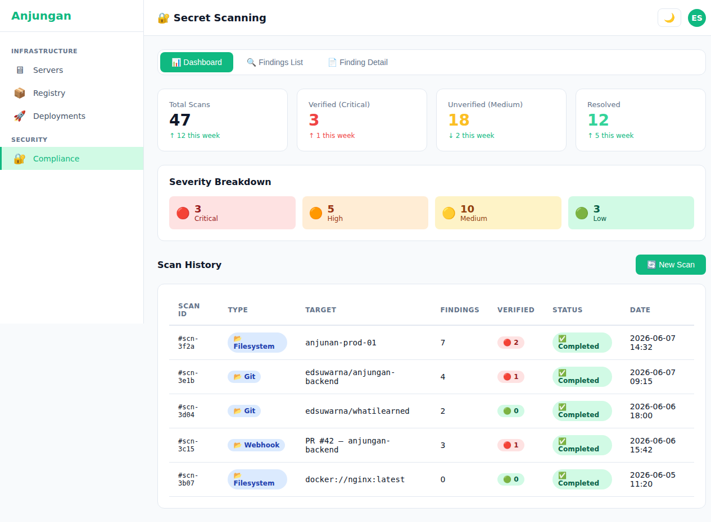
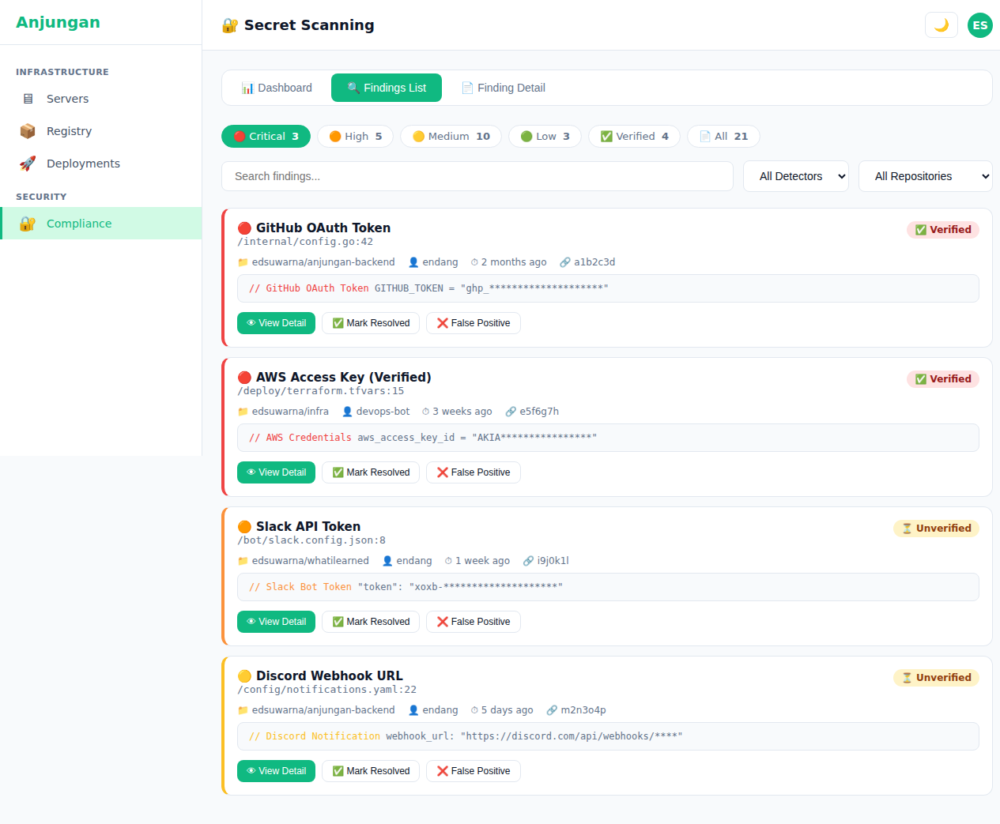
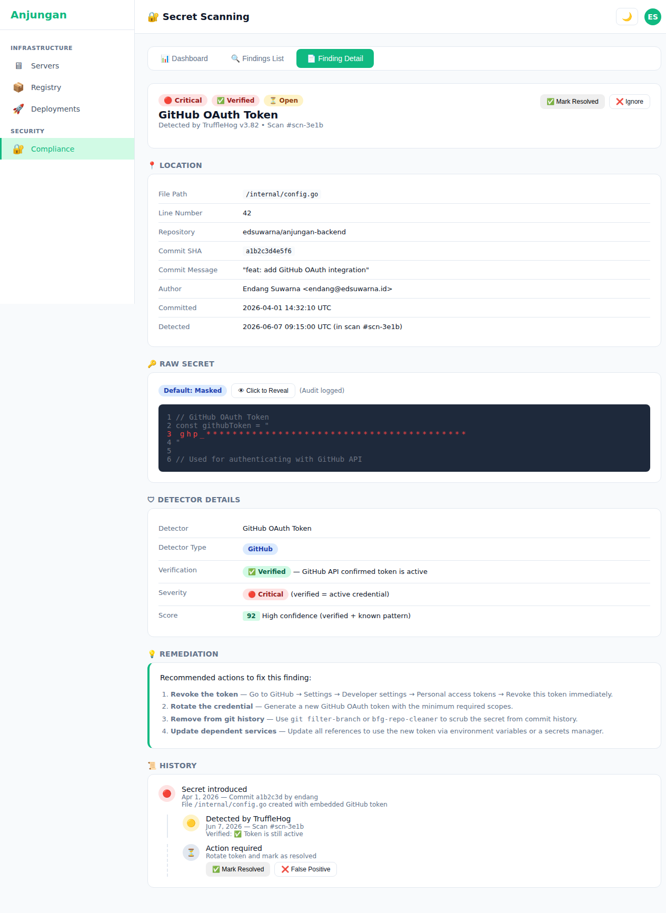

# Anjungan — PRD: Secret Scanning (TruffleHog)

> **Version:** 1.0
> **Status:** 🔴 Not Implemented — Proposed for Phase 3
> **Author:** Endang Suwarna
> **Last Updated:** June 5, 2026

---

## 1. Executive Summary

### Problem Statement

Secret/credential leaks are one of the leading causes of breaches in software engineering. The problems:

- **Developer accidentally commits a secret to git** — API key, database password, cloud credential enters commit history and stays there even after being deleted from the file
- **Secrets in Docker image layers** — credentials get baked into image layers, and anyone who can `docker pull` can extract them
- **No systematic detection** — Anjungan manages repos + container images, but nothing automatically scans for secrets
- **False positive noise** — Regular detection tools have many false positives, causing people to ignore them

**TruffleHog solves this differently** from regular secret scanners:

| Aspect | Trivy Secrets / Grype | TruffleHog |
|-------|----------------------|------------|
| **Detectors** | Limited built-in | **700+ detectors** — AWS, GitHub, Slack, Discord, Stripe, 100+ services |
| **Verification** | ❌ No | ✅ **Verification engine** — tries the credential against the actual API |
| **Git-aware** | Static file scan | ✅ **Git diff/PR scan**, delta detection, commit forensics |
| **Approach** | Regex-only | ✅ **Regex + Entropy + ML** — hybrid detection |

### What This Solves

| Problem | TruffleHog Solution |
|---------|-------------------|
| Secret accidentally committed | **Git history scan** — detects all commits, not just HEAD |
| Secrets in image layers | **Docker image scan** — extracts + scans each layer |
| Many false positives | **Verification** — tries credential against the API, verified = real leak |
| No audit trail | **Historical leak timeline** — when secret was introduced, detected, fixed |
| Credentials still active | **Verified badge** — know which ones are still active vs already revoked |

### Current Status

| Aspect | Status |
|-------|--------|
| Compliance scanner (CIS, Lynis) | ✅ Available in PRD-compliance.md |
| Container image vulnerability (Trivy) | 🔴 Planned — PRD-container-image-scanning.md |
| **TruffleHog Secret Scanner** | ❌ **Not implemented** — This PRD |
| Git repo scanning | ❌ Not implemented |
| Container layer scanning | ❌ Not implemented |
| Verified credential alerting | ❌ Not implemented |
| Historical leak tracking | ❌ Not implemented |

### Target Audience

- **Endang** (platform engineer) — detect leaked credentials across repos + servers
- **DevOps** — prevent deployments containing secrets
- **Security team** — audit trail + verified credential scoring
- **Developers** — know if their credentials are leaked, can rotate

### Goals

| Goal | Metric |
|------|--------|
| Detect secrets in git repositories | ✅ All connected repos |
| Detect secrets in container image layers | ✅ Via agent filesystem scan |
| Verified vs unverified classification | ✅ TruffleHog verification engine |
| Historical leak tracking | ✅ Timeline: commit → detected → fixed |
| Integrate with Anjungan repos + containers | ✅ Cross-module |
| Response time (single repo scan) | < 2 minutes |

---

## 2. Product Overview

### Architecture

```
┌─────────────────────────────────────────────────────────────────┐
│                      Anjungan Server                             │
│                                                                  │
│  ┌──────────────┐  ┌──────────────────┐  ┌───────────────────┐   │
│  │ Git Scanner   │  │ Container FS     │  │ Webhook           │   │
│  │ (SSH/Agent)   │  │ Scanner (Agent)  │  │ Receiver          │   │
│  └──────┬───────┘  └──────┬───────────┘  └──────┬────────────┘   │
│         │                 │                     │                │
│         ▼                 ▼                     ▼                │
│  ┌─────────────────────────────────────────────────────────┐    │
│  │                TruffleHog Engine                          │    │
│  │  • 700+ detectors  • Verification API  • JSON output    │    │
│  └─────────────────────────────────────────────────────────┘    │
│         │                 │                     │                │
│         ▼                 ▼                     ▼                │
│  ┌──────────────┐  ┌──────────────┐  ┌──────────────────────┐   │
│  │ secret_scans  │  │ secret_      │  │ Frontend Dashboard  │   │
│  │ table         │  │ findings     │  │ /secrets            │   │
│  └──────────────┘  │ table         │  └──────────────────────┘   │
│                    └──────────────┘                              │
└─────────────────────────────────────────────────────────────────┘
```

### Scanning Modes

TruffleHog has 3 scanning modes in Anjungan:

```
┌─────────────────────────────────────────────────────────────────┐
│  MODE 1: Git Repository Scan                                    │
│─────────────────────────────────────────────────────────────────│
│  Trigger: manual dari halaman repository / scheduled             │
│  Command: trufflehog git https://github.com/org/repo --json     │
│           --no-verification --since-commit HEAD~100              │
│  Coverage: Semua commit history (atau sejak commit tertentu)     │
├─────────────────────────────────────────────────────────────────┤
│  MODE 2: Container Filesystem Scan                              │
│─────────────────────────────────────────────────────────────────│
│  Trigger: manual dari halaman container / agent periodic         │
│  Command: trufflehog filesystem --directory=/path --json         │
│           --only-verified                                        │
│  Run via: Agent di server target                                 │
│  Coverage: Container layers, env files, config files             │
├─────────────────────────────────────────────────────────────────┤
│  MODE 3: CI/CD Webhook Receiver                                 │
│─────────────────────────────────────────────────────────────────│
│  Source: GitHub Action / CI pipeline jalanin TruffleHog          │
│  Endpoint: POST /api/v1/secrets/webhook                          │
│  Format: TruffleHog JSON output                                  │
│  Coverage: Pre-commit / PR check results                         │
└─────────────────────────────────────────────────────────────────┘
```

### Integration Points

| Integration | Description |
|-----------|-----------|
| **PRD-repositories-deployments.md** | Scan secrets in repositories registered in Anjungan |
| **PRD-container-image-scanning.md** | Complement — Trivy handles CVEs, TruffleHog handles secrets in images |
| **PRD-anj-agent.md** | Agent executes filesystem scan on target server |
| **Existing Deployments** | Gate deployment — block deploy if verified secret is found |
| **Existing Compliance Dashboard** | Summary widget — verified leaks count, trend |

---

## 3. Feature Specifications

> **Legend:** ✅ Implemented | 🟡 Partial | 🔴 Planned

### F1 — Git Repository Scan

| | |
|---|---|
| **Priority** | P1 |
| **Status** | 🔴 **Planned** |
| **Backend** | `POST /api/v1/secrets/scan` with `{type: "git", target: "https://github.com/org/repo"}`. Backend executes `trufflehog git --json --no-verification` (or via agent). Parse JSON output → extract findings per detector. Store in `secret_scans` + `secret_findings`. Can scan specific branch, specific commit range, or full history. |
| **Integration** | Can be triggered from `/repositories` page → "Scan Secrets" button per repo. Also from repo detail page. |
| **Limitations** | Large repos (> 10K commits) → scan limited to last 100 commits or last 30 days. Full history scan available manually. |

### F2 — Container Filesystem Scan

| | |
|---|---|
| **Priority** | P1 |
| **Status** | 🔴 **Planned** |
| **Backend** | Agent executes `trufflehog filesystem --directory=/app --json --no-verification` inside the container or host filesystem. Parse results → extract finding path, detector name, verified status, raw value (masked). |
| **Scope** | Container image layers, `/env`, `.env` files, config files (`*.config.*`, `*.json`, `*.yaml`), mounted secrets, build artifacts. |
| **Integration** | Container detail page — "Scan Container for Secrets" button. Agent-based, so private servers can also be scanned. |

### F3 — Webhook Receiver

| | |
|---|---|
| **Priority** | P2 |
| **Status** | 🔴 **Planned** |
| **Backend** | `POST /api/v1/secrets/webhook` receives TruffleHog JSON output from GitHub Action / CI pipeline. Validate payload source (HMAC signature or IP whitelist). Store with source=webhook, linked to repo + commit SHA if available. |
| **CI/CD Integration** | GitHub Action: `trufflesecurity/trufflehog@main` with `--json` output → `curl -X POST https://anjungan.internal/api/v1/secrets/webhook -d @-`. |

### F4 — Verification Engine

| | |
|---|---|
| **Priority** | P1 |
| **Status** | 🔴 **Planned** |
| **What It Does** | TruffleHog **tries the credential** directly against its target API. For example: finds an AWS Access Key → TruffleHog tries `sts:GetCallerIdentity` against AWS API. If successful → `verified: true`. If it fails → `verified: false`. |
| **Why This Matters** | **This is what sets TruffleHog apart from other secret scanners.** Regular scanners detect anything that looks like a secret → many false positives → people ignore them. TruffleHog verified = **confirmed leak**, priority #1 to fix. |
| **Severity Mapping** | `verified: true` → **Critical** (immediate fix required). `verified: false` → **Medium** (high confidence pattern, not confirmed active). |
| **Backend** | Agent executes `trufflehog git --json` (verification default ON). Or webhook payload contains verified field. Store `is_verified` in `secret_findings`. |
| **Risk** | Verification **actively contacts external APIs**. Some organizations may not want this. Option: `--no-verification` flag to disable. |

### F5 — Historical Leak Tracking

| | |
|---|---|
| **Priority** | P2 |
| **Status** | 🔴 **Planned** |
| **Backend** | TruffleHog git scan includes commit metadata: commit SHA, author, timestamp, file path, line number. When re-scanning the same repo, TruffleHog distinguishes new findings from existing ones via `commit_sha + file + line`. **Historical leak timeline**: when the secret first entered a commit, when it was detected, when it's no longer in the latest commit (fixed). |
| **Frontend** | Tab "Historical Leaks" per repo or per finding. Timeline: 🔴 Leak introduced (commit abc123) → 🟡 Detected (scan #3) → 🟢 Fixed (commit def456). |
| **Data** | `secret_findings` has `first_seen_scan_id`, `first_seen_at`, `last_seen_at`, `is_resolved` (no longer appears in latest scan). |

### F6 — Secret Dashboard & Findings

| | |
|---|---|
| **Priority** | P0 |
| **Status** | 🔴 **Planned** |
| **Backend** | `GET /api/v1/secrets/summary` — aggregate: total scans, total findings, verified count, unverified count, by detector type, by severity. `GET /api/v1/secrets/findings` — list findings (?verified=&detector=&repo=&status=). `GET /api/v1/secrets/findings/{id}` — detail. `GET /api/v1/secrets/history` — timeline. |
| **Frontend** | Route `/secrets`. **Dashboard**: KPI cards — total scans, verified leaks (🔴), unverified findings (🟡), trend. **Findings list**: per-finding card — detector name + icon (AWS, GitHub, Slack), file path + line, verified badge, raw snippet (masked), first commit date. **Filter bar**: verified/unverified/all, detector type, repo, severity. **Historical Leaks tab**: timeline view — events grouped by time. |
| **UX** | **Verified badge**: 🔴 Verified (critical) — red bg + checkmark. 🟡 Unverified (medium) — yellow bg. **Detector icons**: per-category icon (AWS, GitHub, Slack, Discord, Generic). **Raw snippet**: truncated to 3 lines + "Show full" toggle — masked by default, reveal on click. **Copy finding ID** button. |

### F7 — Deployment Gate (Future)

| | |
|---|---|
| **Priority** | P3 |
| **Status** | 🔴 **Planned (Future)** |
| **Description** | Before a deployment is executed, Anjungan checks: does this repo have any findings that are not yet fixed with `verified: true`? If so, deployment is blocked with a reason + link to the finding. Admin can override with a written reason. |

---

## 4. API Design

```go
// === Scanning ===
POST   /api/v1/secrets/scan                      // Trigger scan {type: git|filesystem, target, server_id?, repo_connection_id?}
GET    /api/v1/secrets/scans                      // List all scans (?repo=&status=&limit=)
GET    /api/v1/secrets/scans/{id}                 // Scan detail
GET    /api/v1/secrets/scans/{id}/findings        // Findings for a scan

// === Findings ===
GET    /api/v1/secrets/findings                   // List findings (?verified=&detector=&repo=&severity=)
GET    /api/v1/secrets/findings/{id}              // Finding detail + raw value (masked)
PATCH  /api/v1/secrets/findings/{id}              // Update status: resolved/false_positive/acknowledged

// === Summary / Dashboard ===
GET    /api/v1/secrets/summary                    // KPI aggregate
GET    /api/v1/secrets/top-detectors              // Ranking detector types
GET    /api/v1/secrets/history                    // Timeline events

// === Webhook ===
POST   /api/v1/secrets/webhook                    // Receive TruffleHog JSON from CI/CD

// === Per-Repo ===
GET    /api/v1/repositories/{id}/secrets          // Findings for specific repo
POST   /api/v1/repositories/{id}/scan-secrets     // Trigger git scan on repo

// === Per-Server / Container ===
GET    /api/v1/servers/{id}/secrets               // Findings for server
POST   /api/v1/servers/{id}/scan-secrets          // Trigger filesystem scan on server
GET    /api/v1/containers/{id}/secrets            // Findings for container
POST   /api/v1/containers/{id}/scan-secrets       // Trigger container scan
```

---

## 5. Database Schema

```sql
-- Secret scan results
CREATE TABLE secret_scans (
    id              UUID PRIMARY KEY DEFAULT gen_random_uuid(),
    scan_type       VARCHAR(20) NOT NULL,           -- git, filesystem, webhook
    target          TEXT NOT NULL,                   -- repo URL, filesystem path, or "webhook"
    server_id       UUID REFERENCES servers(id),    -- NULL for webhook scans
    repo_connection_id UUID REFERENCES repo_connections(id), -- NULL for filesystem/webhook
    source          VARCHAR(20) DEFAULT 'agent',    -- agent, manual, webhook
    status          VARCHAR(20) DEFAULT 'pending',  -- pending, running, completed, failed
    total_findings  INTEGER DEFAULT 0,
    verified_count  INTEGER DEFAULT 0,
    unverified_count INTEGER DEFAULT 0,
    duration_ms     INTEGER,
    trufflehog_version VARCHAR(50),
    raw_output      JSONB,                          -- Full TruffleHog output
    error_message   TEXT,
    started_at      TIMESTAMP,
    completed_at    TIMESTAMP,
    created_by      UUID REFERENCES users(id),
    created_at      TIMESTAMP DEFAULT NOW()
);

CREATE INDEX idx_sec_scans_type ON secret_scans(scan_type, created_at DESC);
CREATE INDEX idx_sec_scans_status ON secret_scans(status);

-- Individual secret findings
CREATE TABLE secret_findings (
    id              UUID PRIMARY KEY DEFAULT gen_random_uuid(),
    scan_id         UUID NOT NULL REFERENCES secret_scans(id) ON DELETE CASCADE,
    detector_name   VARCHAR(200) NOT NULL,          -- "AWS Access Key", "GitHub PAT", "Slack Token"
    detector_type   VARCHAR(100),                   -- "AWS", "GitHub", "Slack", "Discord", "Generic"
    verified        BOOLEAN DEFAULT FALSE,           -- TruffleHog verification result
    severity        VARCHAR(20) DEFAULT 'medium',    -- critical(verified), medium(unverified)
    file_path       TEXT,
    line_number     INTEGER,
    commit_sha      VARCHAR(40),                    -- from git scan
    commit_message  TEXT,
    commit_timestamp TIMESTAMP,
    author          VARCHAR(255),
    email           VARCHAR(255),
    raw_value       TEXT,                            -- masked by default in API response
    raw_value_hash  VARCHAR(64),                     -- SHA-256 for deduplication
    status          VARCHAR(20) DEFAULT 'open',      -- open, resolved, false_positive, acknowledged
    first_seen_scan_id UUID REFERENCES secret_scans(id),
    first_seen_at   TIMESTAMP,
    last_seen_at    TIMESTAMP,
    resolved_at     TIMESTAMP,
    resolved_by     UUID REFERENCES users(id),
    created_at      TIMESTAMP DEFAULT NOW()
);

CREATE INDEX idx_sec_findings_scan ON secret_findings(scan_id);
CREATE INDEX idx_sec_findings_verified ON secret_findings(verified);
CREATE INDEX idx_sec_findings_detector ON secret_findings(detector_name);
CREATE INDEX idx_sec_findings_status ON secret_findings(status);
CREATE INDEX idx_sec_findings_commit ON secret_findings(commit_sha);

-- Finding status history (audit trail)
CREATE TABLE secret_finding_status_history (
    id              UUID PRIMARY KEY DEFAULT gen_random_uuid(),
    finding_id      UUID NOT NULL REFERENCES secret_findings(id) ON DELETE CASCADE,
    old_status      VARCHAR(20),
    new_status      VARCHAR(20) NOT NULL,
    changed_by      UUID REFERENCES users(id),
    reason          TEXT,
    created_at      TIMESTAMP DEFAULT NOW()
);
```

---

## 6. UX Flow

### Flow: Scan Repository → View Findings

```
1. Buka /repositories → pilih repo "anjungan-backend"
2. Klik dropdown Actions → [Scan Secrets]
3. Modal: "Scan git history for secrets?"
   - Option: "Last 100 commits" (quick) vs "Full history" (slow)
   - Trigger → backend queue scan
4. Scan mulai: "Scanning repository... 340 commits"
5. Selesai → notif: "2 verified secrets found in anjungan-backend"
6. Buka /secrets → liat findings:
   ┌─────────────────────────────────────────────────┐
   │ 🔴 GitHub OAuth Token          ● Verified       │
   │ ── /internal/config.go:42                       │
   │ ── 2 months ago · author: endang                │
   │ ── SHA: a1b2c3d4                                │
   │ ── https://github.com/edsuwarna/anjungan-backend │
   │      [View Detail] [Mark Resolved]              │
   │                                                 │
   │ 🟡 AWS Access Key              ○ Unverified     │
   │ ── /deploy/terraform.tfvars:15                  │
   │ ── 3 weeks ago · author: bot                    │
   └─────────────────────────────────────────────────┘
7. Klik finding → detail:
   - Detector: GitHub OAuth Token
   - File: /internal/config.go line 42
   - Value: ghp_*************** (masked)
   - Verified: ✅ Yes (GitHub API confirmed)
   - Committed: 2026-04-01 by endang
   - Repository: edsuwarna/anjungan-backend
   - Action: "Mark as Resolved" or "Mark as False Positive"
```

### Flow: Verified Secret Alert

```
1. Scan selesai → finding dengan verified: true
2. Dashboard /secrets langsung nampilin:
   🔴 2 critical (verified) · 🟡 5 medium (unverified)
3. Finding card warna merah dengan badge "🔴 CRITICAL — Active credential"
4. Admin kena notif (future: in-app + Telegram):
   "🚨 VERIFIED SECRET LEAK
    GitHub OAuth Token in anjungan-backend/config.go:42
    Active — revoke immediately"
5. Action: "View Finding" → revoke instruction → "Mark Resolved" setelah revoke
```

### Flow: Historical Leak Timeline

```
┌─────────────────────────────────────────────────┐
│  Historical Leaks — anjungan-backend             │
│  (Last 90 days)                                  │
├─────────────────────────────────────────────────┤
│  🔴 Apr 1  — Secret introduced (commit a1b2c3)  │
│              GitHub OAuth Token in config.go:42   │
│               Author: endang                      │
│                 │                                 │
│  🟡 Jun 5  — Detected by TruffleHog scan #3     │
│               Scanner: trufflehog@v3.82           │
│               Verified: ✅ Active                 │
│                 │                                 │
│  🔲 Now     — ⚠️ Action required                 │
│               [View Credential] [Revoke & Fix]    │
└─────────────────────────────────────────────────┘
```

---

## 7. Implementation Roadmap

### 🔴 Phase 1 — Foundation (Planned)

| Order | Feature | Effort | Dependencies |
|-------|---------|--------|-------------|
| 1 | `secret_scans` + `secret_findings` tables + migration | 0.5 days | — |
| 2 | `secret_finding_status_history` table | 0.5 days | #1 |
| 3 | Scan API endpoints (trigger, list, detail) | 1.5 days | #1 |
| 4 | Findings API (list, detail, update status) | 1 days | #1 |
| 5 | Git scan backend (trufflehog git executor) | 1.5 days | Agent/SSH executor |
| 6 | Secret dashboard frontend (/secrets) | 2 days | #3, #4 |
| 7 | Finding detail + verified badge | 1 days | #4 |

### 🔴 Phase 2 — Deep Scanning (Planned)

| Order | Feature | Effort | Dependencies |
|-------|---------|--------|-------------|
| 8 | Container filesystem scan backend (agent-based) | 1.5 days | Agent |
| 9 | Scan trigger from repo + container pages | 1 days | #8 |
| 10 | Verification engine (verified vs unverified UI) | 1 days | #6 |
| 11 | Historical leak timeline | 1.5 days | #4 |
| 12 | Webhook receiver | 1 days | #3 |

### 🔴 Phase 3 — Automation & Gates (Planned — Future)

| Order | Feature | Effort | Notes |
|-------|---------|--------|-------|
| 13 | Deployment gate (block deploy on verified secrets) | 2 days | Requires deployment pipeline |
| 14 | Scheduled repo scan (weekly) | 1 days | — |
| 15 | In-app notification (new verified finding) | 1 days | — |
| 16 | Telegram/email alert (critical finding) | 1 days | Requires notification system |

---

## 8. Non-Functional Requirements

| Requirement | Target |
|-------------|--------|
| Git scan speed (10K commits) | < 3 minutes |
| Git scan speed (100 commits) | < 30 seconds |
| Filesystem scan (1GB) | < 2 minutes |
| Dashboard load | < 2 seconds |
| Finding list pagination | < 500ms per page |
| Raw value storage | Hashed + encrypted, never in plaintext |
| Raw value display | Default masked, click to reveal (audit logged) |
| DB cleanup | Findings > 1 year → archive |
| TruffleHog version | Latest stable, pin in agent config |
| False positive rate | < 10% (verified-only mode) |

### Security Considerations

- **Raw values** — stored encrypted at rest (column-level encryption). API returns masked by default (`ghp_****`). Only admin can reveal with reason logged in audit trail.
- **Verification** — hits external APIs. Rate limited: max 10 verifications/minute. Option to disable verification entirely.
- **Scan tokens** — if scanning a GitHub repo, needs a personal access token with repo scope. Stored encrypted in `repo_connections`.
- **Masking** — default mask: show first 4 + last 4 chars (`AKIA****WXYZ`). Full reveal: click button → confirm dialog → audit log entry.

---

## 9. References

- [TruffleHog](https://github.com/trufflesecurity/trufflehog) — GitHub repo, 27K+ stars
- [PRD-anj-agent.md](./PRD-anj-agent.md) — Agent system
- [PRD-container-image-scanning.md](./PRD-container-image-scanning.md) — Trivy vulnerability scanning
- [PRD-compliance.md](./PRD-compliance.md) — CIS hardening (sister module)
- [PRD-repositories-deployments.md](./PRD-repositories-deployments.md) — Repository management

## 10. Mockup References

The following mockup screenshots were created to visualize the Secret Scanning feature UI:

| Screen | Preview |
|--------|---------|
| **Secret Scan Dashboard** — KPI cards (total scans, verified critical, unverified, resolved), severity breakdown (Critical/High/Medium/Low), scan history table with type, target, findings, and status badges |  |
| **Findings List** — Severity-filtered findings with search bar, detector/repo dropdowns, finding cards (GitHub OAuth Token, AWS Access Key, Slack API Token, Discord Webhook URL) with severity-left-border, verified badges, file paths, and action buttons |  |
| **Finding Detail** — Header with Critical/Verified/Open badges, location section (file path, line number, commit SHA, author), masked raw secret with reveal button, detector details (score 92, verified), 4-step remediation guide, and historical leak timeline (introduced → detected → action required) |  |
