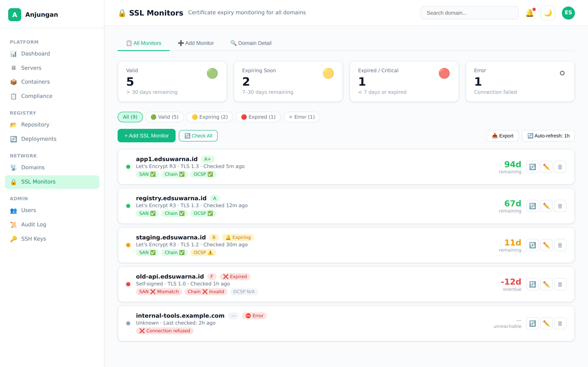
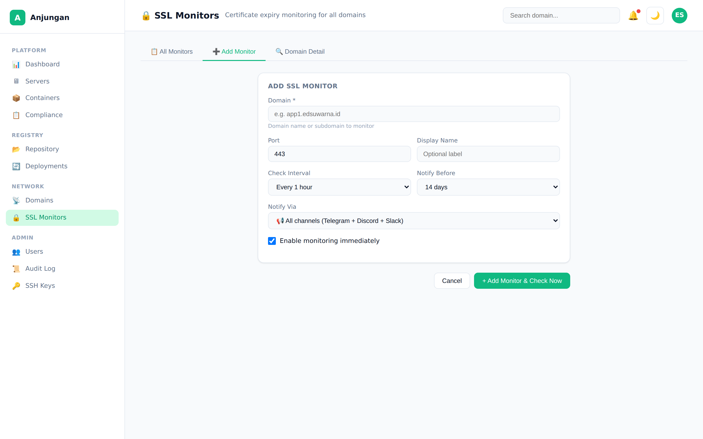
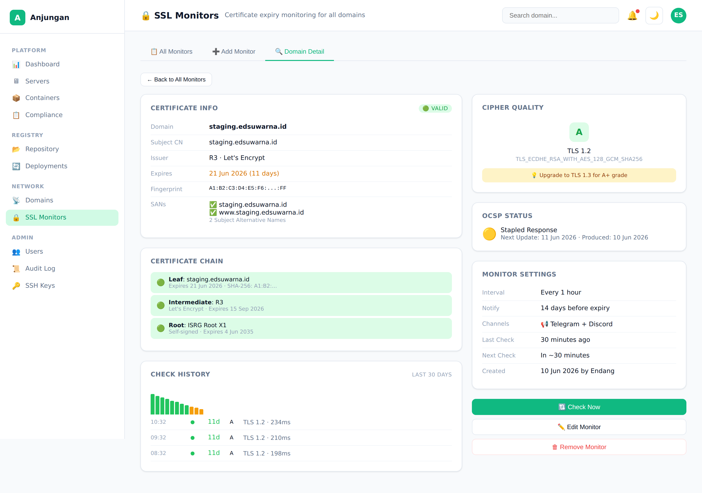

# Anjungan — PRD: SSL Certificate Monitoring

> **Version:** 2.0
> **Status:** 🟡 In Development — Branch `feat/ssl-monitoring` (Phase 2 ✅, Phase 3 pending)
> **Author:** Endang Suwarna
> **Last Updated:** June 10, 2026

---

## 1. Executive Summary

### Problem Statement

Anjungan manages multiple servers and domains, but there is **no centralized SSL certificate expiry monitoring**. Currently:

- Domains spread across Traefik (peladen-central), Cloudflare, Vercel, and other external hosts
- No single dashboard to see **which domains are expiring, when, and how critical**
- Relies on email reminders from Let's Encrypt (only for domains on peladen-central)
- Domains on external hosts (Vercel, Cloudflare, other servers) have **zero visibility**
- Expired certs cause service outages — usually discovered when users report "site down"

### What This Solves

| Problem | Solution |
|---------|---------|
| Spread domains with no central watch | Manual entry — monitor ANY domain, anywhere |
| No expiry warning system | Dashboard badges + notification threshold (default 14 days) |
| Unknown certificate quality | Chain validation, cipher grade, OCSP revocation check |
| Manual TLS check per domain | Automated cron checks + history tracking |
| No audit of who added/removed monitors | Full audit log integration |

### Target Audience

- **Endang** (platform engineer) — know all cert status at a glance, get notified before expiry
- **DevOps** — add domains they're responsible for, monitor any external services

### Goals

| Goal | Metric |
|------|--------|
| Add domain to monitor from UI | < 10 seconds |
| Automated TLS health check | Per cron interval (default 1h) |
| Detect expiring certs | < 14 days before expiry → status change |
| Certificate quality insights | Chain valid? OCSP clean? Cipher grade? |
| Notifications via existing channels | Telegram / Discord / Slack via webhook system |
| Zero dependencies on other features | Standalone — no cluster_servers, no domains table |

### Non-Goals

- ❌ Not a replacement for Traefik / Let's Encrypt auto-renewal
- ❌ Not a full SSL certificate manager (no CSR generation, no cert installation)
- ❌ Not a domain health / uptime monitor (SSL only, not HTTP response)
- ❌ Not auto-discovering domains from Traefik (manual entry only)

---

## 2. Product Overview

### This Feature in the Context of Anjungan

```
User Dashboard
│
├── SSL Monitoring Menu (/ssl-monitors)
│   ├── Domain List → status badges, days remaining, last checked
│   ├── Add SSL Monitor → manual entry form
│   ├── Domain Detail → full cert info + check history
│   └── Check All → manual trigger batch check
│
├── Notification System (existing)
│   ├── Webhook → Telegram / Discord / Slack
│   └── Dashboard Alert → summary card
│
└── Cron Engine (backend)
    ├── CheckExpiringCerts() → periodic TLS check
    └── NotifyWatchers() → alert if < threshold
```

### Flow: Add & Monitor SSL Domain

```
User input                    Anjungan                            Internet
┌────────────────┐          ┌───────────────────────┐         ┌──────────────┐
│ Domain: X      │          │ 1. Save to DB          │         │ 4. TLS handshake│
│ Port: 443      │ ───────▶ │ 2. TLS check → parse   │ ──────▶ │ 5. Return cert  │
│ Notify: 14d    │          │ 3. Update status        │    TLS  │ 6. Chain + OCSP │
│ Interval: 1h   │          │ 7. Display in UI        │         └──────────────┘
└────────────────┘          └───────────────────────┘
```

### Key Design Decision: Manual Entry

Unlike the original PRD-domain-management.md §F6.4 (which relied on auto-discovery from Traefik), this feature uses **manual domain entry**. Rationale:

1. **Flexibility** — monitor domains on any host (Cloudflare, Vercel, external servers)
2. **Zero infra dependency** — works without Traefik config generator or cluster_servers table
3. **Immediate value** — can ship independently without waiting for Domain Management feature
4. **Complete control** — user decides which domains matter, not auto-detection

---

## 3. Feature Specifications

> **Priority Key:** P0 = Must have, P1 = Should have, P2 = Nice to have

### F1 — SSL Monitor CRUD (P0)

| | |
|---|---|
| **Backend** | New `ssl_monitors` table. CRUD: `GET/POST/PUT/DELETE /api/v1/ssl-monitors`. Fields: domain, port (default 443), display_name, check_interval (seconds, default 3600), notify_before_days (default 14), enabled. Filter: `?status=`, `?search=domain`. |
| **Frontend** | Route `/ssl-monitors`. Domain list with badge status, days remaining, issuer, last checked. "+ Add SSL Monitor" button → form. Click domain card → detail view. **Dashboard summary card**: "X certs expiring within 30 days". |
| **UX** | Badge color: 🟢 >30d, 🟡 7-30d, 🔴 <7d/expired, ⚪ pending/error. Inline validation on domain format. Duplicate check (domain+port unique). Quick action dropdown on each card: Check Now, Edit, Delete. |

### F2 — TLS Certificate Check (P0)

| | |
|---|---|
| **Backend** | TLS handshake to `domain:port` → extract: certificate chain, expiry date, issuer (CN + org), subject (CN), SANs (Subject Alternative Names), fingerprint (SHA-256), TLS version, cipher suite. Validate chain (intermediate certs). OCSP check: query OCSP responder from cert → status (good/revoked/unknown). Store result. Update `status`, `cert_expires_at`, `cert_days_remaining`, `last_checked_at`, `last_error`. |
| **Frontend** | Detail page: all cert info displayed. Chain panel: leaf → intermediate → root with validity status. SAN list with domain match indicator (✅ monitored domain is in SANs / ❌ mismatch). Cipher info: TLS version + cipher suite. OCSP status badge. |
| **UX** | SAN mismatch = warning highlight. OCSP revoked = 🔴 critical badge. Chain error = 🟡 warning. |

### F3 — Cipher Quality Grading (P1)

| | |
|---|---|
| **Backend** | Grade based on TLS version + cipher suite: A+ (TLS 1.3), A (TLS 1.2 strong), B (TLS 1.2 weak), C (TLS 1.1), D (TLS 1.0), F (SSLv3). Store as `cipher_grade` VARCHAR(2). |
| **Frontend** | Badge on domain card + detail: A+ 🟢, A 🟢, B 🟡, C 🟠, D 🔴, F 🔴. Tooltip explaining grade criteria. |
| **UX** | Click grade → expand detailed explanation + recommended fix. |

### F4 — Automated Scheduled Checks (P1)

| | |
|---|---|
| **Backend** | Cron job: `CheckExpiringCerts()` — iterate all `ssl_monitors` where `enabled = true`. For each: TLS check → update result. If `cert_days_remaining <= notify_before_days` → trigger notification event. Configurable interval (default: every hour). |
| **Frontend** | No dedicated page — but show "Last checked: X min ago" on each domain. "Check Now" button for manual immediate check. "Check All" button for all domains. |
| **UX** | During check: spinner/pulsing badge. On completion: update without page reload. |

### F5 — Notification Integration (P1)

| | |
|---|---|
| **Backend** | When expiration is detected within threshold, use existing webhook system (`registry_webhooks` / notification channels). Event payload: domain name, days remaining, issuer, expiry date. Notification per SSL monitor (user can configure which channels during add/edit). |
| **Frontend** | In Add/Edit form: notification section — select webhook channels (reuse from webhook system). Dashboard alert card for expiring certs. |
| **UX** | "Notify me via" dropdown (multi-select from existing webhooks). Telegram example notification preview. |

### F6 — Check History & Trend (P2)

| | |
|---|---|
| **Backend** | New `ssl_check_history` table. Each check result: domain_id, checked_at, days_remaining, status, cipher_grade, error_message. Retention: keep last 90 days, auto-purge. |
| **Frontend** | Detail page → "Check History" tab/panel. Timeline view: each check with status + days remaining. Mini chart (days_remaining over time) — shows renewal events (sudden spike = cert renewed). |
| **UX** | Chart: x-axis = date, y-axis = days remaining. Renewal visible as vertical jump. Expiry visible as descending line. |

---

## 4. API Design

### New Endpoints

```go
// === SSL Monitors ===
GET    /api/v1/ssl-monitors                          // List all (?status=&search=&enabled=)
POST   /api/v1/ssl-monitors                          // Add new monitor
GET    /api/v1/ssl-monitors/{id}                     // Detail + current cert info
PUT    /api/v1/ssl-monitors/{id}                     // Update
DELETE /api/v1/ssl-monitors/{id}                     // Remove
POST   /api/v1/ssl-monitors/{id}/check               // Manual TLS check
POST   /api/v1/ssl-monitors/check-all                // Trigger check for all monitors

// === SSL Summary ===
GET    /api/v1/ssl-monitors/summary                  // Counts: total, valid, expiring, expired, error

// === History (Phase 2) ===
GET    /api/v1/ssl-monitors/{id}/history             // Paginated check history (?limit=&offset=)
```

### Response Format

```json
// POST /api/v1/ssl-monitors (Create)
{
  "success": true,
  "data": {
    "id": "uuid-ssl-1",
    "domain": "app1.edsuwarna.id",
    "port": 443,
    "display_name": "App 1 Production",
    "status": "pending",
    "check_interval": 3600,
    "notify_before_days": 14,
    "enabled": true,
    "webhook_ids": ["uuid-wh-1", "uuid-wh-2"],
    "created_at": "2026-06-10T10:00:00Z"
  }
}

// GET /api/v1/ssl-monitors/{id} (Detail)
{
  "success": true,
  "data": {
    "id": "uuid-ssl-1",
    "domain": "app1.edsuwarna.id",
    "port": 443,
    "display_name": "App 1 Production",
    "status": "valid",
    "cert": {
      "subject_cn": "app1.edsuwarna.id",
      "issuer_cn": "R3",
      "issuer_org": "Let's Encrypt",
      "expires_at": "2026-09-20T00:00:00Z",
      "days_remaining": 102,
      "fingerprint_sha256": "AB:CD:...",
      "sans": ["app1.edsuwarna.id", "www.app1.edsuwarna.id"],
      "san_match": true,
      "tls_version": "TLS 1.3",
      "cipher_suite": "TLS_AES_256_GCM_SHA384",
      "cipher_grade": "A+",
      "chain_status": "valid",
      "ocsp_status": "good"
    },
    "last_checked_at": "2026-06-10T10:00:00Z",
    "last_error": null,
    "check_interval": 3600,
    "notify_before_days": 14,
    "enabled": true,
    "webhook_ids": ["uuid-wh-1"],
    "created_at": "2026-06-10T10:00:00Z",
    "updated_at": "2026-06-10T10:00:00Z"
  }
}

// GET /api/v1/ssl-monitors/summary
{
  "success": true,
  "data": {
    "total": 8,
    "valid": 5,
    "expiring_soon": 2,
    "expired": 0,
    "error": 1
  }
}
```

---

## 5. Database Schema

### New Tables

```sql
-- 000024_create_ssl_monitors.up.sql
CREATE TABLE ssl_monitors (
  id UUID PRIMARY KEY DEFAULT gen_random_uuid(),
  domain VARCHAR(255) NOT NULL,
  port INTEGER DEFAULT 443,
  display_name VARCHAR(255),                              -- optional label
  check_interval INTEGER DEFAULT 3600,                     -- seconds
  notify_before_days INTEGER DEFAULT 14,
  webhook_ids UUID[] DEFAULT '{}',                         -- ref to registry_webhooks
  status VARCHAR(20) DEFAULT 'pending',                    -- pending, valid, expiring_soon, expired, error
  cert_subject_cn VARCHAR(255),
  cert_issuer_cn VARCHAR(255),
  cert_issuer_org VARCHAR(255),
  cert_expires_at TIMESTAMP,
  cert_days_remaining INTEGER,
  cert_fingerprint_sha256 VARCHAR(64),
  cert_sans TEXT[] DEFAULT '{}',
  cert_san_match BOOLEAN,
  cert_tls_version VARCHAR(20),
  cert_cipher_suite VARCHAR(100),
  cert_cipher_grade VARCHAR(2),                            -- A+, A, B, C, D, F
  cert_chain_status VARCHAR(20),                           -- valid, invalid, unknown
  cert_ocsp_status VARCHAR(20),                            -- good, revoked, unknown, not_checked
  last_checked_at TIMESTAMP,
  last_error TEXT,
  enabled BOOLEAN DEFAULT TRUE,
  created_by UUID REFERENCES users(id),
  created_at TIMESTAMP DEFAULT NOW(),
  updated_at TIMESTAMP DEFAULT NOW(),
  UNIQUE(domain, port)                                     -- prevent duplicate monitor
);

-- 000025_create_ssl_check_history.up.sql (Phase 2)
CREATE TABLE ssl_check_history (
  id UUID PRIMARY KEY DEFAULT gen_random_uuid(),
  ssl_monitor_id UUID NOT NULL REFERENCES ssl_monitors(id) ON DELETE CASCADE,
  checked_at TIMESTAMP DEFAULT NOW(),
  status VARCHAR(20) NOT NULL,
  days_remaining INTEGER,
  cipher_grade VARCHAR(2),
  tls_version VARCHAR(20),
  cipher_suite VARCHAR(100),
  response_time_ms INTEGER,
  error_message TEXT
);

CREATE INDEX idx_ssl_check_history_monitor_id ON ssl_check_history(ssl_monitor_id);
CREATE INDEX idx_ssl_check_history_checked_at ON ssl_check_history(checked_at);
CREATE INDEX idx_ssl_monitors_status ON ssl_monitors(status);
CREATE INDEX idx_ssl_monitors_enabled ON ssl_monitors(enabled);
```

### Migration Plan

| # | Table | Description |
|---|-------|-------------|
| 000024 | `ssl_monitors` | Core monitor table |
| 000025 | `ssl_check_history` | Check result history (Phase 2, optional) |

---

## 6. UX Flow

### Flow: Add SSL Monitor

```
1. Click "+ Add SSL Monitor"
2. Fill form:
   [Domain *]       app1.edsuwarna.id           → required, domain format validation
   [Port]           443                          → default 443, integer
   [Display Name]   App 1 Production             → optional, defaults to domain
   [Check Interval] Every 1 hour                 → dropdown: 30m, 1h, 6h, 12h, 24h
   [Notify Before]  14 days                      → dropdown: 7d, 14d, 21d, 30d, never
   [Notify Via]      [📢 Telegram Slack ▼]        → multi-select from existing webhooks
3. Click "Add Monitor" → saves → immediately triggers first TLS check
4. Show spinner "Checking domain..."
5. Result → status badge appears, cert info populated
```

### Flow: Dashboard View

```
┌─────────────────────────────────────────────┐
│  🔒 SSL Certificate Monitoring               │
│                                              │
│  ┌──────────── ┌──────────── ┌───────────┐   │
│  │ 🟢 ██ Valid  │ 🟡 ██ Expiring│ 🔴 ██ Expired│   │
│  │     5 certs  │     2 certs  │     0 certs│   │
│  └──────────── └──────────── └───────────┘   │
│                                              │
│  [+ Add SSL Monitor]  [🔃 Check All]         │
│                                              │
│  ┌─────────────────────────────────────┐     │
│  │ 🟢 app1.edsuwarna.id       102d     │     │
│  │    Let's Encrypt R3 · A+ · 1h ago   │     │
│  │    ⋮ (Check Now · Edit · Delete)    │     │
│  ├─────────────────────────────────────┤     │
│  │ 🟡 staging.edsuwarna.id    11d 🔔  │     │
│  │    Let's Encrypt R3 · A · 30m ago   │     │
│  │    ⋮ (Check Now · Edit · Delete)    │     │
│  └─────────────────────────────────────┘     │
└─────────────────────────────────────────────┘
```

### Flow: Domain Detail

```
┌──────────────────────────────────────────┐
│  🔙 Back to SSL Monitors                 │
│                                          │
│  🟢 app1.edsuwarna.id                    │
│     Added 10 Jun 2026 · Check 1h ago      │
│                                          │
│  ┌── Certificate Info ──────────────┐    │
│  │ Subject CN:  app1.edsuwarna.id   │    │
│  │ Issuer:      R3 · Let's Encrypt  │    │
│  │ Expires:     20 Sep 2026 (102d)  │    │
│  │ Fingerprint: AB:CD:...           │    │
│  │                                  │    │
│  │ SANs:                            │    │
│  │  ✅ app1.edsuwarna.id            │    │
│  │  ✅ www.app1.edsuwarna.id        │    │
│  └──────────────────────────────────┘    │
│                                          │
│  ┌── Cipher Quality ───────────────┐    │
│  │ Grade: A+ 🟢                     │    │
│  │ TLS:   TLS 1.3                   │    │
│  │ Suite: TLS_AES_256_GCM_SHA384    │    │
│  └──────────────────────────────────┘    │
│                                          │
│  ┌── Certificate Chain ────────────┐    │
│  │ 🟢 Leaf: app1.edsuwarna.id       │    │
│  │ 🟢 Intermediate: R3              │    │
│  │ 🟢 Root: ISRG Root X1            │    │
│  └──────────────────────────────────┘    │
│                                          │
│  ┌── OCSP Status ──────────────────┐    │
│  │ 🟢 Good (not revoked)            │    │
│  └──────────────────────────────────┘    │
│                                          │
│  │ ⋮ Check Now │ Edit │ Delete │         │
└──────────────────────────────────────────┘
```

---

## 7. Implementation Roadmap

### 🟢 Phase 1 — Core (Sprint 1)

**Goal:** Add domains, TLS check, see status in UI

| Order | Feature | Effort | Dependencies |
|-------|---------|--------|-------------|
| 1 | Migration 000024: `ssl_monitors` table | 0.5 day | — |
| 2 | Backend: SSL monitor CRUD (handler + service + store) | 1 day | #1 |
| 3 | Backend: TLS check engine (Go `crypto/tls` + `x509`) | 1.5 days | #2 |
| 4 | Backend: SSL summary endpoint | 0.5 day | #3 |
| 5 | Frontend: Route `/ssl-monitors` + domain list + status badges | 1 day | #2 |
| 6 | Frontend: Add/Edit SSL monitor form | 0.5 day | #5 |
| 7 | Frontend: Domain detail page (cert info, chain, cipher) | 1 day | #3, #5 |
| 8 | Frontend: Dashboard summary card | 0.5 day | #4 |
| | **Total** | **6.5 days** | |

### 🟡 Phase 2 — Monitoring & Notifications (Sprint 2)

**Goal:** Auto-check, history, notifications

| Order | Feature | Effort | Dependencies |
|-------|---------|--------|-------------|
| 9 | Backend: Cron job `CheckExpiringCerts()` | 1 day | #3 |
| 10 | Backend: Notification trigger via webhook system | 1 day | #9 |
| 11 | Backend: Migration 000025: `ssl_check_history` | 0.5 day | — |
| 12 | Backend: History endpoint + auto-purge | 0.5 day | #11 |
| 13 | Frontend: Check history timeline + chart | 1 day | #12 |
| 14 | Frontend: Notification config in add/edit form | 0.5 day | #10 |
| | **Total** | **4.5 days** | |

### 🔵 Phase 3 — Enhancements (Future)

| Order | Feature | Effort |
|-------|---------|--------|
| 15 | Cipher grade scoring | 1 day |
| 16 | OCSP stapling check | 1 day |
| 17 | Email notification channel | 0.5 day |
| 18 | Export report (CSV) | 0.5 day |
| 19 | Batch import domains | 0.5 day |

### Total Estimated Effort: ~11 days (Phase 1+2)

---

## 8. Non-Functional Requirements

| Requirement | Target |
|-------------|--------|
| **TLS check timeout** | < 10s per domain |
| **Concurrent checks** | goroutine pool (max 10 concurrent) |
| **Cron interval** | Configurable, default every hour |
| **History retention** | 90 days, auto-purge |
| **Response time (API)** | < 100ms for CRUD, < 1s for TLS check |
| **Duplicate prevention** | domain+port unique constraint |
| **Graceful failure** | Network error → status "error", retry next cycle |
| **Audit trail** | All CRUD operations logged to `audit_logs` |
| **Notification dedup** | Don't re-notify every check cycle — only on status change |
| **Data privacy** | No SSL private keys stored (only public cert info) |

---

## 9. Dependencies & Integration Points

| Dependency | Type | Notes |
|------------|------|-------|
| Go `crypto/tls` | stdlib | TLS handshake |
| Go `crypto/x509` | stdlib | Cert parsing + chain validation |
| Go `net` | stdlib | Dial timeout |
| `audit_logs` table | existing | Audit CRUD actions |
| `registry_webhooks` | existing | Reuse for notification delivery |
| `users` table | existing | `created_by` FK |
| Frontend route layout | existing | Sidebar navigation, dark/light mode |

---

## 10. Edge Cases & Error Handling

| Scenario | Behavior |
|----------|----------|
| **Domain unreachable** | Status = "error", `last_error` = "connection refused/timeout" |
| **DNS not resolving** | Status = "error", `last_error` = "no such host" |
| **Cert expired** | Status = "expired", `days_remaining` negative |
| **Self-signed cert** | Chain validation = "invalid", but still show cert info |
| **Cert SAN mismatch** | `san_match = false`, UI warning highlight |
| **OCSP responder unavailable** | `ocsp_status = "unknown"`, not treated as error |
| **Port not SSL (plain HTTP)** | Status = "error", `last_error` = "handshake failure" |
| **Wildcard domain** | Show SAN: `*.edsuwarna.id`, warn if monitor domain doesn't match |
| **Rate limiting** | Max 1 check per domain per 30s (prevent hammering) |
| **Duplicate entry** | Return 409 Conflict — "domain:port already monitored" |

---

## 11. Mockup References

UI mockups created for this feature are available in [`sketches/ssl-monitoring/`](../sketches/ssl-monitoring/):

| Screenshot | Description |
|------------|-------------|
| [`ssl-monitor-list.png`](../sketches/ssl-monitoring/ssl-monitor-list.png) | Main dashboard — KPI cards, filter chips, domain list with status badges, expiry countdown, cipher grade, SAN/Chain/OCSP indicators |
| [`ssl-monitor-add.png`](../sketches/ssl-monitoring/ssl-monitor-add.png) | Add SSL Monitor form — domain, port, display name, check interval, notify threshold, notif channel |
| [`ssl-monitor-detail.png`](../sketches/ssl-monitoring/ssl-monitor-detail.png) | Domain detail — cert info, certificate chain (leaf → intermediate → root), cipher quality grade, OCSP status, check history mini chart, settings |

### Mockup Views







---

## 12. Future Considerations

| Feature | Trigger |
|---------|---------|
| **Auto-import from Traefik** | When Domain Management (F6) is implemented, offer "Import from Traefik" button |
| **Bulk import** | CSV upload for adding many domains at once |
| **Certificate transparency log** | Monitor CT logs for issued certs on monitored domains |
| **Public monitoring page** | Read-only status page (like Uptime Kuma public page) |
| **DNS validation** | Check if DNS resolves before/after expiry |
| **Multi-port** | Monitor multiple ports on same domain (443, 8443, etc.) |
| **Expiry calendar view** | Calendar grid showing all cert expiry dates |
| **Slack DM notification** | Direct message vs channel notification |

---

## 13. PRD Cross-References

| Document | Relation |
|----------|----------|
| `PRD-domain-management.md §F6.4` | Original SSL monitoring spec (replaced by this PRD for standalone implementation) |
| `PRD-registry.md §F7` | Webhook notification system (reused) |
| `TRACKING.md` | Updated to track this feature independently |

---

## 14. References

- [Go crypto/tls](https://pkg.go.dev/crypto/tls) — TLS handshake
- [Go crypto/x509](https://pkg.go.dev/crypto/x509) — Certificate parsing
- [Uptime Kuma SSL Certificate](https://github.com/louislam/uptime-kuma) — Reference UX
- [SSLyze](https://github.com/nabla-c0d3/sslyze) — Cipher grading inspiration
- [Let's Encrypt Chain of Trust](https://letsencrypt.org/certificates/) — Chain validation reference
